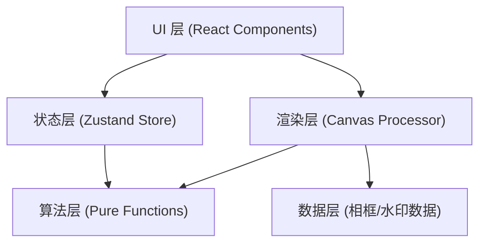

## 1. 架构设计

纯前端单页应用，采用分层模块化架构，状态、算法、渲染、UI 完全解耦。



## 2. 技术描述

- **前端框架**：React 18 + TypeScript（严格模式）
- **构建工具**：Vite（开发端口 5173）
- **状态管理**：Zustand
- **图像处理**：Canvas 2D API + 像素级算法
- **工具库**：uuid
- **样式方案**：原生 CSS（CSS 变量主题系统）

## 3. 文件结构

| 路径 | 职责 |
|------|------|
| `package.json` | 依赖与脚本定义（react、react-dom、typescript、zustand、uuid） |
| `index.html` | Vite 入口 HTML |
| `vite.config.js` | Vite 构建配置（端口 5173） |
| `tsconfig.json` | TypeScript 严格模式配置 |
| `src/main.tsx` | React 应用入口，渲染根组件 |
| `src/App.tsx` | 主布局组件，页面结构与状态分发 |
| `src/components/ImageUploader.tsx` | 图片上传与预览（点击/拖拽） |
| `src/components/StyleSelector.tsx` | 6 种风格缩略图网格选择面板 |
| `src/components/CanvasProcessor.tsx` | Canvas 核心处理：加载图片、像素算法、相框水印叠加、导出 |
| `src/utils/styleAlgorithms.ts` | 纯函数像素算法：水彩、油画、素描、波普、水墨、像素风 |
| `src/utils/frameData.ts` | 相框 SVG 路径数据集合 |
| `src/store/appStore.ts` | Zustand Store：图片 DataURL、选中风格、相框/水印配置 |

## 4. 核心数据模型

### 4.1 Zustand Store 状态定义

```typescript
interface AppState {
  imageDataUrl: string | null;
  originalImage: HTMLImageElement | null;
  selectedStyle: StyleType;
  selectedFrame: FrameType | null;
  frameWidth: number;
  watermarkEnabled: boolean;
  watermarkText: string;
  watermarkPosition: 'left' | 'right';
  isProcessing: boolean;
  showConfirmDialog: boolean;

  setImage: (dataUrl: string, img: HTMLImageElement) => void;
  setStyle: (style: StyleType) => void;
  setFrame: (frame: FrameType | null) => void;
  setFrameWidth: (width: number) => void;
  setWatermarkEnabled: (v: boolean) => void;
  setWatermarkText: (text: string) => void;
  setWatermarkPosition: (pos: 'left' | 'right') => void;
  setProcessing: (v: boolean) => void;
  setShowConfirmDialog: (v: boolean) => void;
}

type StyleType = 'watercolor' | 'oil' | 'sketch' | 'pop' | 'ink' | 'pixel';
type FrameType = 'wood' | 'gold' | 'black' | 'floral' | 'agate' | 'starry';
```

### 4.2 风格算法函数签名

```typescript
type StyleAlgorithm = (pixels: ImageData, width: number, height: number) => ImageData;
```

每种风格对应一个同签名纯函数，输入原始像素数据，返回处理后的像素数据。

## 5. 性能设计

- **分帧处理**：像素算法通过 `requestAnimationFrame` 分片处理，每片处理时间 <16ms，主线程总阻塞 ≤300ms
- **Canvas 尺寸控制**：输出 Canvas 尺寸不超过原图 2 倍，避免超大内存占用
- **CSS 动画**：所有过渡、动效使用 `transform` / `opacity`，确保 GPU 加速，不触发重排
- **纯函数算法**：风格算法无副作用，可缓存，相同输入可快速返回结果
