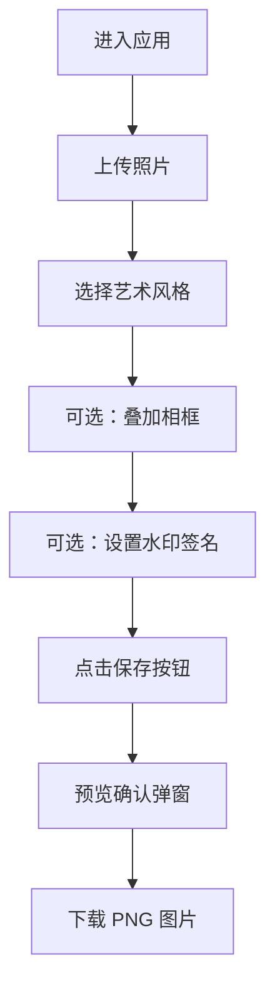

## 1. 产品概述

肖像画生成器是一款基于 Canvas 像素级图像处理的交互式网页应用，将用户上传的人像照片快速转换为 6 种艺术风格绘画，支持叠加相框与水印签名，最终导出高清 PNG 图片。

- 核心目标：为普通用户提供一键式人像艺术化处理工具，无需专业美术技能即可获得精美画作
- 目标用户：社交平台用户、设计师、摄影爱好者、个性化头像制作者

## 2. 核心功能

### 2.1 用户角色
| 角色 | 注册方式 | 核心权限 |
|------|----------|----------|
| 普通用户 | 无需注册，直接使用 | 上传图片、风格转换、相框叠加、水印签名、导出下载 |

### 2.2 功能模块
1. **主处理页**：图片上传区、Canvas 预览区、风格选择面板、相框设置面板、水印签名面板、下载确认弹窗

### 2.3 页面详情
| 页面名称 | 模块名称 | 功能描述 |
|----------|----------|----------|
| 主处理页 | 图片上传模块 | 点击/拖拽上传 jpg/png/webp，最大 8MB，上传区域渐变背景、相机图标、悬停动效、缩略图预览与加载动画 |
| 主处理页 | 风格转换模块 | 6 种风格（水彩、油画、素描、波普艺术、水墨、像素风）圆形缩略图按钮网格，选中发光环，溶解过渡动画 |
| 主处理页 | 相框叠加模块 | 6 种相框样式卡片预览，悬停上浮阴影，滑块调节相框宽度 5-30px，自动适配图片尺寸 |
| 主处理页 | 水印签名模块 | 默认应用名称灰色半透水印，开关控制，自定义签名文字，左右下角位置选择 |
| 主处理页 | 下载保存模块 | 顶部保存按钮，预览确认弹窗（缩放弹出动画），导出原分辨率 PNG，文件名带时间戳 |
| 主处理页 | 响应式布局 | 桌面端左右 70/30 分栏，移动端上下布局，面板横向滑动切换 |

## 3. 核心流程

用户进入应用 → 上传照片（点击或拖拽）→ 选择绘画风格 → 可选叠加相框并调节宽度 → 可选开启/设置水印签名 → 点击保存按钮预览确认 → 下载高清 PNG

## 4. 用户界面设计

### 4.1 设计风格
- **主题色**：深色模式，主背景 `#1a1a2e`，卡片背景 `#16213e`，面板标题栏 `#0f3460`，文字 `#e0e0e0`
- **按钮风格**：圆角设计，风格选择按钮为圆形 100×100px，保存按钮圆形 40px 直径 `#2c3e50` → `#34495e` 悬停
- **字体**：使用 'Segoe UI' 系统字体栈，标题加粗，正文常规
- **布局**：左右分栏（桌面 70/30）、卡片式面板、可折叠模块（三角图标指示）
- **动效**：所有交互 0.2-0.3s 过渡，风格切换溶解扩散动画，弹窗缩放弹出，面板淡入淡出

### 4.2 页面设计概览
| 页面名称 | 模块名称 | UI 元素 |
|----------|----------|---------|
| 主处理页 | 顶部导航栏 | 深色背景、应用标题、右侧圆形保存按钮 |
| 主处理页 | 左侧主区（70%） | 500×350px 圆角上传卡片、Canvas 预览区、风格选择网格 |
| 主处理页 | 右侧面板（30%） | 可折叠风格/相框/水印面板，120×160px 相框卡片，滑块控件 |
| 主处理页 | 底部水印区 | 固定位置，灰色半透明文字 |
| 主处理页 | 确认弹窗 | 半透明遮罩 + 居中卡片 0.3s 缩放弹出 |

### 4.3 响应式
- 桌面端（≥768px）：左右 70/30 分栏布局
- 移动端（<768px）：上下布局，右侧面板置于底部并变为横向滑动式
- 触控优化：增大可点击区域，支持触摸拖拽上传

## 5. 性能要求
- 风格转换主线程阻塞 ≤300ms，使用 requestAnimationFrame 分帧处理
- Canvas 尺寸不超过原图 2 倍，控制内存占用
- 所有动画使用 CSS transition/transform，避免布局抖动
