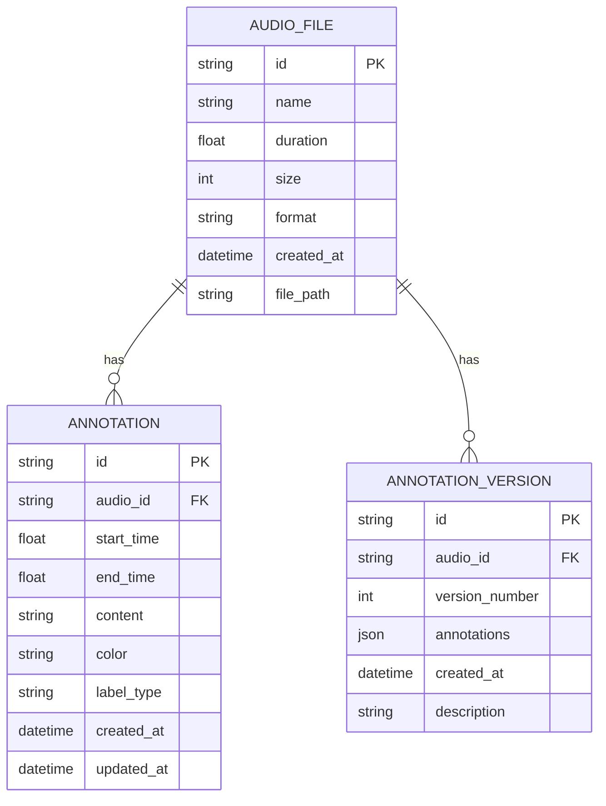
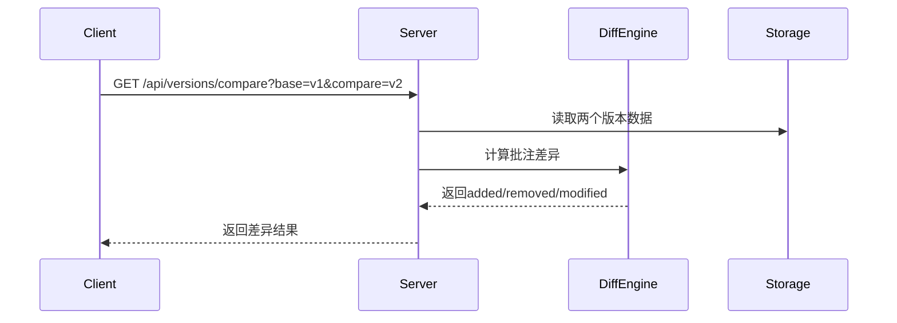

## 1. 架构设计

```mermaid
graph TD
    subgraph "前端层"
        A["React + TypeScript"] --> B["Zustand状态管理
        A --> C["Vite构建工具"]
        A --> D["Web Audio API"]
        D --> E["Canvas波形渲染"]
        A --> F["Axios API客户端"]
    end
    
    subgraph "后端层"
        G["Express.js + TypeScript"]
        G --> H["Multer文件上传"]
        G --> I["REST API路由"]
        I --> J["音频上传模块"]
        I --> K["批注CRUD模块"]
        I --> L["版本管理模块"]
    end
    
    subgraph "数据持久层"
        M["本地文件系统"]
        M --> N["音频文件存储"]
        M --> O["JSON数据存储"]
    end
    
    F --> I
    J --> N
    K --> O
    L --> O
```

## 2. 技术描述

- **前端技术栈**：React@18 + TypeScript@5 + Zustand@4 + Vite@5
- **后端技术栈**：Express@4 + TypeScript@5
- **状态管理**：Zustand - 轻量级状态管理
- **HTTP客户端**：Axios - API请求
- **文件上传**：Multer - 处理multipart/form-data
- **音频处理**：Web Audio API - 客户端波形解析
- **PDF导出**：jsPDF + html2canvas - 生成PDF报告
- **图标库**：lucide-react - UI图标
- **数据持久化**：本地文件系统存储（音频文件+JSON数据）

## 3. 项目结构

```
├── package.json
├── index.html
├── vite.config.ts
├── tsconfig.json
├── tsconfig.node.json
├── shared/
│   └── types.ts              # 前后端共享类型定义
├── server/
│   ├── index.ts             # Express服务入口
│   ├── audioRoutes.ts       # 音频上传路由
│   ├── annotationRoutes.ts # 批注CRUD路由
│   ├── versionRoutes.ts  # 版本管理路由
│   ├── annotationService.ts # 批注业务逻辑
│   ├── versionService.ts   # 版本业务逻辑
│   └── storage.ts          # 文件存储工具
├── src/
│   ├── main.tsx
│   ├── App.tsx
│   ├── store/
│   │   └── useStore.ts   # Zustand状态管理
│   ├── api/
│   │   └── client.ts     # Axios API客户端
│   ├── components/
│   │   ├── Layout.tsx          # 主布局组件
│   │   ├── Sidebar.tsx       # 侧边导航栏
│   │   ├── AudioUploader.tsx  # 音频上传组件
│   │   ├── WaveformViewer.tsx # 波形显示组件
│   │   ├── AnnotationInput.tsx  # 批注输入组件
│   │   ├── AnnotationTag.tsx # 批注标签组件
│   │   ├── VersionTimeline.tsx # 版本时间线
│   │   └── AnnotationReport.tsx # PDF导出组件
│   ├── hooks/
│   │   ├── useWaveform.ts   # 波形处理Hook
│   │   └── useAudioAnalysis.ts # 音频分析Hook
│   └── utils/
│       ├── waveform.ts      # 波形工具函数
│       └── versionDiff.ts  # 版本差异计算
│       └── pdfExport.ts    # PDF导出工具
└── data/
    ├── audio/               # 上传的音频文件
    └── annotations/       # 批注JSON数据
```

## 4. 路由定义

### 前端路由

| 路由 | 页面 | 说明 |
|-------|------|------|
| / | 主工作台 | 音频上传、波形显示、批注编辑 |

### 后端API路由

| 方法 | 路由 | 说明 |
|------|------|------|
| POST | /api/upload | 上传音频文件 |
| GET | /api/audio/:id | 获取音频信息 |
| GET | /api/audio/:id/stream | 流式播放音频 |
| POST | /api/annotations | 创建批注 |
| GET | /api/annotations/:audioId | 获取音频所有批注 |
| PUT | /api/annotations/:id | 更新批注 |
| DELETE | /api/annotations/:id | 删除批注 |
| POST | /api/versions | 创建版本快照 |
| GET | /api/versions/:audioId | 获取音频版本列表 |
| GET | /api/versions/:id | 获取单个版本详情 |
| GET | /api/versions/compare | 对比两个版本差异 |

## 5. API定义

### 5.1 类型定义

```typescript
// 共享类型定义
export interface AudioFile {
  id: string;
  name: string;
  duration: number;
  size: number;
  format: 'mp3' | 'wav';
  createdAt: string;
  filePath: string;
}

export interface Annotation {
  id: string;
  audioId: string;
  startTime: number;
  endTime: number;
  content: string;
  color: string;
  labelType: 'vocal' | 'instrument' | 'rhythm' | 'mix';
  createdAt: string;
  updatedAt: string;
}

export interface AnnotationVersion {
  id: string;
  audioId: string;
  versionNumber: number;
  annotations: Annotation[];
  createdAt: string;
  description?: string;
}

export interface VersionDiff {
  added: Annotation[];
  removed: Annotation[];
  modified: Annotation[];
}
```

### 5.2 请求/响应示例

**POST /api/upload

请求 (multipart/form-data)

```
Content-Type: multipart/form-data
file: [音频文件二进制数据
```

响应:
```json
{
  "success": true,
  "data": {
    "id": "uuid-string",
    "name": "demo.mp3",
    "duration": 245.5,
    "format": "mp3",
    "size": 4500000,
    "createdAt": "2026-06-15T10:30:00Z"
  }
}
```

**POST /api/annotations 请求:

```json
{
  "audioId": "uuid-string",
  "startTime": 10.5,
  "endTime": 15.2,
  "content": "人声需要提高音量",
  "color": "#e74c3c",
  "labelType": "vocal"
}
```

## 6. 数据模型

### 6.1 数据模型ER图



### 6.2 JSON存储格式

**audio_files.json**:
```json
[
  {
    "id": "audio-uuid-1",
    "name": "demo_song.mp3",
    "duration": 245.5,
    "size": 4500000,
    "format": "mp3",
    "createdAt": "2026-06-15T10:30:00Z",
    "filePath": "data/audio/audio-uuid-1.mp3"
  }
]
```

**annotations/audio-uuid-1.json**:
```json
[
  {
    "id": "ann-uuid-1",
    "audioId": "audio-uuid-1",
    "startTime": 10.5,
    "endTime": 15.2,
    "content": "这里人声有点跑调了",
    "color": "#e74c3c",
    "labelType": "vocal",
    "createdAt": "2026-06-15T10:35:00Z",
    "updatedAt": "2026-06-15T10:35:00Z"
  }
]
```

**versions/audio-uuid-1.json**:
```json
[
  {
    "id": "ver-uuid-1",
    "audioId": "audio-uuid-1",
    "versionNumber": 1,
    "annotations": [...],
    "createdAt": "2026-06-15T10:40:00Z",
    "description": "初始版本"
  }
]
```

## 7. 数据流图

### 7.1 批注保存数据流

```mermaid
sequenceDiagram
    participant Client->>Server: POST /api/annotations
    participant Server->>Storage: 保存到JSON文件
    Server-->>Client: 返回保存成功
    Client->>Server: POST /api/versions
    Server->>Storage: 创建版本快照
    Server-->>Client: 返回版本信息
```

### 7.2 版本对比数据流


