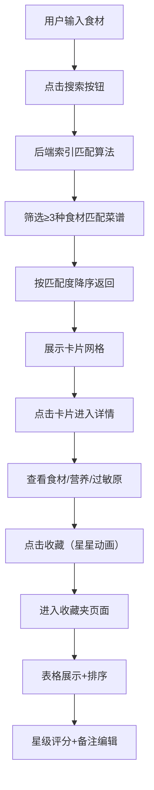

## 1. 产品概述

配方探索者是一款智能菜谱匹配应用，用户上传手头食材后，系统自动推荐可行菜谱并展示营养成分与过敏原风险，同时支持菜谱收藏与个性化评分备注。

- **核心价值**：解决"冰箱里有什么能做什么菜"的日常痛点，减少食材浪费，提升烹饪效率
- **目标用户**：家庭主妇、年轻白领、烹饪爱好者等所有有日常烹饪需求的人群

## 2. 核心功能

### 2.1 功能模块

1. **首页**：食材输入区域（支持拼音首字母快速查找、自动补全）、搜索按钮、搜索结果卡片网格
2. **详情页**：菜品图片占位区、食材清单（已匹配标记）、营养成分柱状图、过敏原警告、收藏按钮
3. **收藏夹页**：收藏菜谱表格（排序功能）、星级评分、备注编辑

### 2.3 页面详情

| 页面名称 | 模块名称 | 功能描述 |
|-----------|-------------|---------------------|
| 首页 | 食材输入区 | 600×200px textarea，每行一种食材，拼音首字母查找+自动补全 |
| 首页 | 搜索按钮 | 主色#ff6b35，圆角8px，悬停上浮2px，水波纹点击效果 |
| 首页 | 结果卡片网格 | 卡片展示菜名、匹配度进度条（0.8s动画填充）、烹饪时长、食材匹配数 |
| 详情页 | 图片区 | 宽幅背景渐变#ffe0b2→#ffcc80 |
| 详情页 | 三栏内容区 | 左：食材清单+绿色对勾；中：营养柱状图（热量/蛋白/脂肪/碳水/纤维）；右：8种过敏原图标（红色闪烁警示） |
| 详情页 | 收藏按钮 | 空心星→实心金星，旋转缩放动画0.3s |
| 收藏夹页 | 表格区 | 按菜名首字母/收藏时间排序，行点击进入详情 |
| 收藏夹页 | 评分备注 | 1-5星点击动画评分，inline文本编辑备注 |

## 3. 核心流程

用户在首页输入食材 → 点击搜索 → 后端匹配至少含3种食材的菜谱（按匹配度排序）→ 展示结果卡片 → 点击卡片进入详情 → 查看食材/营养/过敏原 → 点击收藏 → 进入收藏夹 → 评分+添加备注

## 4. 用户界面设计

### 4.1 设计风格

- **主色**：#ff6b35（活力橙），**辅色**：#f4a261（暖橙），**背景**：#fff8f0（暖米白）
- **按钮**：圆角8px，悬停上浮+阴影，点击水波纹扩散（0.4s）
- **字体**：系统无衬线体（-apple-system, BlinkMacSystemFont, "Segoe UI", sans-serif）
- **布局**：顶部导航+卡片式内容，大屏1200px居中，响应式单列流式
- **图标**：Lucide Icons 线性风格，过敏原使用emoji警示图标

### 4.2 页面设计概览

| 页面名称 | 模块名称 | UI元素 |
|-----------|-------------|-------------|
| 首页 | 食材输入 | 浅灰#ddd边框，focus变主色，0.3s过渡，placeholder引导文字 |
| 首页 | 结果卡片 | 悬停上浮3px+阴影（0.25s ease-out），匹配度进度条0.8s缓出动画 |
| 详情页 | 三栏布局 | 栅格布局，卡片容器，匹配食材绿色✓高亮，营养柱动画，过敏原红色闪烁 |
| 收藏夹页 | 表格 | 斑马纹行，表头固定，排序箭头，星星hover渐变填充，textarea备注 |

### 4.3 响应式

- **Desktop（≥1200px）**：1200px最大宽度居中，详情页三栏布局
- **Tablet（768-1199px）**：100%宽度左右padding 24px，详情页两栏（过敏原换行）
- **Mobile（<768px）**：单列流式，卡片全宽，详情页单栏堆叠，表格横向滚动

### 4.4 性能指标

- 搜索响应时间 ≤ 1.5s
- 首屏加载时间 ≤ 3s
- 所有交互反馈 ≤ 0.3s
