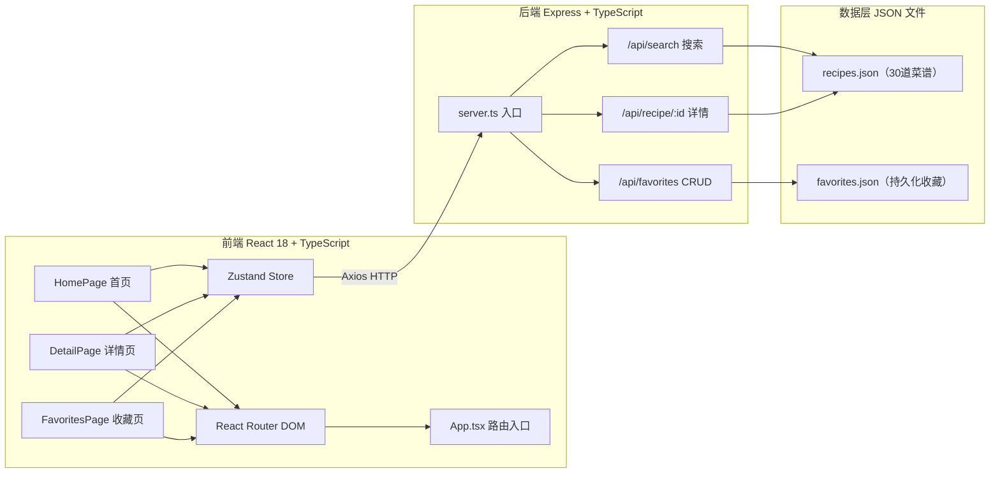
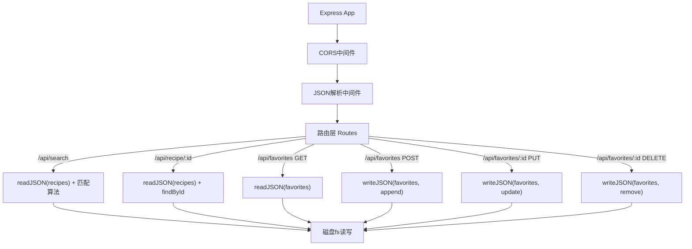
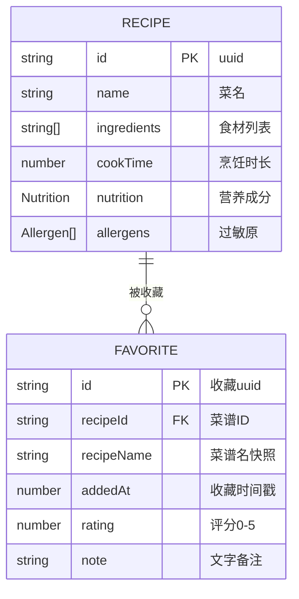

## 1. 架构设计



## 2. 技术说明

- **前端**：React@18 + TypeScript + Vite + React Router DOM@6 + Zustand + Axios
- **后端**：Express@4 + TypeScript + CORS + UUID
- **数据存储**：本地JSON文件持久化（fs模块读写）
- **样式方案**：原生CSS（CSS变量主题系统 + CSS动画），不引入Tailwind

## 3. 路由定义

| 前端路由 | 页面组件 | 用途 |
|-----------|-----------|------|
| / | HomePage | 食材输入 + 搜索结果 |
| /recipe/:id | DetailPage | 菜谱详情 + 收藏操作 |
| /favorites | FavoritesPage | 收藏夹管理 |

| API路由 | 方法 | 用途 |
|---------|------|------|
| /api/search | POST | 根据食材列表搜索菜谱 |
| /api/recipe/:id | GET | 获取单道菜谱详情 |
| /api/favorites | GET | 获取全部收藏 |
| /api/favorites | POST | 添加收藏 |
| /api/favorites/:id | PUT | 更新收藏（评分/备注） |
| /api/favorites/:id | DELETE | 删除收藏 |

## 4. API类型定义

```typescript
// 食材
interface Ingredient { name: string; pinyin: string }

// 营养成分
interface Nutrition {
  calories: number;      // 热量 kcal
  protein: number;       // 蛋白质 g
  fat: number;           // 脂肪 g
  carbs: number;         // 碳水 g
  fiber: number;         // 膳食纤维 g
}

// 8种常见过敏原
type Allergen = 'milk' | 'egg' | 'peanut' | 'tree_nut' | 'soy' | 'wheat' | 'fish' | 'shellfish'

// 菜谱
interface Recipe {
  id: string;
  name: string;
  ingredients: string[];
  cookTime: number;      // 分钟
  nutrition: Nutrition;
  allergens: Allergen[];
}

// 搜索结果（含匹配度）
interface SearchResult extends Recipe {
  matchedCount: number;
  totalIngredients: number;
  matchPercentage: number;
}

// 收藏记录
interface Favorite {
  id: string;            // 收藏ID（uuid）
  recipeId: string;
  recipeName: string;
  addedAt: number;       // timestamp
  rating: 0 | 1 | 2 | 3 | 4 | 5;
  note: string;
}

// 搜索请求
interface SearchRequest { ingredients: string[] }

// 搜索响应
interface SearchResponse { results: SearchResult[] }
```

## 5. 服务器架构



## 6. 数据模型

### 6.1 数据模型定义



### 6.2 搜索匹配算法

1. 输入用户食材列表 `userIngredients`
2. 遍历 `recipes.json` 中每道菜，计算交集 `matched = recipe.ingredients ∩ userIngredients`
3. 过滤 `matched.length >= 3` 的菜谱
4. 计算匹配度：`matchPercentage = (matched.length / recipe.ingredients.length) * 100`
5. 按 `matchPercentage` 降序排序后返回

### 6.3 拼音首字母索引（前端自动补全）

前端维护食材词典，每条记录包含 `{ name, pinyin首字母 }`，输入时按前缀匹配：
- 输入食材中文名匹配 `name.startsWith(input)`
- 输入拼音首字母匹配 `pinyin.startsWith(input.toUpperCase())`

## 7. 项目文件结构

```
├── package.json
├── index.html
├── vite.config.js
├── tsconfig.json
├── src/
│   ├── frontend/
│   │   ├── App.tsx          # 路由根组件
│   │   ├── pages/
│   │   │   ├── HomePage.tsx
│   │   │   ├── DetailPage.tsx
│   │   │   └── FavoritesPage.tsx
│   │   ├── store/
│   │   │   └── useStore.ts  # Zustand状态管理
│   │   └── styles/
│   │       └── global.css   # 全局样式主题
│   └── backend/
│       ├── server.ts        # Express服务入口
│       └── data/
│           ├── recipes.json # 30道菜谱数据
│           └── favorites.json # 收藏持久化（[]）
```

## 8. 启动脚本

```json
{
  "scripts": {
    "dev": "concurrently \"npm run dev:server\" \"npm run dev:client\"",
    "dev:server": "tsx watch src/backend/server.ts",
    "dev:client": "vite",
    "build": "tsc -b && vite build",
    "preview": "vite preview"
  }
}
```
