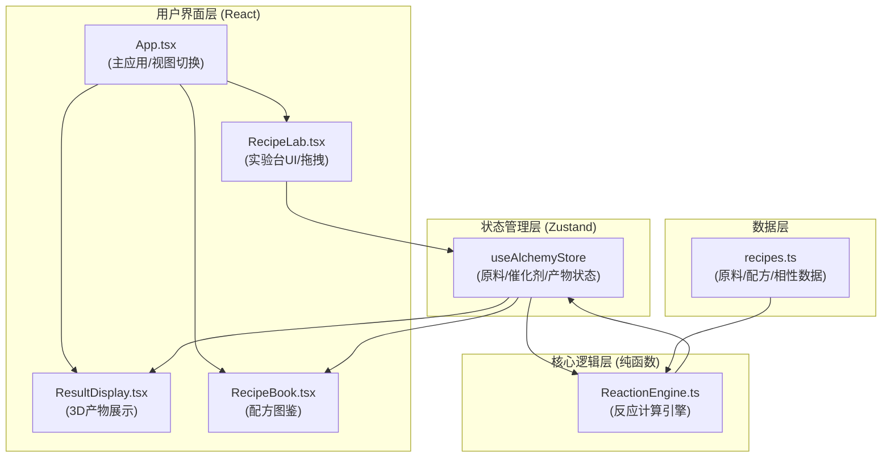

## 1. 架构设计



## 2. 技术描述

- **前端框架**: React 18 + TypeScript（严格模式）
- **构建工具**: Vite 5
- **状态管理**: Zustand
- **3D渲染**: Three.js + @react-three/fiber + @react-three/drei
- **样式方案**: 原生CSS（CSS Modules）+ CSS变量
- **图标库**: lucide-react
- **工具库**: uuid

## 3. 项目文件结构与调用关系

```
e:\solo\VersionFastPro\tasks\auto3\
├── package.json                          (依赖与脚本配置)
├── vite.config.js                        (Vite构建配置)
├── tsconfig.json                         (TypeScript严格模式配置)
├── index.html                            (应用入口)
└── src/
    ├── main.tsx                          (React入口)
    ├── App.tsx                           (主应用组件，视图切换/数据流分发)
    │   ├── 调用 RecipeLab.tsx 接收用户操作
    │   └── 传递状态给 ResultDisplay.tsx
    ├── index.css                         (全局样式/CSS变量)
    ├── store/
    │   └── useAlchemyStore.ts            (Zustand状态管理)
    │       ├── 管理: 反应槽原料、催化剂、产物、已解锁配方
    │       └── 调用: ReactionEngine.calculateReaction()
    ├── core/
    │   └── ReactionEngine.ts             (纯函数反应引擎)
    │       ├── 输入: 原料数组 + 催化剂类型
    │       ├── 匹配预设配方/推导隐藏配方
    │       └── 输出: 产物对象(名称/颜色/属性/评分)
    ├── data/
    │   └── recipes.ts                    (原料数据/预设配方/相性表)
    │       ├── materials: 8种原料基础属性
    │       ├── affinities: 原料间相性值
    │       └── recipes: 10+预设配方定义
    ├── components/
    │   ├── RecipeLab.tsx                 (实验台核心UI)
    │   │   ├── MaterialShelf: 原料架(拖拽源)
    │   │   ├── ReactionSlot: 反应槽(拖拽目标)
    │   │   └── CatalystSelector: 催化剂选择器
    │   ├── ResultDisplay.tsx             (产物展示面板)
    │   │   ├── ProductSphere: Three.js 3D球体
    │   │   ├── Particles: 粒子特效
    │   │   └── ProductInfo: 属性/评分展示
    │   └── RecipeBook.tsx                (配方图鉴侧边栏)
    │       ├── 已解锁配方卡片
    │       └── 未解锁隐藏配方(灰色问号)
    └── types/
        └── index.ts                      (TypeScript类型定义)
```

## 4. 数据模型与类型定义

### 4.1 核心数据类型

```typescript
// 原料ID
type MaterialId = 'water' | 'fire' | 'earth' | 'air' | 'silver' | 'sulfur' | 'mercury' | 'salt';

// 催化剂类型
type CatalystType = 'acid' | 'alkaline' | 'neutral';

// 原料定义
interface Material {
  id: MaterialId;
  name: string;
  color: string;
  properties: {
    heat: number;      // 热性 0-10
    cold: number;      // 寒性 0-10
    dry: number;       // 干性 0-10
    wet: number;       // 湿性 0-10
    volatility: number; // 挥发性 0-10
    stability: number;  // 稳定性 0-10
  };
  symbol: string;       // 炼金符号
}

// 配方定义
interface Recipe {
  id: string;
  name: string;
  materials: MaterialId[]; // 按顺序排列的原料组合(1-3个)
  catalyst: CatalystType;
  isHidden?: boolean;
  product: Product;
}

// 反应槽中的原料
interface SlotMaterial {
  material: Material;
  order: number;  // 1, 2, 3
}

// 产物
interface Product {
  id: string;
  name: string;
  description: string;
  color: string;        // 主颜色
  secondaryColor: string; // 次颜色(用于渐变)
  texture: 'smooth' | 'flame' | 'crystal' | 'mist' | 'metal' | 'liquid';
  properties: {
    heat: number;
    cold: number;
    dry: number;
    wet: number;
    volatility: number;
    stability: number;
  };
  propertyChanges: {
    heat: number;
    cold: number;
    dry: number;
    wet: number;
    volatility: number;
    stability: number;
  };
  score: number;        // 0-100分
  stars: 1 | 2 | 3 | 4 | 5;
}

// 相性表
interface AffinityTable {
  [key: string]: number; // 格式: "materialA-materialB": -5 ~ +5
}
```

### 4.2 Zustand Store 状态

```typescript
interface AlchemyState {
  // 反应槽状态: [槽1, 槽2, 槽3]，null表示空槽
  slots: (SlotMaterial | null)[];
  // 选中的催化剂
  selectedCatalyst: CatalystType | null;
  // 当前产物
  currentProduct: Product | null;
  // 已解锁配方ID列表
  unlockedRecipes: string[];
  // 图鉴侧边栏开关
  isRecipeBookOpen: boolean;
  // 是否正在计算
  isCalculating: boolean;
}
```

## 5. 反应计算算法（ReactionEngine）

### 5.1 计算流程
1. **输入验证**: 至少1个原料 + 必选催化剂
2. **预设配方匹配**: 按原料顺序+催化剂精确匹配预设配方表
3. **隐藏配方推导**: 如无精确匹配，计算原料相性总和推导隐藏配方
4. **属性计算**: 聚合原料属性，乘以催化剂系数和相性修正
5. **评分计算**: 基于属性平衡度 + 相性值 + 配方稀有度
6. **输出产物对象**

### 5.2 性能约束
- 单次计算必须 ≤ 50ms
- 纯函数，无副作用，便于测试

## 6. 性能优化策略

| 优化项 | 策略 |
|--------|------|
| 拖拽帧率 ≥ 45FPS | 使用CSS transform而非top/left，will-change提示 |
| 3D渲染 ≥ 40FPS | requestAnimationFrame控制，粒子数限制≤150 |
| 反应计算 ≤ 50ms | 纯函数O(1)查表匹配，避免循环嵌套 |
| 状态更新 | Zustand选择器避免不必要重渲染 |
| 动画过渡 | CSS cubic-bezier非线性过渡，0.2-0.5s |
