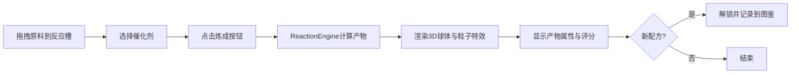

## 1. 产品概述

炼金术配方实验台是一款面向独立游戏开发者的交互式模拟工具，用于测试和平衡炼金术主题模拟经营游戏的配方机制。玩家/开发者可通过拖拽原料到反应槽、选择催化剂，实时观察炼金产物的生成过程，辅助游戏数值设计与配方平衡。

- 主要用途：辅助炼金术游戏配方系统的设计、测试与平衡
- 目标用户：独立游戏开发者、游戏设计师、炼金术游戏爱好者

## 2. 核心功能

### 2.1 用户角色
本应用为单用户工具，无需角色区分。

### 2.2 功能模块
1. **实验台主界面**：原料架、三个反应槽、催化剂选择器、炼成触发按钮
2. **产物展示面板**：3D球体模型、粒子特效、产物信息与评分
3. **配方图鉴系统**：已解锁配方列表、隐藏配方提示、配方详情展示

### 2.3 页面详情

| 页面名称 | 模块名称 | 功能描述 |
|----------|----------|----------|
| 实验台主页 | 原料架 | 展示8种原料（水、火、土、风、银、硫磺、汞、盐），支持拖拽，悬停显示属性提示 |
| 实验台主页 | 反应槽区域 | 三个方形反应槽，接收拖拽原料，显示顺序编号，点击可移除，弹性动画 |
| 实验台主页 | 催化剂选择器 | 三种催化剂（酸性/碱性/中性），选中高亮放大，半透明圆角矩形 |
| 实验台主页 | 炼成按钮 | 触发反应计算，加载期间显示旋转动画 |
| 产物展示面板 | 3D球体展示 | Three.js渲染的动态球体，颜色纹理随产物变化，缓慢自转 |
| 产物展示面板 | 粒子特效 | 环绕球体的漂浮粒子，颜色/大小随产物属性变化 |
| 产物展示面板 | 产物信息 | 名称、属性变化条（绿增红减）、炼金评分与星级 |
| 配方图鉴侧边栏 | 图鉴列表 | 已解锁配方卡片展示，未解锁配方灰色带问号 |
| 配方图鉴侧边栏 | 配方详情 | 产物名称、原料组合、评分，左侧色条指示产物颜色 |

## 3. 核心流程

用户从原料架拖拽原料到三个反应槽（按顺序）→ 选择催化剂类型 → 点击炼成按钮 → ReactionEngine计算反应结果 → 3D产物球体渲染并显示属性与评分 → 若为新配方则解锁并记录到图鉴。

## 4. 用户界面设计

### 4.1 设计风格
- **主色调**：深色奇幻主题，深紫(#1a0a2e)到深蓝(#0d1b2a)径向渐变背景
- **强调色**：原料各自属性色（火红/水蓝/土黄/风白/银银/硫磺金/汞灰/盐绿）
- **按钮风格**：半透明磨砂玻璃效果(backdrop-filter: blur(8px))，圆角12px，非线性过渡 cubic-bezier(0.34, 1.56, 0.64, 1)
- **字体**：奇幻风格字体搭配清晰易读的无衬线字体
- **布局**：桌面端两列（左60%实验台/右40%产物），移动端上下堆叠
- **图标**：使用lucide-react图标库，书形图鉴按钮

### 4.2 页面设计概览

| 页面名称 | 模块名称 | UI元素 |
|----------|----------|--------|
| 实验台主页 | 原料架 | 圆形按钮(40px)，颜色对应属性，悬停放大1.15倍，0.2s过渡，工具提示 |
| 实验台主页 | 反应槽 | 60x60方形虚线边框，落入弹性动画(1.1倍缩放回弹0.2s) |
| 实验台主页 | 催化剂选择 | 半透明圆角矩形（酸红/碱蓝/中灰），选中时1.05倍放大+边框高亮 |
| 产物展示面板 | 3D球体 | 颜色渐变+纹理（如凤凰之泪红色火焰纹），每10秒自转一圈 |
| 产物展示面板 | 粒子特效 | 150个以内，大小3-8px，随机漂浮 |
| 产物展示面板 | 评分展示 | 加粗20px名称，属性数值条，星级评价(1-5星) |
| 配方图鉴 | 配方卡片 | 左侧4px色条，悬停上浮2px，未解锁灰色带问号 |

### 4.3 响应式
- 桌面端优先设计（宽度 ≥ 768px）：两列布局，反应槽60x60
- 移动端（宽度 < 768px）：上下堆叠布局，反应槽缩小为45x45
- 触控优化：拖拽操作支持触屏

### 4.4 3D场景指导
- **环境与氛围**：深色宇宙/魔法阵背景，低强度环境光配合点光源
- **光照设置**：主方向光 + 半球光，球体自发光材质增强质感
- **相机设置**：透视相机，固定距离，跟随球体轻微晃动
- **构图与焦点**：产物球体居正中，粒子环绕形成视觉焦点
- **交互与动画**：球体缓慢自转，粒子随机漂浮运动，0.5秒平滑过渡切换产物
- **后处理效果**：轻微泛光(Bloom)增强魔法感
- **性能约束**：Three.js渲染 ≥ 40FPS，粒子 ≤ 150个
