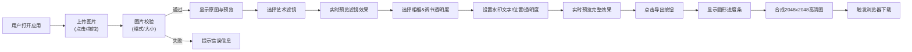

## 1. 产品概述

ArtStudio Pro是一款在线图片艺术风格转换与相框装饰工具，面向网页设计师、摄影爱好者和社交媒体创作者。无需安装任何软件，用户上传照片后即可在浏览器内实时应用水彩、素描、油画等6种艺术风格滤镜，叠加12款精美装饰相框，并自定义签名水印，最终导出高清PNG图片。

- 核心价值：将专业级图片后期处理能力通过浏览器即可访问，零门槛、零成本
- 目标用户：网页设计师、摄影爱好者、内容创作者、普通用户

## 2. 核心功能

### 2.1 用户角色
| 角色 | 注册方式 | 核心权限 |
|------|----------|----------|
| 访客用户 | 无需注册 | 完整使用所有滤镜、相框、水印功能，支持图片导出 |

### 2.2 功能模块
1. **图片上传模块**：点击/拖拽上传，文件格式校验，大小限制，拖拽动画提示
2. **风格滤镜库**：6种艺术风格滤镜（水彩、素描、油画、波普艺术、水墨、像素风），缩略图预览，实时切换
3. **相框叠加系统**：3系列12款相框（古典/现代/简约各4款），透明度调节，金色边框高亮选中
4. **自定义水印**：文字输入（≤20字符），5种位置选择，透明度滑块，自动适配字号
5. **高清导出模块**：2048x2048像素PNG导出，圆形进度条动画，浏览器自动下载

### 2.3 页面详情
| 页面名称 | 模块名称 | 功能描述 |
|----------|----------|----------|
| 主工作台 | 原图预览区（左栏） | 上传区域拖拽动画，原图缩略图展示，重新上传入口 |
| 主工作台 | 效果展示区（中栏） | 棋盘格背景，居中预览，实时渲染滤镜+相框+水印效果 |
| 主工作台 | 控制面板区（右栏） | 当前状态显示条，可折叠的滤镜/相框/水印面板，导出按钮 |
| 主工作台 | 导出进度层 | 全屏遮罩，圆形进度动画0%-100%，完成提示 |

## 3. 核心流程

用户打开应用 → 上传图片（点击或拖拽） → 选择艺术风格滤镜（6选1） → 选择装饰相框（12选1，调节透明度） → 输入水印文字并设置位置/透明度 → 实时预览效果 → 点击导出按钮 → 观看进度动画 → 自动下载高清PNG

## 4. 用户界面设计

### 4.1 设计风格
- **主色调**：暗色科技风，主背景#1e1e2e，卡片背景#2d2d3f，边框#3d3d5c
- **强调色**：主题紫#6c63ff（滑块填充），金色#d4a574（选中高亮边框）
- **字体**：serif衬线体（水印），现代无衬线（界面）
- **交互风格**：所有按钮0.2s颜色过渡，点击0.1s缩放至0.95倍；面板折叠0.3s高度过渡；滤镜切换0.3s淡入；悬停放大1.05倍

### 4.2 页面设计概述
| 页面名称 | 模块名称 | UI元素 |
|----------|----------|--------|
| 主工作台 | 三栏布局 | 左300px原图区，中弹性预览区，右320px控制面板，固定宽度+弹性宽度组合 |
| 主工作台 | 滤镜面板 | 2行3列网格，80x80缩略图，悬停放大+金色描边，选中态永久高亮 |
| 主工作台 | 相框面板 | 3列垂直滚动列表，选中金色边框高亮，下方透明度滑块 |
| 主工作台 | 水印面板 | 文字输入框+长度计数，5个位置按钮（四角+居中），透明度#6c63ff主题色滑块 |
| 主工作台 | 响应式适配 | <1024px：右侧面板变底部抽屉（40%高度，可拖拽）；<700px：单栏流动布局 |
| 主工作台 | 进度层 | 半透明全屏遮罩，居中圆形SVG进度环，百分比数字，完成后渐隐 |

### 4.3 响应式
- 桌面优先（≥1024px）：三栏固定布局
- 平板（700-1024px）：两栏布局，右侧面板折叠为底部抽屉（高度40%，可拖拽调整）
- 移动（<700px）：单栏流动布局，所有面板垂直堆叠
- 触摸优化：增大可点击区域≥44px，滑块手柄直径16px支持触摸拖动

### 4.4 性能指标
- 滤镜处理：2048x1536像素单张≤200ms（Canvas像素级操作）
- 预览更新：切换滤镜/调参数≤150ms
- 图片导出：合成+下载≤3秒
