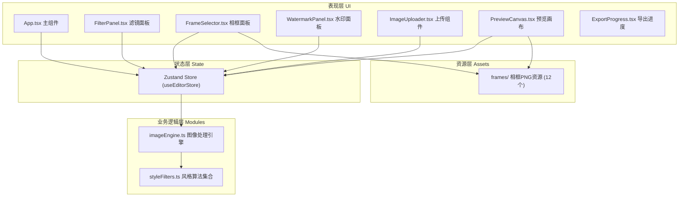

## 1. 架构设计



## 2. 技术描述

- **前端框架**：React@18 + TypeScript（strict模式，target ES2020）
- **构建工具**：Vite@5（配置路径别名 @ → src）
- **状态管理**：Zustand@4（集中管理图片状态、滤镜参数、相框选择、水印设置）
- **图像处理**：HTML5 Canvas 2D API（getImageData / putImageData 像素级操作）
- **UI组件库**：纯CSS实现（无第三方UI库，自定义暗色主题）
- **图标**：lucide-react
- **辅助库**：uuid（生成唯一ID）

## 3. 目录结构

```
src/
├── App.tsx                      # 主组件，三栏布局容器，状态监听与分发
├── store/
│   └── useEditorStore.ts        # Zustand全局状态管理
├── modules/
│   ├── imageEngine.ts           # 图像处理引擎：加载/渲染/合成/导出
│   └── styleFilters.ts          # 6种风格滤镜算法函数（纯函数）
├── components/
│   ├── FilterPanel.tsx          # 滤镜选择面板（2x3网格）
│   ├── FrameSelector.tsx        # 相框选择面板（3列滚动）
│   ├── WatermarkPanel.tsx       # 水印设置面板
│   ├── ImageUploader.tsx        # 图片上传组件（点击+拖拽）
│   ├── PreviewCanvas.tsx        # 效果预览画布（棋盘格背景）
│   ├── OriginalPanel.tsx        # 左侧原图预览区
│   ├── ControlPanel.tsx         # 右侧控制面板容器
│   ├── ExportProgress.tsx       # 导出进度动画组件
│   └── CollapsibleSection.tsx   # 可折叠面板通用容器
├── assets/
│   └── frames/                  # 12个相框PNG资源
│       ├── classical-1.png ~ classical-4.png
│       ├── modern-1.png ~ modern-4.png
│       └── minimal-1.png ~ minimal-4.png
├── types/
│   └── index.ts                 # 全局类型定义
└── styles/
    └── global.css               # 全局样式与主题变量
```

## 4. 核心数据结构

### 4.1 Zustand Store 状态定义

```typescript
interface EditorState {
  // 图片
  originalImage: HTMLImageElement | null
  originalImageDataUrl: string | null
  imageWidth: number
  imageHeight: number
  
  // 当前效果
  currentFilter: FilterType  // 'none' | 'watercolor' | 'sketch' | 'oil' | 'pop' | 'ink' | 'pixel'
  filterIntensity: number    // 0.0 - 1.0
  
  // 相框
  currentFrame: FrameType    // 'none' | 'classical-1' ~ 'minimal-4'
  frameOpacity: number       // 0.0 - 1.0
  
  // 水印
  watermarkText: string      // max 20 chars
  watermarkOpacity: number   // 0.0 - 1.0
  watermarkPosition: WatermarkPosition // 'tl' | 'tr' | 'bl' | 'br' | 'center'
  
  // UI状态
  isExporting: boolean
  exportProgress: number     // 0 - 100
  collapsedPanels: Record<string, boolean>
  
  // Actions
  setOriginalImage: (file: File) => Promise<void>
  setFilter: (f: FilterType) => void
  setFilterIntensity: (v: number) => void
  setFrame: (f: FrameType) => void
  setFrameOpacity: (v: number) => void
  setWatermarkText: (t: string) => void
  setWatermarkOpacity: (v: number) => void
  setWatermarkPosition: (p: WatermarkPosition) => void
  togglePanel: (key: string) => void
  exportImage: () => Promise<void>
}
```

### 4.2 滤镜算法接口

```typescript
// styleFilters.ts 中每个滤镜函数签名
type FilterFunction = (
  imageData: ImageData,
  options?: { intensity?: number }
) => ImageData
```

## 5. 关键技术方案

### 5.1 Canvas 图像处理流水线

```
原始图片 → 缩放至工作尺寸 → getImageData获取像素 
→ styleFilters对应算法处理像素 → putImageData写入离屏Canvas 
→ 叠加相框(globalAlpha) → 绘制水印文字 → 最终渲染
```

### 5.2 6种风格滤镜算法简述

| 滤镜 | 核心算法 |
|------|----------|
| 水彩 | 双边滤波+色彩量化+边缘软化+饱和度提升 |
| 素描 | 灰度化→Sobel边缘检测→反相→颜色减淡混合 |
| 油画 | K-Means色彩聚类+邻域像素统计+厚重笔刷模拟 |
| 波普艺术 | 高对比4色调色板映射+色调分离+饱和增强 |
| 水墨 | 灰度化+直方图均衡化+墨晕扩散+飞白纹理叠加 |
| 像素风 | 降采样至1/N分辨率→最近邻插值放大→硬边调色 |

### 5.3 导出流程

1. 创建2048x2048离屏Canvas
2. 将原图按比例居中绘制
3. 应用所选滤镜算法
4. 按frameOpacity叠加选中的相框PNG（cover模式）
5. 根据watermarkPosition和opacity绘制文字水印（serif字体，自动计算字号）
6. canvas.toBlob()生成PNG，通过a[download]触发下载
7. 每步更新exportProgress状态驱动动画

### 5.4 性能优化策略

- 预览使用工作尺寸（如1024px宽）处理，导出时才使用2048px
- 防抖处理滑块拖动事件，避免高频重绘
- 离屏Canvas缓存已处理的滤镜结果，参数未变化时直接复用
- 采用requestAnimationFrame分批处理像素，避免主线程阻塞
- 相框PNG资源预加载，选择时无需等待
