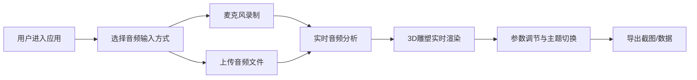

## 1. 产品概述

声音雕塑3D沙盒是一款沉浸式音频可视化应用，通过实时分析音频频谱特征，将声音转化为动态的3D几何雕塑，创造出随音乐呼吸和舞动的数字生命体体验。

- 核心价值：将听觉体验转化为视觉艺术，让用户直观地"看见"声音的形态与律动
- 目标用户：音乐爱好者、视觉艺术家、创意设计师、VJ表演者
- 应用场景：音乐可视化欣赏、现场演出背景、艺术创作灵感、教学演示

## 2. 核心功能

### 2.1 用户角色
| 角色 | 注册方式 | 核心权限 |
|------|---------|---------|
| 普通用户 | 无需注册 | 使用全部可视化功能、录制/上传音频、导出作品 |

### 2.2 功能模块
1. **音频输入与分析模块**：麦克风录制、文件上传、实时频谱分析、波形可视化
2. **3D雕塑生成模块**：低频立方体阵列、中频球体环、高频粒子喷射、连接线
3. **交互控制模块**：参数调节、颜色主题切换、场景相机控制
4. **性能与导出模块**：LOD优化、FPS监控、场景截图、数据导出

### 2.3 页面详情
| 页面名称 | 模块名称 | 功能描述 |
|---------|---------|---------|
| 主界面 | 顶部波形面板 | 实时显示音频波形图，高度120px，深色背景渐变线条 |
| 主界面 | 中央3D场景 | Three.js渲染的动态雕塑，支持鼠标拖拽旋转和滚轮缩放 |
| 主界面 | 右侧控制面板 | 灵敏度、粒子数量滑块，颜色主题切换，导出按钮 |
| 主界面 | 底部音频控制条 | 播放/暂停、进度条、音量显示，高度60px |
| 主界面 | 录音/上传按钮 | 圆形录音按钮（48px直径）、圆角矩形上传按钮 |

## 3. 核心流程

用户打开应用后，可选择麦克风录制或上传音频文件，系统实时分析音频并驱动3D雕塑动画。用户可通过右侧面板调节参数和切换主题，最终导出截图和分析数据。

## 4. 用户界面设计

### 4.1 设计风格
- **设计主题**：赛博朋克艺术风格，深邃宇宙感与霓虹光影交织
- **主色调**：深色背景 #0f0f23，辅以紫色 #6c63ff 和红色 #ff6b6b 强调
- **按钮风格**：圆角精致设计，悬停上浮3px带阴影，点击下沉1px，0.3秒过渡动画
- **字体**：现代无衬线字体，浅色 #e0e0e0，标题加粗
- **布局风格**：分层卡片式布局，半透明磨砂玻璃质感面板
- **视觉元素**：金色边框点缀、渐变色彩、发光效果、粒子光效

### 4.2 页面设计概述
| 页面名称 | 模块名称 | UI元素 |
|---------|---------|-------|
| 主界面 | 顶部波形面板 | 高度120px，深色背景#1a1a2e，渐变色波形从#ff6b6b到#4ecdc4 |
| 主界面 | 中央3D场景 | 深蓝渐变背景，星云背景球，三个几何体组，发光连接线 |
| 主界面 | 右侧控制面板 | 宽度280px，半透明rgba(26,26,46,0.85)，圆角12px，金色边框 |
| 主界面 | 底部控制条 | 高度60px，深色#0f0f23，圆角8px，播放/暂停/进度/音量 |
| 主界面 | 录音按钮 | 圆形48px，默认灰色#ccc，录音时红色#ff3333，1Hz脉动光圈 |
| 主界面 | 上传按钮 | 圆角矩形，主色#6c63ff |
| 主界面 | 导出按钮 | 圆形，主色#4ecdc4 |

### 4.3 响应式
- 桌面优先设计，最小支持宽度1024px
- 大屏幕下3D场景区域自适应扩展
- 控制面板固定右侧，底部控制条固定底部

### 4.4 3D场景指引
- **环境氛围**：深邃宇宙空间，深蓝渐变背景，星云雾气
- **光照设置**：环境光 + 点光源，营造体积感和发光效果
- **相机设置**：初始位置(0,5,10)，目标点(0,0,0)，OrbitControls控制
- **构图元素**：立方体阵列（底部）、球体环（中部）、粒子喷射（中心爆发）
- **交互动画**：几何体随音频实时变形、旋转、喷射，颜色主题切换1秒过渡
- **后期效果**：发光效果、轻微泛光、半透明连接线
- **性能控制**：LOD细节降级、FPS监控、粒子数量自适应
