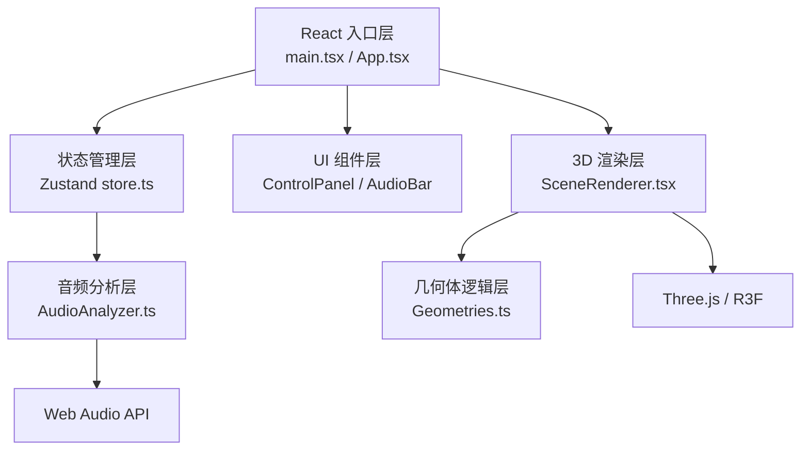

## 1. 架构设计



## 2. 技术描述

- **前端框架**：React 18 + TypeScript
- **构建工具**：Vite 5
- **3D 渲染**：Three.js + @react-three/fiber + @react-three/drei
- **状态管理**：Zustand
- **音频处理**：Web Audio API（AnalyserNode、AudioContext）
- **样式方案**：原生 CSS + CSS Modules，配合 CSS 变量
- **唯一标识**：uuid

## 3. 文件结构

```
src/
├── main.tsx              # React 入口
├── App.tsx               # 根组件，全局布局
├── store.ts              # Zustand 全局状态
├── audio/
│   └── AudioAnalyzer.ts  # 音频分析模块
├── scene/
│   ├── SceneRenderer.tsx # 3D 场景渲染组件
│   └── Geometries.ts     # 几何体生成与更新逻辑
└── ui/
    ├── ControlPanel.tsx  # 右侧控制面板
    └── AudioBar.tsx      # 底部音频控制条
```

## 4. 状态模型 (Zustand)

### 4.1 音频数据状态
| 字段 | 类型 | 说明 |
|------|------|------|
| frequencyData | Float32Array | 256频点频率分布 |
| volume | number | 当前音量 0-100 |
| bpm | number | BPM节拍数，精确到小数点后1位 |
| isRecording | boolean | 是否正在录音 |
| isPlaying | boolean | 是否正在播放 |
| audioFile | File \| null | 当前音频文件 |
| currentTime | number | 当前播放时间 |
| duration | number | 音频总时长 |

### 4.2 场景参数状态
| 字段 | 类型 | 说明 |
|------|------|------|
| sensitivity | number | 灵敏度 0.5-2.0，步长0.1，默认1.0 |
| particleCount | number | 粒子数量 50-200，步长10，默认100 |
| colorTheme | string | 颜色主题，六种预设 |
| lodEnabled | boolean | 是否启用LOD |

### 4.3 性能指标状态
| 字段 | 类型 | 说明 |
|------|------|------|
| fps | number | 当前帧率 |
| isPerformanceMode | boolean | 是否处于性能模式 |

## 5. 颜色主题定义

| 主题名称 | 低频色 | 中频起始色 | 中频结束色 | 粒子起始色 | 粒子结束色 |
|---------|--------|-----------|-----------|-----------|-----------|
| 霓虹幻彩 | #ff6b6b | #00ffff | #ff00ff | #ffd700 | #ff4500 |
| 极光冰蓝 | #4ecdc4 | #00bfff | #9370db | #e0ffff | #87ceeb |
| 熔岩烈焰 | #ff4500 | #ff6347 | #ffd700 | #ff0000 | #ff8c00 |
| 赛博朋克 | #ff00ff | #00ff00 | #ff00ff | #ffff00 | #00ffff |
| 星空银河 | #6c63ff | #9370db | #4b0082 | #e6e6fa | #483d8b |
| 柔和粉彩 | #ffb6c1 | #b0e0e6 | #dda0dd | #fffacd | #f0e68c |

## 6. 音频分析算法

### 6.1 频率分段
- **低频段**：20-250Hz，对应频谱索引约 0-3（256点FFT，采样率44100Hz）
- **中频段**：250-2000Hz，对应频谱索引约 3-24
- **高频段**：2000-20000Hz，对应频谱索引约 24-255

### 6.2 BPM 检测
- 使用能量峰值检测法
- 统计低频段能量峰值间隔
- 滑动窗口平滑处理

### 6.3 缓动算法
- 立方体Y轴伸缩使用线性插值 (LERP)，延迟0.2秒
- 颜色主题切换使用 1 秒过渡动画

## 7. 性能优化策略

1. **LOD 自动降级**：粒子数量 > 150 时启用
   - 粒子细节减少 50%
   - 球体分段从 32 降至 16
   - 立方体保持不变

2. **FPS 监控**：
   - FPS < 40 时暂停粒子生成
   - FPS 恢复后逐步恢复粒子生成

3. **渲染优化**：
   - 使用 BufferGeometry 替代 Geometry
   - 粒子系统使用 Points
   - 合并几何体减少draw call

## 8. 导出功能

### 8.1 截图导出
- 使用 Three.js renderer.domElement.toDataURL()
- 分辨率 1920x1080
- 格式 PNG

### 8.2 数据导出
- JSON 格式
- 包含字段：时间戳、频段能量值（低/中/高）、BPM、音量
- 每帧一条记录
