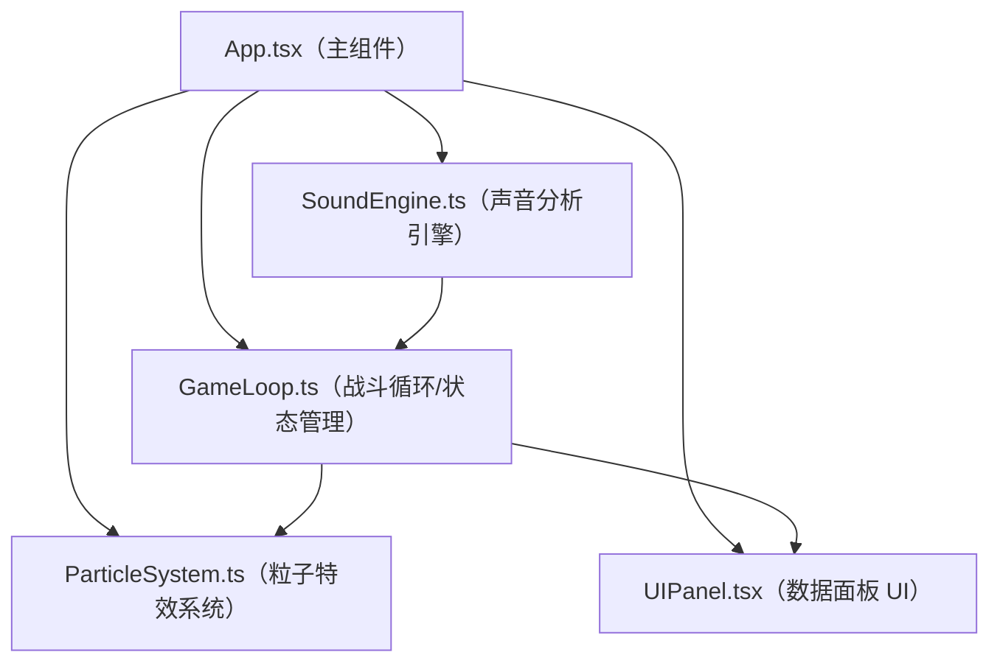

## 1. 架构设计



## 2. 技术选型描述

- 前端框架：React 18 + TypeScript
- 构建工具：Vite
- 状态管理：Zustand
- 音频分析：Web Audio API（AnalyserNode FFT）
- 渲染层：HTML5 Canvas 2D
- 唯一标识：uuid
- 样式：原生 CSS（styles.css）

## 3. 模块接口定义

### 3.1 SoundEngine 模块接口
```typescript
interface SoundFeatures {
  frequency: number;    // 0-1000 Hz
  amplitude: number;    // 0-1
  bpm: number;          // 节奏 BPM
  isActive: boolean;    // 是否有有效声音输入
}

interface SoundEngine {
  start(): Promise<void>;
  stop(): void;
  triggerSimulated(skillId: number): void;
  subscribe(callback: (features: SoundFeatures) => void): () => void;
}
```

### 3.2 ParticleSystem 模块接口
```typescript
interface Particle {
  id: string;
  x: number;
  y: number;
  vx: number;
  vy: number;
  color: string;
  life: number;
  maxLife: number;
  size: number;
  trail: { x: number; y: number }[];
}

interface ParticleSystem {
  emit(skillId: string, x: number, y: number, combo: boolean): void;
  update(deltaTime: number): void;
  render(ctx: CanvasRenderingContext2D): void;
  getCount(): number;
}
```

### 3.3 GameLoop 状态接口（Zustand Store）
```typescript
interface SkillState {
  id: string;
  name: string;
  cooldownRemaining: number;
  color: string;
  condition: {
    freqMin: number;
    freqMax: number;
    minAmplitude: number;
  };
}

interface GameState {
  skills: SkillState[];
  soundFeatures: SoundFeatures;
  hitCount: number;
  totalAttempts: number;
  hitRate: number;
  screenShake: number;
  lastSkillTime: number;
  lastSkillId: string | null;
  triggerSkill: (id: string) => void;
  updateSoundFeatures: (f: SoundFeatures) => void;
  tick: (deltaTime: number) => void;
}
```

### 3.4 技能映射表
| 技能 ID | 技能名称 | 频率范围 | 最小振幅 | 颜色 | 按键 |
|---------|----------|----------|----------|------|------|
| impact | 音波冲击 | 800-1000Hz | 0.6 | #00d4ff | 1 |
| shield | 护盾共鸣 | 200-400Hz | 0.3 | #ffd700 | 2 |
| blade | 音刃斩 | 600-800Hz | 0.7 | #ff4444 | 3 |
| shockwave | 震荡波 | 400-600Hz | 0.5 | #aa00ff | 4 |
| echo | 回声陷阱 | 100-200Hz | 0.4 | #00ff88 | 5 |

## 4. 文件结构

```
project-root/
├── package.json
├── vite.config.js
├── tsconfig.json
├── index.html
└── src/
    ├── SoundEngine.ts      # 声音分析引擎
    ├── GameLoop.ts         # Zustand 状态管理 + 游戏循环逻辑
    ├── ParticleSystem.ts   # 粒子特效系统
    ├── UIPanel.tsx         # 实时数据面板 React 组件
    ├── App.tsx             # 主组件（Canvas + 按钮区 + 面板）
    ├── main.tsx            # React 入口
    └── styles.css          # 全局样式
```

## 5. 性能优化策略

- 粒子池化：限制最大粒子数 100，超出时复用最旧粒子
- RAF 节流：requestAnimationFrame 统一驱动游戏循环与渲染
- 状态分片：Zustand 选择器避免不必要的组件重渲染
- 数据缓存：BPM 计算使用滑动窗口，避免每帧全量重算
- Canvas 分层：粒子特效与背景独立渲染策略
