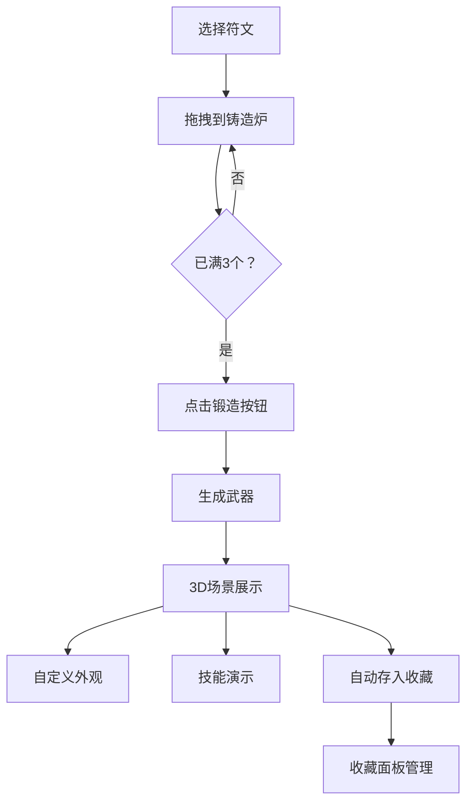

## 1. 产品概述
符文工坊是一款基于Web的3D武器锻造交互应用，玩家通过组合古代符文石铸造带有独特魔法效果的武器，实时3D渲染展示武器并支持技能演示。
- 主要目的：提供沉浸式的武器锻造体验，结合符文合成、3D展示、自定义外观和技能演示
- 目标用户：游戏爱好者、魔法/奇幻题材爱好者
- 产品价值：将复杂的3D渲染技术与直观的拖拽交互结合，创造独特的数字铸造体验

## 2. 核心功能

### 2.1 Feature Module
1. **符文合成模块**：拖拽符文到铸造炉，组合生成武器
2. **武器展示与交互模块**：3D实时渲染武器，支持旋转缩放和部位点击
3. **自定义外观模块**：调整武器颜色、金属质感、光晕强度
4. **技能演示模块**：播放武器技能连击动画和伤害数值
5. **武器收藏与加载模块**：本地存储收藏武器，支持加载和删除

### 2.3 Page Details
| 页面名称 | 模块名称 | 功能描述 |
|---------|---------|---------|
| 主页面 | 符文库 | 8种基础符文展示，支持拖拽到铸造炉，可折叠 |
| 主页面 | 铸造炉 | 六边形容器，接收符文拖放，边框渐变，粒子效果，锻造按钮 |
| 主页面 | 3D场景 | Three.js渲染武器，自动旋转，鼠标交互，技能动画 |
| 主页面 | 属性面板 | 武器属性展示，颜色/质感/光晕调节滑块 |
| 主页面 | 收藏抽屉 | 右侧滑出，武器列表展示，加载/删除操作 |

## 3. 核心流程
用户从左侧符文库拖拽符文到中央铸造炉 → 放置3个符文后点击锻造按钮 → 系统生成武器并在3D场景展示 → 用户可调整外观参数 → 点击演示按钮播放技能动画 → 武器自动存入收藏 → 可从收藏面板加载历史武器

## 4. User Interface Design

### 4.1 Design Style
- **主色调**：深色主题，背景#1a1a2e，主色#e94560，辅色#0f3460，文字#ffffff
- **按钮风格**：圆形锻造按钮（直径64px，青铜色渐变），悬停有炽热光晕；演示按钮透明背景2px边框，悬停半透明填充
- **字体**：使用Cinzel Decorative作为标题字体（奇幻风格），Noto Sans SC作为正文字体
- **布局风格**：三栏布局，左栏符文库可折叠，中央3D场景，右栏属性面板+收藏
- **动画效果**：0.25秒过渡动画，悬停上浮transform: translateY(-4px)，阴影增强

### 4.2 Page Design Overview
| 页面名称 | 模块名称 | UI Elements |
|---------|---------|-------------|
| 主页面 | 符文库 | 8个符文卡片，颜色编码，拖拽源，悬停放大效果 |
| 主页面 | 铸造炉 | 六边形边框，内部粒子效果，锻造按钮居中 |
| 主页面 | 3D场景 | 深色背景，金色微粒子漂浮，武器自动旋转，流光效果 |
| 主页面 | 属性面板 | 12色色环，粗糙度滑块，光晕强度滑块 |
| 主页面 | 收藏抽屉 | 右侧滑入0.3秒ease-out，卡片列表，删除按钮 |

### 4.3 Responsiveness
- 桌面端（>768px）：三栏布局，左栏可折叠，右栏可拖拽调整宽度（最小300px）
- 移动端（≤768px）：左右栏变为顶部和底部固定面板，3D场景占满剩余空间
- 触摸优化：符文拖拽支持触摸事件，3D场景支持双指缩放

### 4.4 3D Scene Guidance
- **环境**：深色空间背景，漂浮金色微粒子（20个/帧，2-4px随机大小，半透明）
- **光照**：主光源暖白色（强度1.2），环境光（强度0.4），边缘光（强度0.6）突出武器轮廓
- **相机**：透视相机，初始距离5，fov=60度，轨道控制器支持旋转缩放
- **武器组成**：刃（主体）、柄（握持）、装饰宝石（发光）三部分，支持独立材质调整
- **动画**：自动旋转0.02 rad/s，流光效果沿UV流动（流速与攻击力正相关）
- **后处理**：轻微泛光效果，增强魔法氛围
- **性能目标**：帧率保持30fps以上，拖拽响应延迟低于50ms

## 5. 交互细节
- **符文拖拽**：HTML5 Drag & Drop API，拖拽时半透明跟随效果
- **铸造炉放置**：拖放区域高亮，边框颜色根据符文元素占比渐变
- **锻造动画**：粒子爆发效果，武器从粒子中凝聚显现
- **武器点击**：点击刃/柄/宝石部位弹出放大提示框（0.3秒弹性动画）
- **技能演示**：5秒连击动画，包含3次攻击+1次符文能量释放，伤害浮字上升淡出
- **收藏滑出**：右侧抽屉从右向左滑入，0.3秒ease-out动画
