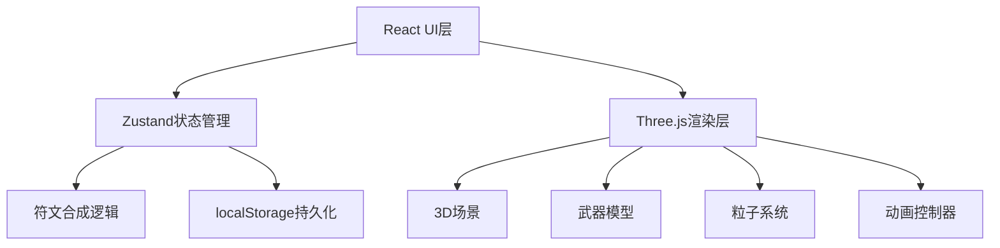

## 1. Architecture Design


## 2. Technology Description
- **前端**：React@18 + TypeScript + Vite
- **3D渲染**：Three.js@0.160（原生Three.js，不使用React Three Fiber）
- **状态管理**：Zustand@4
- **唯一ID**：uuid@9
- **样式**：原生CSS + CSS变量，不使用Tailwind
- **构建工具**：Vite@5 + @vitejs/plugin-react@4

## 3. Route Definitions
| 路由 | 用途 |
|------|------|
| / | 主页面（唯一页面，单页应用） |

## 4. Module Architecture
```
src/
├── types.ts          # 类型定义（符文、武器、属性等接口）
├── store.ts          # Zustand全局状态管理
├── App.tsx           # 主应用入口
├── main.tsx          # React渲染入口
├── index.css         # 全局样式和CSS变量
├── RuneLibrary.tsx   # 左侧符文库组件（可折叠）
├── ForgeScene.tsx    # 中央3D铸造场景组件
└── ControlPanel.tsx  # 右侧控制面板组件
```

## 5. Data Model

### 5.1 Type Definitions
```typescript
// 元素类型
type ElementType = 'fire' | 'water' | 'earth' | 'wind' | 'lightning' | 'ice' | 'light' | 'dark';

// 稀有度
type Rarity = 'common' | 'rare' | 'epic' | 'legendary';

// 符文接口
interface Rune {
  id: string;
  name: string;
  element: ElementType;
  color: string;
  rarity: Rarity;
  icon: string;
}

// 武器接口
interface Weapon {
  id: string;
  name: string;
  baseAttack: number;
  element: ElementType;
  subStats: {
    type: string;
    value: number;
  }[];
  particleColor: string;
  createdAt: number;
  customization: {
    baseColor: string;
    roughness: number;
    glowIntensity: number;
  };
}

// 应用状态
interface AppState {
  runeLibrary: Rune[];
  forgeSlots: (Rune | null)[];
  currentWeapon: Weapon | null;
  collection: Weapon[];
  isForging: boolean;
  isDemoPlaying: boolean;
  leftPanelCollapsed: boolean;
  rightPanelWidth: number;
}
```

### 5.2 Data Flow
1. 符文拖拽 → 更新forgeSlots状态 → 触发铸造炉UI更新
2. 点击锻造 → 调用forgeWeapon() → 根据符文组合计算武器属性 → 生成Weapon对象
3. 武器生成 → 更新currentWeapon → 触发3D场景重新渲染武器
4. 自定义调整 → 更新customization → 实时更新3D模型材质
5. 收藏武器 → 添加到collection数组 → localStorage持久化
6. 加载收藏 → 从collection选取 → 设置为currentWeapon

## 6. Key Implementation Points

### 6.1 符文合成算法
- 基础攻击力 = 符文稀有度权重之和 × 10 + 随机波动（±10%）
- 主元素 = 占比最高的元素（相同则按优先级选择）
- 附加属性数量 = 稀有符文数量 + 1（最多3条）
- 武器名称 = 元素前缀 + 稀有度后缀 + 随机武器类型

### 6.2 Three.js 渲染架构
- ForgeScene组件使用useRef管理Three.js对象（scene, camera, renderer）
- 使用useEffect初始化场景，清理函数销毁资源
- 独立的animation loop，使用requestAnimationFrame
- 武器模型使用Three.js内置几何体组合生成（BoxGeometry, CylinderGeometry, SphereGeometry）
- 流光效果使用ShaderMaterial实现，自定义vertex/fragment shader

### 6.3 性能优化
- 3D渲染使用独立的canvas，避免与React重渲染冲突
- 粒子对象池复用，避免频繁创建销毁
- 状态更新时使用Zustand的selector避免不必要重渲染
- 拖拽操作使用原生Drag事件，不使用重渲染密集的库

### 6.4 状态管理分区
- forge相关：符文槽位、锻造状态
- weapon相关：当前武器、自定义参数
- collection相关：武器列表、localStorage同步
- ui相关：面板折叠状态、宽度、动画状态
