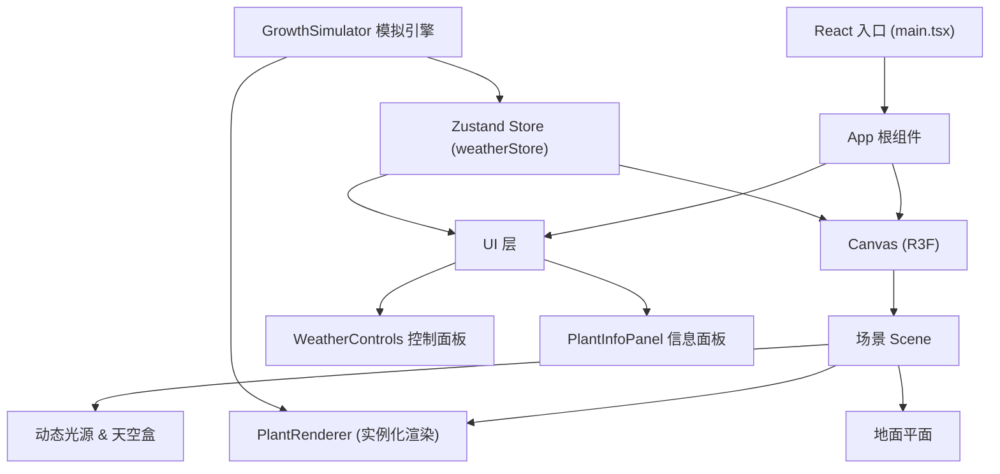

## 1. 架构设计



## 2. 技术描述
- **前端框架**：React 18 + TypeScript 5
- **构建工具**：Vite 5
- **3D渲染**：Three.js + @react-three/fiber + @react-three/drei
- **状态管理**：Zustand 4
- **工具库**：lodash
- **状态共享**：Zustand单一store管理天气参数、生态时间、植物数据和选中状态

## 3. 核心目录结构
```
src/
├── main.tsx              # 应用入口，挂载React和Canvas
├── App.tsx               # 根组件，组合3D场景与UI
├── index.css             # 全局样式
├── store/
│   └── weatherStore.ts   # Zustand全局状态
├── components/
│   ├── GrowthSimulator.ts    # 核心生长算法（纯TS类）
│   ├── PlantRenderer.tsx     # R3F组件，实例化渲染植物
│   ├── WeatherControls.tsx   # 天气控制面板UI
│   ├── PlantInfoPanel.tsx    # 植物详情面板
│   ├── SceneEnvironment.tsx  # 天空盒、光源、地面
│   └── HealthGlow.tsx        # 植物选中发光罩
└── types/
    └── index.ts          # 类型定义（Plant, Weather, Species等）
```

## 4. 数据模型

### 4.1 类型定义
```typescript
type Species = 'tree' | 'shrub' | 'vine' | 'grass';
type WeatherMode = 'sunny' | 'cloudy' | 'rainy' | 'dusty';
type GrowthStage = 'seedling' | 'mature' | 'aging';

interface WeatherParams {
  temperature: number;  // -10 ~ 45 ℃
  humidity: number;     // 0 ~ 100 %
  light: number;        // 0 ~ 2000 lux
  windSpeed: number;    // 0 ~ 20 m/s
}

interface Plant {
  id: string;
  species: Species;
  position: [number, number, number];  // x, y, z
  age: number;           // 模拟天数
  height: number;        // 当前高度
  maxHeight: number;     // 物种最大高度
  leafCount: number;
  maxLeaves: number;
  orientation: number;   // 朝向角度（弧度）
  tilt: number;          // 倾斜角度（受风/光影响）
  health: number;        // 0 ~ 100
  stage: GrowthStage;
  leafColor: string;     // 当前叶片颜色
  segments: number;      // 分段数（随生长增加）
}

interface WeatherStore {
  weather: WeatherParams;
  targetWeather: WeatherParams;
  weatherMode: WeatherMode;
  timeScale: 1 | 2 | 5 | 10;
  ecoDay: number;          // 已模拟天数
  plants: Plant[];
  selectedPlantId: string | null;
  setWeather: (p: Partial<WeatherParams>) => void;
  setWeatherMode: (mode: WeatherMode) => void;
  setTimeScale: (s: 1 | 2 | 5 | 10) => void;
  selectPlant: (id: string | null) => void;
  tick: (deltaMs: number) => void;
  initPlants: () => void;
}
```

## 5. 关键技术决策

### 5.1 实例化渲染
- 使用 `THREE.InstancedMesh` 对同一物种的植物进行批处理，减少draw call
- 每个物种维护一个InstancedMesh，通过instanceMatrix更新每株植物的位置/旋转/缩放

### 5.2 LOD策略
- 相机距离 < 30：叶片全分段（乔木12段/灌木8段/藤蔓6段/草4段）
- 相机距离 30-60：叶片减少50%分段
- 相机距离 > 60：使用简化十字面片

### 5.3 生长模拟循环
- 由R3F的 `useFrame` hook驱动，每帧调用 `weatherStore.tick(delta)`
- 生态时间缩放：`simulatedDelta = realDelta * timeScale`
- 天气参数平滑过渡：`lerp(current, target, 1 - Math.pow(0.001, delta/2000))` 实现2s过渡

### 5.4 植物健康度计算
```
health = 
  clamp(100 
    - |temperature - 25| * 1.5          // 偏离最适温度25℃扣分
    - |humidity - 60| * 0.8             // 偏离最适湿度60%扣分
    - |light - 1000| * 0.02             // 偏离最适光照扣分
    + windSpeed * (windSpeed > 12 ? -2 : 0.5),  // 大风扣分，微风加分
  0, 100)
```

### 5.5 颜色渐变
- 健康(80-100)：#aaffaa → #44cc44（嫩绿→深绿）
- 亚健康(40-80)：#ffcc44（黄色）
- 不健康(0-40)：#ff6666 → #8b4513（红→褐）

### 5.6 性能优化
- React.memo包装所有UI子组件
- useCallback缓存事件处理函数
- Zustand selector避免不必要重渲染
- requestAnimationFrame驱动渲染，目标60FPS
- 植物数据批量更新，减少React状态更新频率
