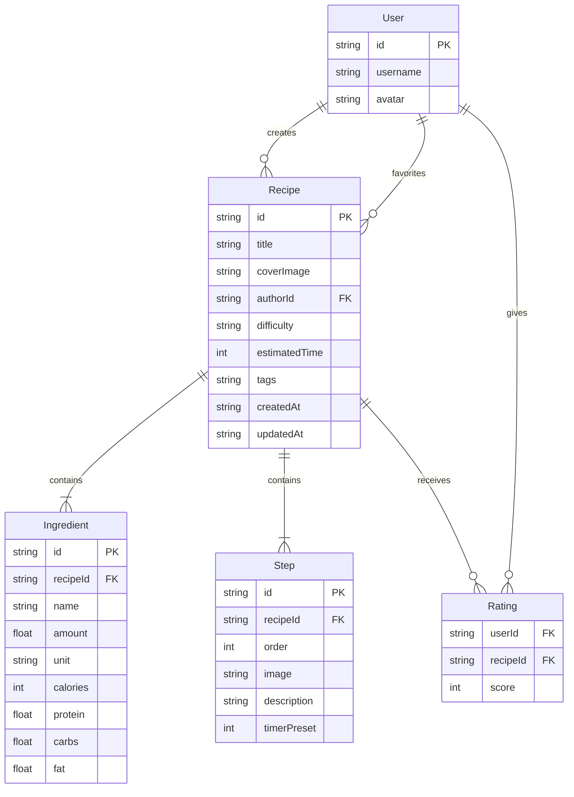

## 1. 架构设计

```mermaid
flowchart TB
    subgraph "前端 (React + Zustand)"
        "RecipeList 页面" --> "API模块"
        "RecipeEditor 页面" --> "API模块"
        "RecipeEditor 页面" --> "Socket.IO Client"
        "Zustand Store" --> "RecipeList 页面"
        "Zustand Store" --> "RecipeEditor 页面"
    end
    subgraph "后端 (Express + Socket.IO)"
        "REST API 路由" --> "RecipeStore 内存存储"
        "Socket.IO 实时协作" --> "RecipeStore 内存存储"
    end
    "API模块" --> "REST API 路由"
    "Socket.IO Client" --> "Socket.IO 实时协作"
```

## 2. 技术说明

- 前端：React 18 + TypeScript + Zustand + Tailwind CSS + Vite
- 路由：react-router-dom
- 后端：Express 4 + Socket.IO
- 数据存储：内存存储（RecipeStore），启动时预置示例数据
- 实时协作：Socket.IO WebSocket
- 构建工具：Vite
- 初始化工具：vite-init（react-express-ts 模板）

## 3. 路由定义

| 路由 | 用途 |
|------|------|
| / | 首页，展示食谱卡片列表和搜索 |
| /recipe/:id | 食谱详情页 |
| /editor/:id | 编辑已有食谱（多人协作） |
| /editor/new | 创建新食谱 |
| /profile | 个人中心（我的食谱和收藏） |
| /login | 登录/注册页 |

## 4. API定义

### 4.1 食谱相关

| 方法 | 路径 | 说明 | 请求体 | 响应 |
|------|------|------|--------|------|
| GET | /api/recipes | 获取食谱列表（支持search和tag查询参数） | - | Recipe[] |
| GET | /api/recipes/:id | 获取单个食谱详情 | - | Recipe |
| POST | /api/recipes | 创建新食谱 | CreateRecipeDTO | Recipe |
| PUT | /api/recipes/:id | 更新食谱 | UpdateRecipeDTO | Recipe |
| DELETE | /api/recipes/:id | 删除食谱 | - | { success: boolean } |

### 4.2 用户相关

| 方法 | 路径 | 说明 | 请求体 | 响应 |
|------|------|------|--------|------|
| POST | /api/auth/register | 注册 | { username, password } | User |
| POST | /api/auth/login | 登录 | { username, password } | User |
| GET | /api/users/:id | 获取用户信息 | - | User |

### 4.3 互动相关

| 方法 | 路径 | 说明 | 请求体 | 响应 |
|------|------|------|--------|------|
| POST | /api/recipes/:id/favorite | 收藏食谱 | { userId } | { success: boolean } |
| DELETE | /api/recipes/:id/favorite | 取消收藏 | { userId } | { success: boolean } |
| POST | /api/recipes/:id/rate | 评分 | { userId, score: 1-5 } | { avgScore, totalRaters } |
| POST | /api/recipes/:id/like | 点赞 | { userId } | { likes } |

### 4.4 WebSocket事件

| 事件名 | 方向 | 数据 | 说明 |
|--------|------|------|------|
| join-recipe | Client→Server | { recipeId, userId } | 加入食谱协作房间 |
| leave-recipe | Client→Server | { recipeId, userId } | 离开食谱协作房间 |
| recipe-update | Client→Server | { recipeId, changes } | 发送编辑更改 |
| recipe-updated | Server→Client | { recipeId, changes } | 广播编辑更改给其他协作者 |
| collaborators-update | Server→Client | { users: User[] } | 更新在线协作者列表 |

### 4.5 TypeScript类型定义

```typescript
interface Ingredient {
  id: string;
  name: string;
  amount: number;
  unit: string;
  calories: number;
  protein: number;
  carbs: number;
  fat: number;
}

interface Step {
  id: string;
  order: number;
  image: string;
  description: string;
  timerPreset?: number;
}

interface Recipe {
  id: string;
  title: string;
  coverImage: string;
  authorId: string;
  authorName: string;
  difficulty: "easy" | "medium" | "hard";
  estimatedTime: number;
  tags: string[];
  ingredients: Ingredient[];
  steps: Step[];
  ratings: { userId: string; score: number }[];
  likes: string[];
  favorites: string[];
  createdAt: string;
  updatedAt: string;
}

interface User {
  id: string;
  username: string;
  avatar: string;
  createdRecipes: string[];
  favoritedRecipes: string[];
}
```

## 5. 服务器架构

```mermaid
flowchart LR
    "Express Router" --> "RecipeService"
    "Socket.IO Handler" --> "RecipeService"
    "RecipeService" --> "RecipeStore 内存存储"
    "RecipeService" --> "UserService"
    "UserService" --> "UserStore 内存存储"
```

## 6. 数据模型

### 6.1 数据模型定义



### 6.2 初始化数据

项目启动时预置3-5个示例食谱和2-3个示例用户，确保首页即有内容展示。示例数据包含完整的配料、步骤、评分和收藏信息。
