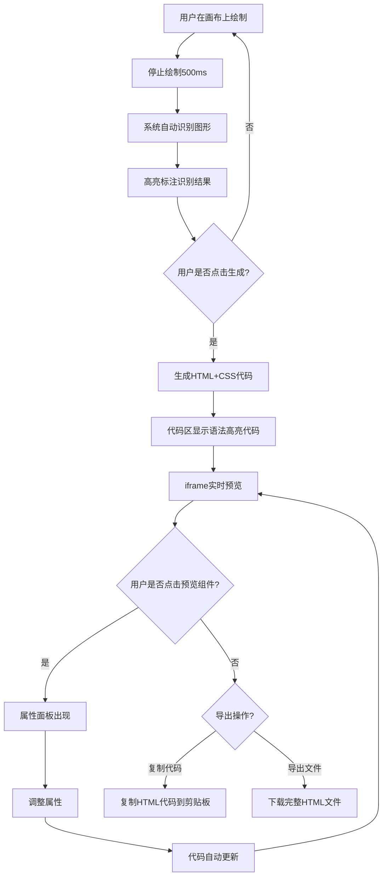

## 1. 产品概述

手绘草图转HTML/CSS在线工具，旨在解决设计师与前端开发者之间因沟通不准确导致的反复修改问题。用户在画布上手绘UI草图，系统自动识别图形类型并生成对应的HTML+CSS代码，支持实时预览与属性调整。

- 目标用户：UI设计师、前端开发者、产品经理
- 核心价值：将手绘草图快速转化为可用的前端代码，减少设计与开发间的沟通成本

## 2. 核心功能

### 2.1 用户角色
| 角色 | 使用方式 | 核心权限 |
|------|----------|----------|
| 普通用户 | 直接访问 | 绘制草图、生成代码、调整属性、导出文件 |

### 2.2 功能模块
1. **主页（单页应用）**：画布绘制区、代码预览区、属性面板、工具栏

### 2.3 页面详情
| 页面名称 | 模块名称 | 功能描述 |
|----------|----------|----------|
| 主页 | 顶部工具栏 | 撤销、重做、清空画布、一键生成按钮 |
| 主页 | 画布区 | 800x600像素Canvas，支持鼠标/触控笔绘制矩形、圆形、文本框，网格背景，停止绘制500ms后自动识别 |
| 主页 | 代码预览区 | 右侧实时显示HTML+CSS代码（语法高亮），底部iframe实时预览 |
| 主页 | 属性面板 | 选中组件后显示宽度、高度、背景色、圆角调整，调整后代码自动更新 |
| 主页 | 可拖拽分隔条 | 左右分栏中间4px分隔条，支持拖拽调整比例 |

## 3. 核心流程

用户在画布上手绘UI组件 → 系统在500ms无操作后自动识别图形类型（矩形/圆形/文本） → 识别结果以半透明边界高亮标注 → 用户点击"生成"按钮 → 系统生成HTML+CSS代码 → 右侧代码区显示带语法高亮的代码 → 底部iframe实时预览渲染效果 → 用户点击预览中的组件 → 属性面板出现 → 调整属性后代码自动更新 → 用户复制代码或导出HTML文件

## 4. 用户界面设计

### 4.1 设计风格
- 主色：蓝色 #4a6cf7，辅色：深灰 #2c3e50
- 背景色：白色 #ffffff，画布背景 #f5f5f5
- 按钮风格：圆角6px，主色按钮#4a6cf7，普通按钮淡灰#f0f0f0
- 字体：系统字体栈，代码区monospace 14px
- 布局风格：左右分栏，顶部工具栏
- 极简风格，白+深灰为主，蓝色强调

### 4.2 页面设计概览
| 页面名称 | 模块名称 | UI元素 |
|----------|----------|--------|
| 主页 | 顶部工具栏 | 水平排列按钮，淡灰底色#f0f0f0，hover #e0e0e0，生成按钮主色#4a6cf7圆角6px |
| 主页 | 画布区 | 800x600 Canvas，#f5f5f5背景，#ddd 1px网格线，深蓝#2c3e50画笔3px |
| 主页 | 代码预览区 | monospace字体14px，语法高亮，下方iframe预览 |
| 主页 | 属性面板 | 宽度300px，输入框/取色器/滑块，右侧弹出 |
| 主页 | 分隔条 | 4px宽，主色#4a6cf7，可拖拽 |

### 4.3 响应式适配
- 桌面优先，最小宽度480px
- 页面宽度<1024px时左右布局切换为上下布局
- 画布区占60%，代码区占40%

### 4.4 识别结果颜色方案
- 矩形：蓝色 rgba(52,152,219,0.3)
- 圆形：绿色 rgba(46,204,113,0.3)
- 文本：橙色 rgba(243,156,18,0.3)
- 选中组件：虚线边框 #e74c3c 2px
- 弹性动画：cubic-bezier(0.175, 0.885, 0.32, 1.275) 0.3s
