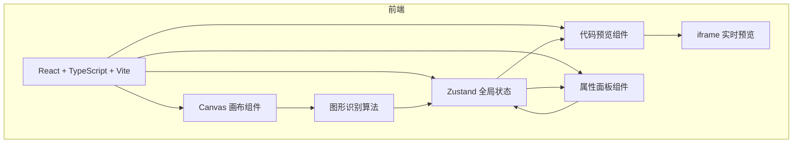

## 1. 架构设计



## 2. 技术说明
- 前端：React@18 + TypeScript + Vite + Tailwind CSS
- 初始化工具：vite-init (react-ts 模板)
- 状态管理：Zustand
- 后端：无
- 数据库：无（纯前端应用）

## 3. 路由定义
| 路由 | 用途 |
|------|------|
| / | 单页应用主页面，包含所有功能模块 |

## 4. 文件结构
```
├── package.json
├── index.html
├── vite.config.js
├── tsconfig.json
├── src/
│   ├── main.tsx                    # 应用入口
│   ├── App.tsx                     # 主布局组件
│   ├── store/
│   │   └── useAppStore.ts          # Zustand全局状态
│   ├── components/
│   │   ├── Canvas.tsx              # 画布组件
│   │   ├── CodePreview.tsx         # 代码预览+iframe渲染
│   │   └── PropertyPanel.tsx       # 属性面板
│   └── utils/
│       └── shapeRecognizer.ts      # 图形识别算法
```

## 5. 状态管理设计（Zustand）

```typescript
interface Shape {
  id: string;
  type: 'rectangle' | 'circle' | 'text';
  x: number;
  y: number;
  width: number;
  height: number;
  points?: { x: number; y: number }[];  // 原始轨迹点
  style: {
    backgroundColor: string;
    borderRadius: number;
  };
}

interface AppState {
  shapes: Shape[];
  recognizedShapes: Shape[];
  generatedCode: string;
  selectedShapeId: string | null;
  history: Shape[][];
  historyIndex: number;
}
```

## 6. 图形识别算法

### 核心逻辑
1. **轨迹采集**：记录用户绘制过程中的所有鼠标/触控点坐标
2. **预处理**：对轨迹点进行采样平滑（Douglas-Peucker算法简化）
3. **特征提取**：
   - 计算轨迹的边界框（bounding box）
   - 计算轨迹面积与边界框面积之比（填充率）
   - 计算轨迹的闭合度（起终点距离/轨迹总长）
   - 计算轨迹的圆度（4π×面积/周长²）
4. **分类规则**：
   - 矩形：闭合度高 + 填充率在0.7-1.0之间 + 有明显直角
   - 圆形：闭合度高 + 圆度>0.7
   - 文本：闭合度低 + 轨迹宽度较窄 + 水平延伸

### 性能要求
- 从绘制完成到识别结果显示 ≤ 2秒
- 识别准确率 ≥ 85%
