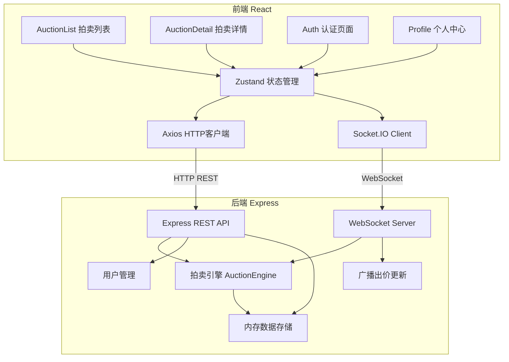
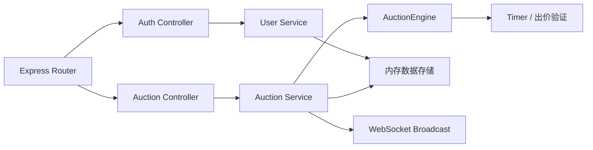
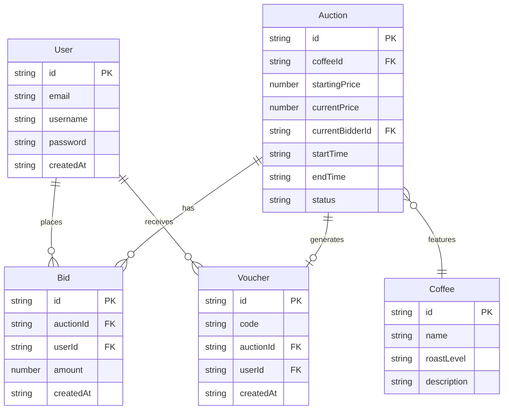

## 1. 架构设计



## 2. 技术说明
- **前端**：React@18 + TypeScript + TailwindCSS@3 + Vite
- **初始化工具**：vite-init (react-express-ts 模板)
- **状态管理**：Zustand
- **HTTP客户端**：Axios
- **后端**：Express@4 + TypeScript
- **实时通信**：ws (WebSocket) + socket.io-client
- **唯一ID生成**：uuid
- **数据库**：内存数据存储（Map结构），模拟数据库

## 3. 路由定义
| 路由 | 用途 |
|------|------|
| / | 拍卖列表首页 |
| /auction/:id | 拍卖详情页 |
| /login | 用户登录 |
| /register | 用户注册 |
| /profile | 个人中心（历史记录+兑换券） |

## 4. API定义

### 4.1 用户相关
```typescript
POST /api/auth/register
Request: { email: string; username: string; password: string }
Response: { user: User; token: string }

POST /api/auth/login
Request: { email: string; password: string }
Response: { user: User; token: string }

GET /api/users/me
Headers: { Authorization: string }
Response: User

GET /api/users/me/bids
Headers: { Authorization: string }
Response: Bid[]

GET /api/users/me/vouchers
Headers: { Authorization: string }
Response: Voucher[]
```

### 4.2 拍卖相关
```typescript
GET /api/auctions
Response: Auction[]

GET /api/auctions/:id
Response: AuctionDetail

POST /api/auctions/:id/bids
Headers: { Authorization: string }
Request: { amount: number }
Response: Bid
```

### 4.3 数据类型定义
```typescript
interface User {
  id: string;
  email: string;
  username: string;
  createdAt: string;
}

interface Coffee {
  id: string;
  name: string;
  roastLevel: "light" | "medium" | "dark";
  description: string;
  imageUrl?: string;
}

interface Auction {
  id: string;
  coffee: Coffee;
  startingPrice: number;
  currentPrice: number;
  currentBidder?: string;
  startTime: string;
  endTime: string;
  status: "upcoming" | "active" | "ended";
  bidCount: number;
}

interface AuctionDetail extends Auction {
  bids: Bid[];
}

interface Bid {
  id: string;
  auctionId: string;
  userId: string;
  username: string;
  amount: number;
  createdAt: string;
}

interface Voucher {
  id: string;
  code: string;
  auctionId: string;
  coffeeName: string;
  userId: string;
  createdAt: string;
}
```

## 5. 服务端架构图



## 6. 数据模型

### 6.1 数据模型定义



### 6.2 WebSocket消息协议

```typescript
// 客户端发送
interface ClientMessage {
  type: "place_bid";
  payload: { auctionId: string; amount: number; userId: string };
}

// 服务端广播
interface ServerMessage {
  type: "bid_update" | "auction_ended" | "auction_started";
  payload: {
    auctionId: string;
    currentPrice?: number;
    currentBidder?: string;
    bid?: Bid;
    winner?: string;
    voucherCode?: string;
  };
}
```
