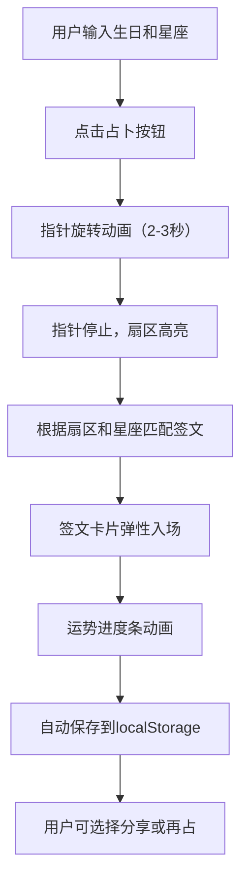

## 1. 产品概述

数字玄学占卜盘是一款融合东方玄学与现代视觉设计的在线占卜应用。用户通过输入生日和选择星座，体验动态旋转的八宫占卜盘，获得个性化的签文解析与运势指引。

- 核心价值：以沉浸式视觉体验呈现传统占卜文化，为用户提供娱乐性与仪式感兼具的命运探索
- 目标用户：对玄学、星座、占卜文化感兴趣的年轻群体

## 2. 核心功能

### 2.1 用户角色

| 角色 | 注册方式 | 核心权限 |
|------|----------|----------|
| 访客用户 | 无需注册 | 使用占卜功能、查看历史记录、切换主题 |

### 2.2 功能模块

1. **占卜盘旋转模块**：八分区动态圆盘、双层旋转金环、指针缓动动画、扇区高亮效果
2. **签文解析模块**：64条签文智能匹配、弹性入场动画、运势进度条、分享与再占功能
3. **历史记录模块**：localStorage 本地存储、缩略卡片水平滚动、历史结果回溯
4. **主题定制模块**：占星/巫术双主题切换、全局颜色联动过渡、星系渐变背景

### 2.3 页面详情

| 页面名称 | 模块名称 | 功能描述 |
|----------|----------|----------|
| 主页面 | 输入区域 | 日期选择器（圆角8px，边框#aaa，聚焦变金#d4a762）、星座下拉选择、圆形占卜按钮（直径56px，金棕渐变，1px金色描边，点击收缩0.2闪烁） |
| 主页面 | 占卜盘区域 | Canvas 八分区圆盘（直径420px，半透明放射渐变）、双层金环（外环6s正向旋转，内环4s反向）、指针（长180px，棕红#8b4513，三角箭头）、旋转动画（2-3秒由慢到快再减速停止）、扇区高亮（亮度+30%，1.5秒） |
| 主页面 | 签文卡片区域 | 竖排楷体签文（深褐#3b2314，行高1.8）、运势进度条（0-100，圆角6px，分段颜色）、弹性入场动画（translateY 60px→0，0.5s cubic-bezier）、分享/再占按钮 |
| 主页面 | 历史记录区域 | 缩略卡片（高48px，2行滚动，间距8px，hover上移4px）、最多30条记录、最近结果自动高亮、点击回溯完整签文 |
| 主页面 | 主题切换 | 双圆形按钮（金色占星/银色巫术）、0.6秒渐变过渡、背景与盘面颜色联动、过渡透明度0.5动画 |

## 3. 核心流程

用户输入生日与星座 → 点击占卜按钮 → 指针开始旋转（加速2-3秒后减速停止） → 扇区高亮 → 匹配签文 → 签文卡片弹性入场 → 运势进度条动画 → 自动保存至历史记录 → 用户可分享或再次占卜

## 4. 用户界面设计

### 4.1 设计风格

- **主色调**：暗紫 #1a1a2e、深蓝 #0f0c29
- **辅助色**：金色 #d4a762、银色 #c0c0c0、棕红 #8b4513
- **字体**：思源宋体/衬线系，签文使用楷体
- **布局**：三列式（左占卜盘、中签文、下历史），移动端堆叠单列
- **动效**：所有 transition 使用 transform 和 opacity 实现 GPU 加速
- **交互反馈**：hover 时阴影扩散（4px 浅金半透明）或亮度提升（+15%）

### 4.2 页面设计概述

| 页面名称 | 模块名称 | UI 元素 |
|----------|----------|----------|
| 主页面 | 输入区域 | 日期选择器（圆角8px）、星座选择器、圆形占卜按钮（渐变+描边+点击动效） |
| 主页面 | 占卜盘 | Canvas 420px 八分区、放射渐变扇区、双层旋转金环、指针动画、扇区高亮 |
| 主页面 | 签文卡片 | 竖排文字、弹性入场、进度条渐变、分享/再占按钮 |
| 主页面 | 历史记录 | 水平滚动卡片、日期/主题/数值展示、hover 动效 |
| 主页面 | 主题切换 | 双圆形按钮、0.6秒全局过渡、透明度闪烁效果 |

### 4.3 响应式

- **桌面端**（≥768px）：三列布局，占卜盘 420px
- **移动端**（<768px）：单列堆叠布局，占卜盘缩小至 280px，字体相应缩小
- **触摸优化**：按钮最小点击区域 48px，滚动流畅

### 4.4 视觉细节

- **背景**：星系径向渐变，从 #1a1a2e 过渡到 #0f0c29
- **占卜盘扇区**：8个半透明渐变色，中心放射状模糊过渡
- **运势颜色**：<30 红色 #c0392b、30-70 橙色 #d4a762、>70 绿色 #27ae60
- **动画帧率**：占卜盘旋转稳定 55FPS 以上
