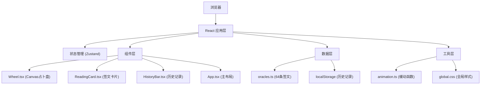

## 1. 架构设计



## 2. 技术描述

- **前端框架**：React 18 + TypeScript 5
- **构建工具**：Vite 5
- **状态管理**：Zustand 4
- **样式方案**：原生 CSS + CSS 变量
- **图形渲染**：HTML5 Canvas API
- **动画方案**：requestAnimationFrame + CSS transition/transform

## 3. 项目结构

```
auto52/
├── index.html                    # 入口HTML
├── package.json                  # 项目配置
├── vite.config.js                # Vite配置
├── tsconfig.json                 # TypeScript配置
└── src/
    ├── main.tsx                  # React入口
    ├── App.tsx                   # 主组件（布局+状态）
    ├── components/
    │   ├── Wheel.tsx             # Canvas占卜盘组件
    │   ├── ReadingCard.tsx       # 签文卡片组件
    │   └── HistoryBar.tsx        # 历史记录组件
    ├── data/
    │   └── oracles.ts            # 64条签文数据
    ├── utils/
    │   └── animation.ts          # 动画工具函数
    └── styles/
        └── global.css            # 全局样式
```

## 4. 数据模型

### 4.1 核心类型定义

```typescript
// 主题类型
type Theme = 'astrology' | 'witchcraft';

// 星座类型
type ZodiacSign = 'aries' | 'taurus' | 'gemini' | 'cancer' | 'leo' | 'virgo' 
  | 'libra' | 'scorpio' | 'sagittarius' | 'capricorn' | 'aquarius' | 'pisces';

// 占卜主题（8个扇区）
type FortuneCategory = 'career' | 'love' | 'health' | 'wealth' 
  | 'family' | 'friendship' | 'travel' | 'wisdom';

// 签文数据
interface Oracle {
  id: number;
  category: FortuneCategory;
  text: string;
  luckyNumbers: number[];
  compatibleSigns: ZodiacSign[];
}

// 占卜结果
interface DivinationResult {
  id: string;
  timestamp: number;
  birthday: string;
  zodiacSign: ZodiacSign;
  category: FortuneCategory;
  sectorIndex: number;
  oracle: Oracle;
  fortuneScore: number;
  theme: Theme;
}

// 应用状态
interface AppState {
  theme: Theme;
  isSpinning: boolean;
  pointerAngle: number;
  currentResult: DivinationResult | null;
  history: DivinationResult[];
  selectedSector: number | null;
}
```

### 4.2 状态管理（Zustand）

```typescript
// store 包含：
- theme: 当前主题
- birthday: 用户生日
- zodiacSign: 用户星座
- isSpinning: 是否正在旋转
- pointerAngle: 指针角度
- currentResult: 当前占卜结果
- history: 历史记录数组
- actions: 主题切换、开始占卜、停止占卜、保存结果等
```

## 5. 核心算法

### 5.1 指针旋转算法
- 使用 `requestAnimationFrame` 实现 60FPS 动画
- 缓动函数：`easeInOutQuad` 实现由慢到快再减速
- 旋转时长：2000-3000ms 随机
- 最终角度：确保停止在扇区中心位置 + 随机偏移

### 5.2 签文匹配算法
- 基于指针停止的扇区索引（0-7）确定主题
- 从对应主题的 8 条签文中，根据星座匹配度加权随机抽取
- 运势分数计算：基础分（50）+ 扇区偏移（±20）+ 星座匹配度（±30）

### 5.3 Canvas 绘制逻辑
- 每帧重绘：八分区扇区 + 双层旋转金环 + 指针
- 使用 `createRadialGradient` 实现放射状渐变
- 扇区高亮：临时增加亮度滤镜 `filter: brightness(1.3)`

## 6. 性能优化

- **动画优化**：仅使用 `transform` 和 `opacity` 实现 transition，开启 GPU 加速
- **Canvas 优化**：使用 `requestAnimationFrame`，避免频繁重绘
- **状态优化**：Zustand 细粒度订阅，避免不必要的重渲染
- **内存优化**：历史记录限制 30 条，超出自动删除最早记录
- **帧率保证**：占卜盘旋转动画使用独立的 rAF 循环，稳定 55FPS+

## 7. 依赖清单

```json
{
  "react": "^18.2.0",
  "react-dom": "^18.2.0",
  "typescript": "^5.3.0",
  "zustand": "^4.4.0",
  "vite": "^5.0.0",
  "@vitejs/plugin-react": "^4.2.0"
}
```
