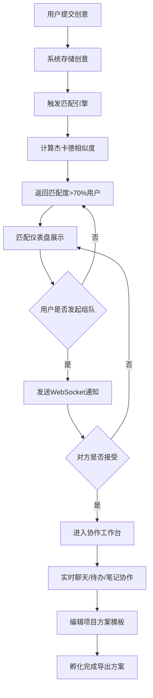

## 1. 产品概述

InspireMatch 是一款面向团队的在线灵感速配与创意孵化器应用。它允许团队成员提交创意点子，通过关键词智能匹配兴趣相近的合作伙伴，并在限时协作工作台内将创意孵化成可执行的项目方案。

- **核心问题**：团队内部创意点子分散，难以找到同好协作，创意缺乏落地机制
- **目标用户**：产品团队、设计团队、创新部门、跨职能协作小组
- **核心价值**：快速匹配志同道合的成员，通过结构化协作加速创意落地

---

## 2. 核心功能

### 2.1 用户角色
| 角色 | 说明 | 核心权限 |
|------|------|----------|
| 团队成员 | 默认角色 | 提交创意、发起匹配、组队协作 |

### 2.2 功能模块
1. **创意提交面板**：标题/描述/关键词输入，标签选择器，提交反馈
2. **匹配仪表盘**：杰卡德相似度匹配，匹配卡片展示，发起组队
3. **协作工作台**：实时聊天、待办事项、Markdown笔记、项目模板协作
4. **灵感热度榜**：创意热度统计，毛玻璃卡片，自动滚动展示
5. **主导航布局**：左侧导航栏，Logo，菜单项，响应式折叠

### 2.3 页面详情
| 页面/模块 | 子模块 | 功能描述 |
|-----------|--------|----------|
| 创意提交面板 | 标题输入 | 必填，文本输入框，最大60字 |
| 创意提交面板 | 一句话描述 | 必填，多行文本，最大200字 |
| 创意提交面板 | 关键词选择器 | 预设20个标签，至少选3个，彩色圆角标签 |
| 创意提交面板 | 提交按钮 | 渐变背景，悬停缩放动画，成功绿色浮动提示 |
| 匹配仪表盘 | 匹配卡片 | 头像/用户名/兴趣标签/圆形进度条匹配度 |
| 匹配仪表盘 | 发起组队 | 点击发送WebSocket通知，等待对方确认 |
| 协作工作台 | 实时聊天 | 左右气泡，表情图片支持，0.2s过渡 |
| 协作工作台 | 待办事项 | 增删改查，拖拽排序，完成状态删除线 |
| 协作工作台 | 合作笔记 | Markdown编辑器，实时同步，冲突提示 |
| 协作工作台 | 项目模板 | 名称/目标/成果/时间线，实时协作编辑 |
| 灵感热度榜 | 排行卡片 | 毛玻璃效果，悬停上浮+阴影，每3s自动滚动 |
| 主导航 | 左侧导航 | 240px宽，选中项青蓝色高亮，移动端汉堡菜单 |

---

## 3. 核心流程

---

## 4. 用户界面设计

### 4.1 设计风格
- **主题**：暗色科技风
- **背景色**：#1a1a2e（深邃夜空蓝）
- **主色调**：青蓝色 #00d2ff + 紫色 #6c63ff 线性渐变
- **按钮**：渐变背景（#00d2ff→#6c63ff），悬停亮度+20%，0.3s缩放/旋转动画
- **字体**：Space Grotesk（标题）+ Inter（正文）- 注：根据规范使用非通用字体，实际可通过Google Fonts引入
- **布局**：左侧240px固定导航 + 右侧自适应内容区
- **圆角**：卡片/面板统一12px圆角
- **阴影**：多层box-shadow，悬停增强

### 4.2 页面设计概览
| 模块 | UI元素 | 细节规范 |
|------|--------|----------|
| 导航栏 | Logo + 5个菜单项 | 选中项青蓝色文字+左侧竖线指示器 |
| 提交表单 | 3个输入区+提交按钮 | 0.4s淡入动画，输入框聚焦渐变描边 |
| 匹配卡片 | 头像+标签+进度条 | 首字母头像随机渐变背景，进度条绿→红渐变 |
| 聊天面板 | 消息气泡 | 自己青蓝色靠右，对方#333灰色靠左，0.2s过渡 |
| 待办列表 | 可拖拽项 | 半透明占位提示，弹性回弹动画 |
| 热度榜卡片 | 毛玻璃容器 | rgba(255,255,255,0.15)背景，1px半透边框，悬停translateY(-5px) |

### 4.3 响应式设计
- **断点**：768px
- **桌面端（≥768px）**：左侧240px导航常驻，卡片网格布局
- **移动端（<768px）**：导航折叠为汉堡菜单，卡片全宽纵向堆叠
- **触控优化**：按钮最小点击区44px，拖拽支持touch事件

### 4.4 动画规范
| 场景 | 效果 | 时长 | 缓动函数 |
|------|------|------|----------|
| 表单淡入 | opacity 0→1, translateY(10px)→0 | 0.4s | ease-out |
| 按钮悬停 | scale(1.05), filter brightness(1.2) | 0.3s | cubic-bezier(0.4,0,0.2,1) |
| 热度榜悬停 | translateY(-5px), shadow增强 | 0.3s | ease-out |
| 消息出现 | opacity 0→1, translateX(±10px) | 0.2s | ease-out |
| 拖拽回弹 | position elastic | 0.3s | cubic-bezier(0.34,1.56,0.64,1) |
