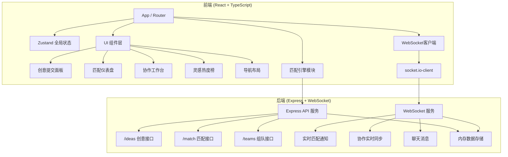
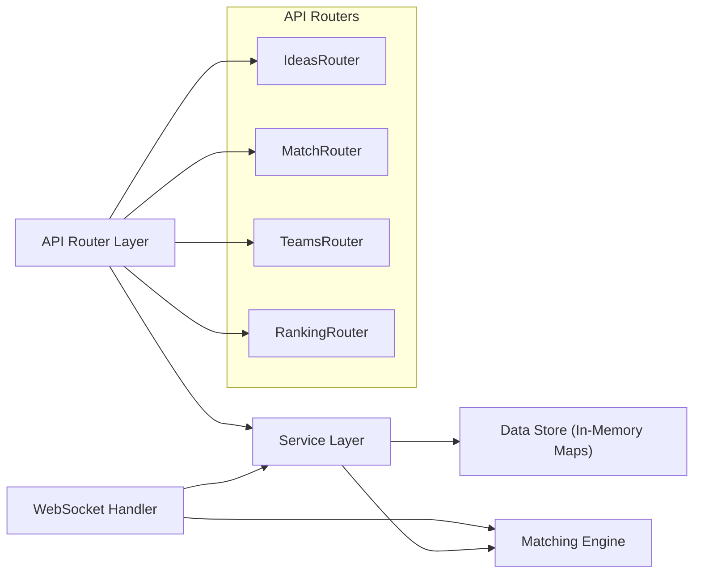
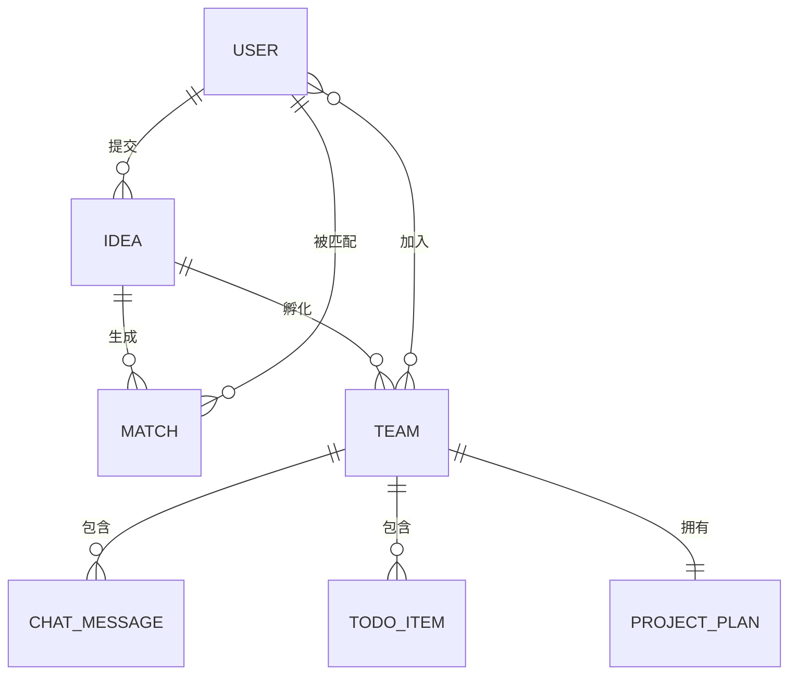

## 1. 架构设计



---

## 2. 技术说明

- **前端框架**：React 18 + TypeScript（严格模式）
- **构建工具**：Vite 5
- **状态管理**：Zustand 4
- **路由**：React Router DOM 6
- **HTTP 客户端**：Axios
- **实时通信**：socket.io-client + ws
- **CSS方案**：原生CSS Modules + CSS变量（用户需求未指定Tailwind，按需使用内联样式配合全局CSS）
- **后端框架**：Express 4
- **WebSocket**：socket.io + ws
- **数据层**：Node.js 内存存储（Map结构），mock数据初始化
- **图标库**：lucide-react

---

## 3. 路由定义

| 路由路径 | 页面/组件 | 用途说明 |
|----------|----------|----------|
| `/` | 首页仪表盘 | 创意提交 + 匹配结果 + 热度榜 |
| `/submit` | IdeaSubmissionPanel | 创意提交页面（也可嵌入首页） |
| `/match` | MatchingResultBoard | 匹配结果仪表盘 |
| `/workbench/:teamId` | CollaborativeWorkbench | 协作工作台（组队后进入） |
| `/ranking` | 灵感热度榜 | 独立热度榜页面 |

---

## 4. API 定义

### 4.1 类型定义
```typescript
// 共享类型定义
interface User {
  id: string;
  username: string;
  avatar?: string;
  tags: string[];
  isActive: boolean;
}

interface Idea {
  id: string;
  userId: string;
  title: string;
  description: string;
  tags: string[];
  createdAt: number;
  matchCount: number;
  teamCount: number;
}

interface MatchResult {
  userId: string;
  username: string;
  avatar?: string;
  tags: string[];
  similarity: number;
  ideaId: string;
}

interface Team {
  id: string;
  members: User[];
  ideaId: string;
  createdAt: number;
  messages: ChatMessage[];
  todos: TodoItem[];
  notes: string;
  projectPlan: ProjectPlan;
}

interface ChatMessage {
  id: string;
  senderId: string;
  content: string;
  type: 'text' | 'emoji' | 'image';
  timestamp: number;
}

interface TodoItem {
  id: string;
  content: string;
  completed: boolean;
  order: number;
}

interface ProjectPlan {
  name: string;
  goal: string;
  outcomes: string;
  timeline: string;
  lastEditorId?: string;
  lastUpdated?: number;
}
```

### 4.2 REST API 接口
```
POST   /api/ideas          提交创意创意
GET    /api/ideas          获取所有创意列表
GET    /api/ideas/:id      获取单个创意详情

POST   /api/match          请求匹配用户
Body: { ideaId, userId, tags }

GET    /api/teams/:id      获取组队详情
POST   /api/teams          创建新组队
PUT    /api/teams/:id/plan 更新项目方案
GET    /api/ranking        获取灵感热度榜
```

### 4.3 WebSocket 消息
```
client -> server:
  'match:request'       { userId, tags, ideaId }
  'team:invite'         { fromUserId, toUserId, ideaId }
  'team:accept'         { teamId, userId }
  'team:decline'        { teamId, userId }
  'chat:send'           { teamId, message }
  'todo:update'         { teamId, todos }
  'notes:update'        { teamId, content }
  'plan:update'         { teamId, plan, editorId }

server -> client:
  'match:result'        { matches: MatchResult[] }
  'team:invited'        { fromUser, idea }
  'team:accepted'       { team }
  'team:declined'       { fromUser }
  'chat:message'        { message }
  'todo:updated'        { todos }
  'notes:updated'       { content, editorId }
  'plan:updated'        { plan, editorId }
  'plan:conflict'       { latestPlan, warning }
```

---

## 5. 服务端架构



---

## 6. 数据模型

### 6.1 ER 图


### 6.2 内存数据结构（Mock数据）
```typescript
// 内存存储容器
interface DataStore {
  users: Map<string, User>;
  ideas: Map<string, Idea>;
  teams: Map<string, Team>;
  activeSockets: Map<string, string>;  // socketId -> userId
}

// 预设20个兴趣标签
const PRESET_TAGS = [
  'AI', '游戏', '艺术', '教育', '电商', '金融', '社交', '工具',
  '健康', '音乐', '旅行', '美食', '体育', '科学', '环保', '公益',
  '设计', '营销', '运营', '技术'
];
```

---

## 7. 性能约束实现方案

| 约束指标 | 目标 | 实现方案 |
|----------|------|----------|
| 匹配响应时间 | ≤2秒 | 前端/后端双端计算杰卡德相似度，内存读取O(1)，集合运算O(n) |
| WebSocket延迟 | <500ms | Socket.IO + 本地内存广播，无数据库IO |
| 文本同步延迟 | <300ms | Debounce 100ms + 即时广播 + 版本号冲突检测 |
