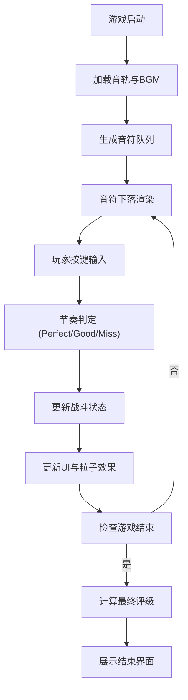

## 1. 产品概述

音律共鸣节奏战斗原型是一款以"音律共鸣"为核心的节奏战斗游戏验证工具。玩家根据音乐节拍在横向音轨上点击对应按键攻击敌人，同时躲避障碍物，系统实时计算连击评分并展示流畅度反馈。

- 目标用户：独立游戏开发者、节奏游戏设计师
- 核心价值：快速验证音轨同步、敌人行为与玩家动作之间的协调性
- 使用场景：游戏原型开发阶段的玩法机制验证

## 2. 核心功能

### 2.1 功能模块

1. **音轨解析模块**：加载解析预置节拍数据，生成音符时间戳队列，对齐BGM播放时间轴
2. **节奏判定模块**：监听玩家按键事件，与音符队列对比判定 Perfect/Good/Miss
3. **敌人AI与战斗模块**：根据音乐阶段生成不同敌人，管理战斗逻辑与生命值
4. **UI控制模块**：Canvas音符渲染、连击分数显示、敌人状态条、玩家血条
5. **性能监控模块**：实时FPS监控，低于阈值时自动优化渲染精度

### 2.2 页面详情

| 页面名称 | 模块名称 | 功能描述 |
|---------|---------|---------|
| 游戏主界面 | 顶部进度条 | 显示音乐播放进度，渐变色彩从绿到红 |
| 游戏主界面 | Canvas游戏区 | 800x600像素，音符下落、判定线、敌人、粒子效果 |
| 游戏主界面 | 底部状态栏 | 连击数、得分、玩家血条 |
| 游戏主界面 | 按键提示灯 | 左右两侧按键状态指示 |
| 游戏主界面 | 性能提示 | 右下角性能优化启用提示 |
| 结束界面 | 评级展示 | 根据得分和连击数给出S/A/B/C评级 |

## 3. 核心流程

## 4. 用户界面设计

### 4.1 设计风格

- **视觉主题**：深空蓝渐变背景，赛博朋克风格的音律战斗
- **主色调**：深空蓝 (#0a0a2e → #1a1a4e)、金色 (#ffd700)、青色 (#00e5ff)、品红 (#ff00e5)
- **辅助色**：绿色 (#2ecc71)、红色 (#e74c3c)、黄色 (#f1c40f)
- **字体**：现代无衬线字体，数字使用等宽风格
- **按钮风格**：圆角8px、深色半透明背景、金色边框悬停效果

### 4.2 页面设计概览

| 页面名称 | 模块名称 | UI元素 |
|---------|---------|-------|
| 游戏主界面 | 顶部进度条 | 高度40px深色半透明背景，内部进度条渐变绿到红 |
| 游戏主界面 | Canvas游戏区 | 800x600像素，2px圆角，1px边框 #4a4a8a |
| 游戏主界面 | 音符 | 圆形直径12px，黄色 #f1c40f，带半透明尾迹 |
| 游戏主界面 | 判定反馈 | 金色/绿色光圈，灰色Miss文字 |
| 游戏主界面 | 敌人 | 左右两侧敌人，血条显示 |
| 游戏主界面 | 状态栏 | 高度80px半透明黑底，连击数/得分/血条 |
| 游戏主界面 | 按键提示灯 | 直径20px，左侧青色，右侧品红 |
| 结束界面 | 评级展示 | 字号48px，S金A银B铜C灰 |

### 4.3 响应式设计

- 桌面端优先设计，最小宽度1000px
- Canvas区域随窗口宽度等比例缩放
- 两侧提示灯间距保持20px
- 状态栏和进度条自适应宽度

### 4.4 动画与动效

- 音符尾迹：8个残影，间隔2px，透明度递减
- 判定光圈：缩放至1，持续0.15秒
- 连击动画：每5连击缩放1.1倍
- 敌人消灭：粒子扩散碎裂动画，持续0.3秒
- 按键反馈：0.1秒缩小再恢复
- Boss出场：暗红色渐变条幅淡入0.5秒
- 性能提示：1秒后淡出消失
