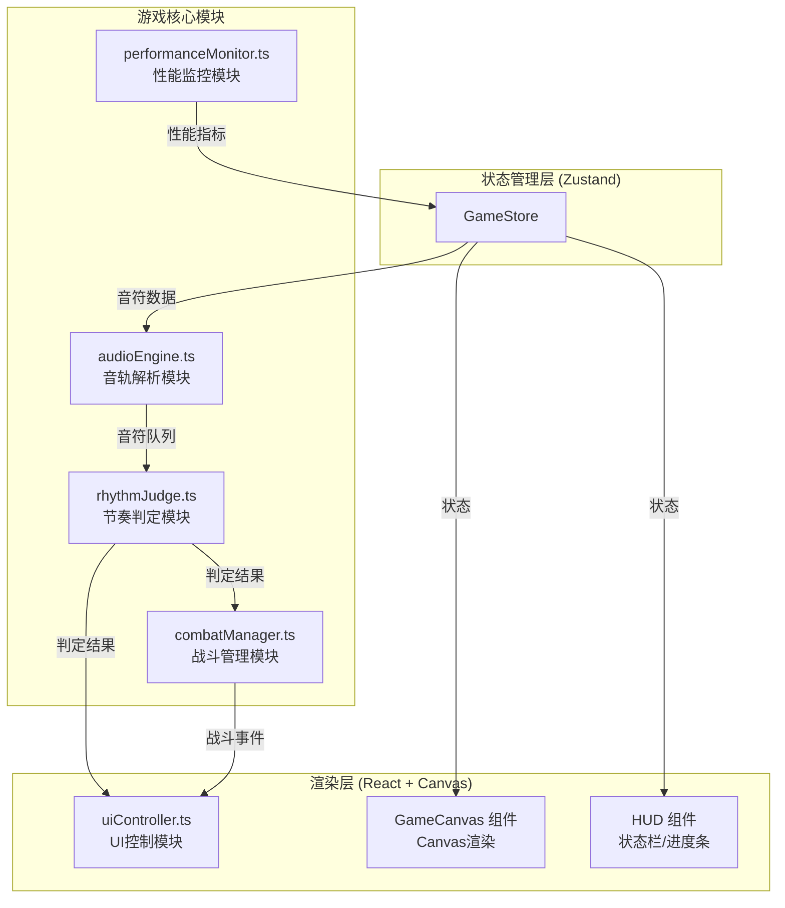

## 1. 架构设计



## 2. 技术描述

- **前端框架**：React 18 + TypeScript + Vite
- **状态管理**：Zustand
- **渲染技术**：HTML5 Canvas 2D
- **样式方案**：CSS Modules / 内联样式
- **音频处理**：Web Audio API (合成节拍音)
- **构建工具**：Vite

## 3. 模块详解

### 3.1 音轨解析模块 (audioEngine.ts)

**职责**：加载和解析预置节拍数据，生成音符时间戳队列，对齐BGM播放时间轴。

**输入**：
- BPM配置参数 (默认128)
- 小节数 (默认16小节)
- 节拍模式配置

**输出**：
- 音符队列 (Note[])，包含时间戳、轨道(左/右)、类型等
- 当前播放时间 (ms)
- 播放进度 (0-1)

**核心类型**：
```typescript
interface Note {
  id: string;
  time: number;      // 理想击中时间 (ms)
  track: 'left' | 'right';
  hit: boolean;
  judgment?: 'perfect' | 'good' | 'miss';
}
```

### 3.2 节奏判定模块 (rhythmJudge.ts)

**职责**：监听玩家按键事件，与音符队列对比，输出判定结果。

**判定规则**：
- 误差 < 50ms → Perfect
- 误差 < 100ms → Good
- 否则 → Miss

**输入**：
- 按键时间戳
- 当前音符队列
- 判定线时间

**输出**：
- 判定结果事件
- 连击计数更新
- 得分更新

### 3.3 战斗管理模块 (combatManager.ts)

**职责**：管理敌人AI、战斗逻辑、玩家血量。

**敌人类型**：
- 普通小兵 (左侧，血量100，每4拍出现)
- 盾兵 (右侧，血量150，每8拍出现)
- Boss (血量800，第六小节出现，上下移动)

**核心规则**：
- 普通敌人3次击中消灭
- Boss 10次击中消灭
- 连续Miss 3次 → 玩家受伤 -20 HP

### 3.4 UI控制模块 (uiController.ts)

**职责**：Canvas渲染管理，音符、敌人、粒子效果绘制。

**渲染内容**：
- 音符下落与尾迹
- 判定光圈效果
- 敌人与血条
- 粒子爆炸效果
- 判定文字反馈

### 3.5 性能监控模块 (performanceMonitor.ts)

**职责**：实时FPS监控，自动优化。

**监控指标**：
- FPS (每秒帧率)
- 输入延迟

**优化策略**：
- FPS < 45 → 尾迹残影从8个减至4个
- 每10秒检查一次
- 显示"性能优化已启用"提示

## 4. 状态管理 (Zustand)

```typescript
interface GameState {
  // 游戏状态
  status: 'idle' | 'playing' | 'paused' | 'ended';
  score: number;
  combo: number;
  maxCombo: number;
  perfectCount: number;
  goodCount: number;
  missCount: number;
  playerHp: number;
  maxPlayerHp: number;
  
  // 音符与敌人
  notes: Note[];
  enemies: Enemy[];
  
  // 时间
  currentTime: number;
  duration: number;
  
  // 性能
  fps: number;
  trailCount: number;
  showPerfHint: boolean;
  
  // Actions
  startGame: () => void;
  pauseGame: () => void;
  resumeGame: () => void;
  resetGame: () => void;
  handleKeyPress: (track: 'left' | 'right') => void;
  update: (deltaTime: number) => void;
  setPerformance: (fps: number) => void;
}
```

## 5. 文件结构

```
.
├── package.json
├── index.html
├── vite.config.js
├── tsconfig.json
└── src/
    ├── main.tsx              # 入口文件
    ├── App.tsx               # 根组件
    ├── store/
    │   └── useGameStore.ts   # Zustand 状态管理
    ├── audio/
    │   └── audioEngine.ts    # 音轨解析模块
    ├── rhythm/
    │   └── rhythmJudge.ts    # 节奏判定模块
    ├── combat/
    │   └── combatManager.ts  # 战斗管理模块
    ├── rendering/
    │   └── uiController.ts   # UI控制模块
    ├── performance/
    │   └── performanceMonitor.ts # 性能监控模块
    ├── components/
    │   ├── GameCanvas.tsx    # 游戏Canvas组件
    │   ├── HUD.tsx           # 顶部进度条和状态栏
    │   ├── KeyIndicator.tsx  # 按键提示灯
    │   └── ResultScreen.tsx  # 结束界面
    ├── types/
    │   └── game.ts           # 类型定义
    └── utils/
        └── constants.ts      # 常量配置
```

## 6. 性能约束

- 目标帧率：≥ 55 FPS (1080p，集成显卡)
- 输入延迟：≤ 16ms (单帧响应)
- 自动优化：FPS < 50 时降低粒子密度和尾迹数量
- 粒子数量：判定爆炸40个粒子，半径2-4px
- 尾迹数量：默认8个，性能模式4个
