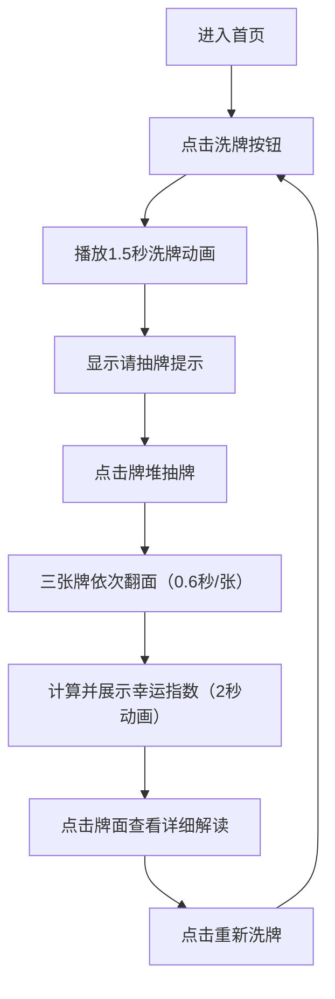

## 1. 产品概述
纸牌星盘运势预测是一款基于数字塔罗牌的在线运势占卜应用。用户通过洗牌、抽牌的互动方式获得事业、感情、机遇三大主题的运势解读，结合过去-现在-未来的牌阵布局，为用户提供沉浸式的神秘玄学体验。

- 核心目的：通过趣味占卜互动，为用户提供情感慰藉和娱乐体验
- 目标用户：对玄学、塔罗、星座文化感兴趣的年轻群体
- 市场价值：填补轻量级占卜娱乐应用的空白，具备社交传播潜力

## 2. 核心功能

### 2.1 功能模块
1. **首页主界面**：洗牌抽牌模块、牌阵展示模块、幸运指数模块、解读面板模块

### 2.2 页面详情
| 页面名称 | 模块名称 | 功能描述 |
|---------|---------|----------|
| 首页 | 洗牌抽牌模块 | 圆形洗牌按钮（径向渐变紫金色），点击触发1.5秒上下翻动洗牌动画，54张牌组成的牌堆，点击牌堆随机抽取三张牌并依次翻面（0.6秒中心外翻转动画） |
| 首页 | 牌阵展示模块 | 三张牌从左到右对应过去-现在-未来牌位，每个牌位下方圆形半透明底座（带虚线边缘和发光效果），牌面底部显示牌名和关键词，点击牌放大1.2倍并切换解读面板 |
| 首页 | 解读面板模块 | 320px宽白色面板，顶部渐变色匹配牌面主色调，运势等级0-100进度条，详细文字解读段落，手机端从底部滑入覆盖模式（60%屏高） |
| 首页 | 幸运指数模块 | 牌阵上方直径120px环形进度条（12px宽度，紫金色渐变），3:4:3加权平均计算，2秒动画增长，重新洗牌按钮（紫底圆角，悬停变金色） |

## 3. 核心流程
用户进入应用 → 点击"洗牌"按钮 → 牌堆播放1.5秒洗牌动画 → 提示"请抽牌" → 用户点击牌堆抽取三张牌 → 三张牌依次翻面展示 → 系统计算并展示幸运指数环形进度条 → 用户点击任意牌查看详细解读 → 点击"重新洗牌"重置全部流程

## 4. 用户界面设计

### 4.1 设计风格
- **主色调**：深紫 #1a1a2e（全局背景）、紫色 #6a0dad、金色 #d4a762
- **辅助色**：牌底深蓝 #1a1a2e、白色牌面 #fff、底座浅紫 #e0d8f0
- **按钮风格**：圆形64px直径（洗牌按钮）、圆角22px长方形（重抽按钮）
- **字体**：使用衬线体营造神秘古典氛围，标题用装饰性字体，正文用清晰易读字体
- **布局风格**：居中对称布局，卡片悬浮式设计，元素带呼吸光晕动效
- **视觉特效**：box-shadow呼吸动画（3秒周期，透明度0.2-0.5）、翻转动画、渐变环形进度条

### 4.2 页面设计概述
| 页面名称 | 模块名称 | UI元素 |
|---------|---------|--------|
| 首页 | 洗牌抽牌模块 | 圆形渐变按钮（64px直径）、牌堆（54张叠加效果、深蓝底金色螺旋纹背面）、洗牌上下翻动动画（1.5秒）、请抽牌文字提示 |
| 首页 | 牌阵展示模块 | 三张牌排列（高140px宽92px圆角8px）、底座（直径110px虚线发光边缘）、牌名关键词标签、放大过渡动画（0.3秒1.2倍） |
| 首页 | 解读面板模块 | 320px宽度面板、顶部渐变色条、0-100进度条、多段落文字解读、手机端底部滑入（60%屏高） |
| 首页 | 幸运指数模块 | 120px环形进度条（12px宽度紫金渐变）、居中数字显示、160x44px重抽按钮（悬停变色0.3秒过渡） |

### 4.3 响应式设计
- **桌面端**：三张牌并排水平排列，间距40px，标准牌尺寸
- **平板端**：牌间距缩小至24px，牌尺寸整体缩减10%
- **手机端**：三张牌纵向排列，每张独占一行，间距12px，解读面板改为底部滑入覆盖模式（60%屏幕高度，向上滑动关闭）

### 4.4 性能指标
- 洗牌动画和翻牌动画帧率不低于50fps
- 所有交互响应延迟不超过100ms
- 采用CSS动画为主，避免复杂JS计算
