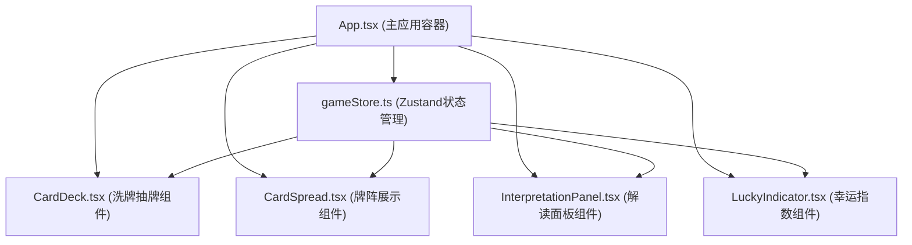

## 1. 架构设计
本项目为纯前端单页应用，采用React组件化架构，使用Zustand进行全局状态管理，无后端服务。



## 2. 技术描述
- **前端框架**：React@18 + TypeScript@5
- **构建工具**：Vite@5
- **状态管理**：Zustand@4
- **样式方案**：原生CSS + CSS Modules（使用CSS变量定义设计令牌）
- **动画方案**：纯CSS3动画 + CSS transitions/transforms（保证50fps+性能）
- **初始化工具**：vite-init（react-ts模板）

## 3. 项目结构
```
├── src/
│   ├── components/
│   │   ├── CardDeck.tsx           # 洗牌与抽牌交互组件
│   │   ├── CardSpread.tsx         # 牌阵展示与解读交互组件
│   │   ├── InterpretationPanel.tsx # 运势解读面板组件
│   │   └── LuckyIndicator.tsx     # 幸运指数环形进度条组件
│   ├── store/
│   │   └── gameStore.ts           # Zustand全局状态管理
│   ├── data/
│   │   └── cards.ts               # 54张塔罗牌数据定义
│   ├── styles/
│   │   └── global.css             # 全局样式与设计令牌
│   ├── main.tsx                   # React应用入口
│   └── App.tsx                    # 主应用组件
├── package.json
├── vite.config.js                 # Vite配置（含@路径别名）
├── tsconfig.json                  # TypeScript严格模式配置
└── index.html                     # HTML入口
```

## 4. 数据模型

### 4.1 牌数据定义
```typescript
interface TarotCard {
  id: number;
  name: string;           // 牌名，如"命运之轮"
  keyword: string;        // 关键词，如"转折"
  theme: 'career' | 'love' | 'opportunity'; // 运势主题
  fortuneScore: number;   // 运势值 0-100
  primaryColor: string;   // 牌面主色调（十六进制）
  symbol: string;         // 抽象几何符号标识
  interpretation: {       // 三个时间维度的解读
    past: string;
    present: string;
    future: string;
  };
  description: string;    // 牌面详细描述
  isSpecial?: boolean;    // 是否为特殊命运牌
}
```

### 4.2 全局状态定义
```typescript
interface GameState {
  // 牌库
  deck: TarotCard[];
  // 已抽出的三张牌
  drawnCards: TarotCard[];
  // 游戏阶段: 'idle' | 'shuffling' | 'ready' | 'drawing' | 'complete'
  phase: GamePhase;
  // 当前选中的牌索引（用于解读面板）
  selectedCardIndex: number | null;
  // 幸运指数
  luckyScore: number;
  // 牌是否已翻面
  flippedCards: boolean[];
  
  // Actions
  shuffle: () => void;
  drawCards: () => void;
  selectCard: (index: number | null) => void;
  resetGame: () => void;
  setCardFlipped: (index: number) => void;
}
```

## 5. 核心算法

### 5.1 Fisher-Yates洗牌算法
```
function shuffleDeck(deck):
  for i from deck.length - 1 down to 1:
    j = random(0, i + 1)
    swap deck[i] and deck[j]
  return deck
```

### 5.2 幸运指数计算（加权平均）
```
luckyScore = (pastCard.fortuneScore * 0.3 
            + presentCard.fortuneScore * 0.4 
            + futureCard.fortuneScore * 0.3)
```

### 5.3 抽牌逻辑
1. 从已洗牌的牌库中随机抽取不重复的3张
2. 分配对应主题：第1张=事业运势，第2张=感情走向，第3张=近期机遇
3. 分配对应时间维度：左=过去，中=现在，右=未来

## 6. 动画与性能方案
- **洗牌动画**：CSS `@keyframes` + `transform: translateY()` 实现上下翻动，1.5秒，steps帧动画
- **翻牌动画**：CSS `transform: rotateY(180deg)` + `perspective` 实现3D翻转，0.6秒 ease-out
- **呼吸光晕**：CSS `@keyframes` + `box-shadow` 透明度动画，3秒无限循环
- **环形进度条**：SVG `stroke-dasharray` + `stroke-dashoffset` 过渡实现增长动画，2秒
- **性能优化**：
  - 所有动画使用 `transform` 和 `opacity` 属性（GPU加速）
  - 避免布局抖动（reflow），动画元素设置 `will-change`
  - 使用 `requestAnimationFrame` 协调复杂动画时序
