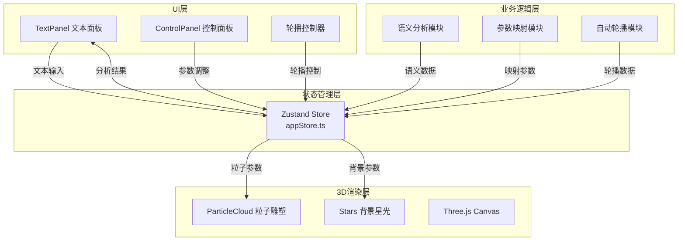

## 1. 架构设计



## 2. 技术选型

- **前端框架**：React 18 + TypeScript（严格模式，target ES2020）
- **构建工具**：Vite 5 + vite-plugin-react
- **3D渲染**：Three.js r160 + @react-three/fiber 8 + @react-three/drei 9
- **状态管理**：Zustand 4
- **样式方案**：原生CSS + CSS变量，毛玻璃效果，无Tailwind依赖（按用户指定）
- **图标方案**：lucide-react

## 3. 目录结构

```
auto59/
├── index.html              # 入口页面
├── package.json            # 依赖配置
├── vite.config.js          # Vite构建配置
├── tsconfig.json           # TypeScript配置
└── src/
    ├── main.tsx            # React DOM挂载点
    ├── App.tsx             # 主应用组件
    ├── stores/
    │   └── appStore.ts     # Zustand全局状态
    ├── effects/
    │   ├── ParticleCloud/
    │   │   └── ParticleCloud.tsx  # 3D粒子雕塑组件
    │   └── Stars/
    │       └── Stars.tsx          # 背景星光组件
    ├── components/
    │   ├── TextPanel/
    │   │   └── TextPanel.tsx      # 文本输入面板
    │   └── ControlPanel/
    │       └── ControlPanel.tsx   # 控制面板
    └── utils/
        ├── semanticAnalyzer.ts    # 语义分析工具
        ├── colorMappings.ts       # 颜色映射配置
        └── presets.ts             # 预设样式配置
```

## 4. 核心数据模型

### 4.1 状态定义（Zustand Store）

```typescript
interface ParticleParams {
  hueShift: number;        // 色调偏移 [-1, 1]，正暖负冷
  motionIntensity: number; // 运动剧烈度 [0.2, 1.5]
  aggregation: number;     // 聚集程度 [0.8, 1.2]
}

interface AnalysisResult {
  wordFrequencies: { word: string; count: number }[];
  sentiment: 'positive' | 'negative' | 'neutral';
  sentimentScore: number;  // [-1, 1]
  keywords: { word: string; size: number; color: string }[];
}

interface AppState {
  inputText: string;
  isAnalyzing: boolean;
  analysisResult: AnalysisResult | null;
  particleParams: ParticleParams;
  emotionIntensity: number;     // [0, 100]
  particleSize: number;         // [2, 8]
  backgroundBrightness: number; // [0, 1]
  isAutoPlaying: boolean;
  currentExampleIndex: number;
  examples: { text: string; label: string }[];
}
```

### 4.2 预设样式定义

```typescript
interface PresetStyle {
  name: string;
  color: string;
  params: ParticleParams;
  emotionIntensity: number;
  particleSize: number;
  backgroundBrightness: number;
}
```

## 5. 核心算法

### 5.1 语义分析算法

1. **词频统计**：分词、去停用词、统计词频、取Top10关键词
2. **情感极性分析**：
   - 预设积极词汇表（joy, love, happy, bright, warm, etc.）
   - 预设消极词汇表（sad, dark, cold, pain, alone, etc.）
   - 匹配计数计算情感得分 = (积极词数 - 消极词数) / 总词数
3. **参数映射**：
   - 色调偏移 = 情感得分 × 情绪强度
   - 运动剧烈度 = 0.2 + |情感得分| × 1.3 × 情绪强度
   - 聚集程度 = 1.0 - 情感得分 × 0.2 × 情绪强度

### 5.2 粒子系统算法

1. **初始布局**：球坐标系均匀分布4000点，半径180
2. **动态更新**（每帧）：
   - 绕Y轴旋转：角度 += motionIntensity × deltaTime
   - 随机抖动：Perlin噪声或正弦函数叠加，幅度随motionIntensity
   - 径向偏移：基础半径 × aggregation + 抖动
   - 颜色插值：暖色(#ff9f43) ↔ 冷色(#0abde3)，由hueShift控制
   - 透明度闪烁：0.7 + 0.3 × sin(time × frequency)

### 5.3 关键词云渲染

- 字号映射：`12px + (frequency / maxFrequency) × 24px`
- 颜色随机从当前色板选取，包含透明度0.8

## 6. 性能优化策略

1. **InstancedMesh**：使用Three.js InstancedMesh渲染4000个立方体，单次draw call
2. **几何体复用**：所有粒子复用同一个BoxGeometry和Material
3. **矩阵更新优化**：仅在必要时更新instanceMatrix，使用setMatrixAt
4. **帧速率控制**：使用requestAnimationFrame，deltaTime归一化动画速度
5. **事件节流**：滑块事件使用throttle（16ms）确保响应流畅
6. **内存管理**：组件卸载时正确dispose几何体和材质

## 7. 快捷键定义

- `S`：保存当前帧为PNG图片
- `Space`：播放/暂停自动轮播
- `1/2/3/4`：快速切换预设样式
