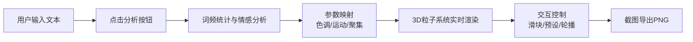

## 1. 产品概述

LyricViz 是一款将英文歌词/诗歌实时转化为3D粒子动态雕塑的可视化应用，解决抽象文本情感难以具象化表达的问题，为用户提供沉浸式的情感映射视觉体验。

- **核心价值**：将文本语义转化为动态视觉艺术，让情感可感知、可交互
- **目标用户**：音乐爱好者、诗人、设计师、艺术创作者
- **使用场景**：音乐可视化、诗歌欣赏、情感表达、艺术创作

## 2. 核心功能

### 2.1 功能模块

1. **文本输入与语义解析模块**：文本输入、词频统计、情感分析、关键词云展示
2. **3D粒子雕塑渲染模块**：4000立方体粒子系统、动态参数映射、闪烁发光效果
3. **背景星光粒子模块**：200个缓慢旋转的星点、深空渐变背景
4. **交互控制面板**：情绪强度、粒子大小、背景亮度滑块，四种风格预设
5. **自动轮播模块**：3组示例文本轮播（欢快/忧伤/激昂）、8秒切换
6. **截图导出模块**：S键快捷键保存PNG

### 2.2 页面详情

| 页面名称 | 模块名称 | 功能描述 |
|---------|---------|----------|
| 主页面 | 文本输入面板 | 500x200px半透明输入框，支持200词以内英文文本，聚焦发光效果 |
| 主页面 | 分析按钮 | 紫蓝渐变圆角按钮，悬停上移动效，触发语义分析 |
| 主页面 | 关键词云卡片 | 半透明卡片，词频映射文字大小，色板随机配色 |
| 主页面 | 3D粒子雕塑 | 中央球状粒子系统，4000立方体，随语义参数动态变化 |
| 主页面 | 控制面板 | 右侧悬浮毛玻璃面板，三滑块+四预设按钮 |
| 主页面 | 轮播控制器 | 圆形脉冲播放按钮，右下角文本情感标签 |
| 主页面 | 背景星光层 | 深空渐变+200缓慢旋转星点 |

## 3. 核心流程

用户输入英文文本 → 点击分析按钮 → 系统进行词频统计和情感极性分析 → 映射为粒子系统参数（色调偏移/运动剧烈度/聚集程度） → 3D粒子实时渲染动态效果 → 用户可通过滑块调整或预设切换 → 可启动自动轮播或截图保存

## 4. 用户界面设计

### 4.1 设计风格

- **整体风格**：暗色调科幻风格，深空蓝紫渐变背景
- **主色调**：深蓝紫 #0a0a23 → #1b1b3a 渐变
- **强调色**：发光青 #00e5ff、渐变紫 #6c5ce7→#a29bfe
- **色板**：暖橙 #ff9f43、冷蓝 #0abde3、红 #ff6b6b、黄 #ffd93d、绿 #00b894
- **字体**：现代无衬线字体，层级清晰（标题/正文/标签）
- **控件风格**：半透明毛玻璃效果（backdrop-filter: blur(10px)），圆角设计，微动效反馈
- **动效原则**：hover放大1.05倍、点击脉冲波纹、过渡动画0.3s

### 4.2 页面设计概览

| 页面名称 | 模块名称 | UI元素 |
|---------|---------|--------|
| 主页面 | 整体布局 | 左右分栏（≥1440px），底部折叠（<1024px），中央3D场景 |
| 主页面 | 文本输入框 | 500x200px，半透明白底rgba(255,255,255,0.1)，1px边框，聚焦#00e5ff发光 |
| 主页面 | 分析按钮 | 圆角8px，渐变#6c5ce7→#a29bfe，悬停上移2px，阴影加深 |
| 主页面 | 关键词卡片 | 半透明卡片，词频映射字号，色板随机配色 |
| 主页面 | 3D粒子系统 | 球状4000立方体，闪烁发光，公转+抖动 |
| 主页面 | 控制面板 | 240px宽毛玻璃悬浮，三滑块，四圆形预设按钮 |
| 主页面 | 轮播按钮 | 44px圆形，#0984e3背景，脉冲扩散动画 |
| 主页面 | 情感标签 | 圆角半透明白色标签，悬停展开完整文本 |

### 4.3 响应式设计

- **桌面端（≥1440px）**：左侧输入面板+中央3D场景+右侧控制面板
- **平板端（1024-1439px）**：保持三栏布局，适当压缩宽度
- **移动端（<1024px）**：控制面板折叠为底部可展开工具栏，输入框自适应宽度

### 4.4 3D场景设计

- **环境**：深空渐变背景 #0a0a23 → #1b1b3a，200个星光粒子缓慢旋转
- **灯光**：环境光+两盏方向光，确保立方体粒子立体感
- **相机**：PerspectiveCamera，fov=75，距离450，自动轨道控制
- **构图**：粒子雕塑居中，占据视觉中心，星光背景营造纵深感
- **动画**：粒子绕Y轴公转、随机抖动、透明度正弦闪烁、径向位置偏移
- **后期**：轻微辉光效果增强发光感
- **性能预算**：4200个mesh，目标帧率≥55FPS

## 5. 非功能性需求

- **性能**：粒子渲染帧率≥55FPS（Chrome基准），滑块延迟≤50ms，语义分析响应≤1s
- **兼容性**：Chrome/Edge/Firefox最新版本，支持WebGL2
- **交互**：所有操作有即时视觉反馈，微动效流畅自然
