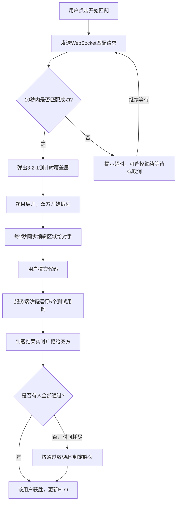
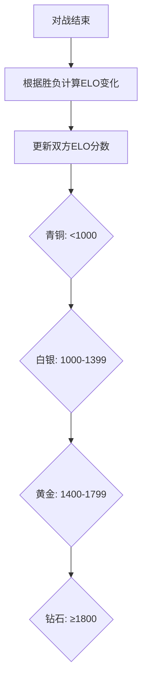

## 1. 产品概述

实时代码对战平台——面向编程学习者的竞技式在线编程环境，学员可在限时内根据题目编写代码，与AI或其他学员进行算法正确性和运行效率的实时比拼，通过ELO段位系统持续激励学习动力。

## 2. 核心功能

### 2.1 用户角色

| 角色 | 注册方式 | 核心权限 |
|------|----------|----------|
| 学员 | 邮箱注册登录 | 匹配对战、查看历史记录与回放、个人中心 |
| AI对手 | 系统自动 | 作为匹配超时时的备选对手 |

### 2.2 功能模块

1. **登录注册页**：邮箱注册/登录、表单校验、记住登录状态
2. **竞技场页面**：题目展示、Monaco代码编辑器、提交按钮、对手状态面板、实时比分板、倒计时
3. **匹配大厅**：匹配按钮、匹配等待动画、超时提示
4. **个人中心**：用户信息、段位徽章、ELO分数、历史对战记录列表、对战回放

### 2.3 页面详情

| 页面名称 | 模块名称 | 功能描述 |
|----------|----------|----------|
| 登录注册页 | 注册表单 | 邮箱+密码注册，前端校验格式，调用注册API |
| 登录注册页 | 登录表单 | 邮箱+密码登录，JWT令牌存储，跳转首页 |
| 竞技场页面 | 题目面板 | 半透明磨砂玻璃效果固定面板，显示题目简述和约束条件 |
| 竞技场页面 | 代码编辑器 | Monaco Editor，支持语法高亮/行号/自动补全，每2秒同步编辑位置给对手 |
| 竞技场页面 | 对手状态面板 | 对手头像、段位徽章、编辑活跃度脉冲指示器 |
| 竞技场页面 | 实时比分板 | 柱状图展示双方通过测试用例数量，弹起入场动画 |
| 竞技场页面 | 倒计时进度条 | 颜色从绿渐变为红，10分钟计时 |
| 竞技场页面 | 匹配倒计时覆盖层 | 3-2-1大号数字居中，弹簧缩放动画 |
| 个人中心 | 用户信息卡 | 头像、昵称、ELO分数、段位徽章（悬停放大1.05倍） |
| 个人中心 | 历史对战记录 | 列表展示对手昵称、题目、胜负、运行结果 |
| 个人中心 | 对战回放 | 时间轴形式展示双方提交和测试结果变化 |

## 3. 核心流程

**匹配对战流程**：用户点击"开始匹配" → 系统在10秒内按段位相近原则匹配对手 → 匹配成功弹出3-2-1倒计时覆盖层 → 题目展开，双方开始编程 → 用户编写代码时每2秒同步编辑区域给对手 → 用户提交代码 → 服务端在沙箱中运行5个测试用例 → 判题结果实时广播给双方 → 先全部通过者获胜/时间耗尽按规则判定胜负 → 更新双方ELO分数和段位

**ELO段位计算流程**：

## 4. 用户界面设计

### 4.1 设计风格

- **主背景色**：#0f0f23（深邃太空蓝黑）
- **卡片背景色**：#1a1a2e（暗紫灰）
- **强调色**：#00d4ff（电子青蓝）、#ff6b6b（警告红）
- **按钮风格**：圆角8px，主按钮#00d4ff渐变背景，悬停亮度+10%
- **字体**：标题用'Orbitron'（科技感显示字体），正文用'JetBrains Mono'（代码风格UI字体）
- **布局风格**：左右两栏布局，左侧65%编辑器区，右侧35%对手与比分区
- **图标风格**：lucide-react线性图标

### 4.2 页面设计概览

| 页面名称 | 模块名称 | UI元素 |
|----------|----------|--------|
| 登录注册页 | 表单区域 | 居中卡片布局，毛玻璃背景，输入框暗色底+亮色边框，按钮渐变#00d4ff |
| 竞技场页面 | 题目面板 | 磨砂玻璃效果(backdrop-blur)，圆角12px，半透明背景，固定于编辑器上方 |
| 竞技场页面 | 编辑器 | Monaco Editor暗色主题，行号高亮，对手编辑区域浅色高亮 |
| 竞技场页面 | 对手状态面板 | 头像+段位徽章（悬停放大1.05倍0.2秒），脉冲圆点(0.5秒循环) |
| 竞技场页面 | 比分板 | 柱状图，底部弹起动画0.4秒，#00d4ff(己方)/#ff6b6b(对手)配色 |
| 竞技场页面 | 倒计时进度条 | 线性进度条，绿→黄→红渐变，过渡1秒 |
| 竞技场页面 | 匹配倒计时覆盖 | 全屏半透明遮罩，大号数字居中，弹簧缩放动画(spring bounce) |
| 个人中心 | 用户信息卡 | 卡片布局，头像+段位徽章，ELO分数大号显示 |
| 个人中心 | 对战记录列表 | 表格/列表布局，胜负标记(绿色胜/红色负) |
| 个人中心 | 对战回放 | 水平时间轴，节点标注提交和测试结果，可拖拽播放进度 |

### 4.3 响应式设计

- 桌面优先设计，断点768px
- 宽度<768px时：编辑器面板占满宽度，对手面板折叠为可拖出侧边栏
- 触摸设备：按钮最小44px触控区域，编辑器区域可滚动

### 4.4 动画规范

- 匹配倒计时数字：弹簧缩放(scale 1→1.3→1)，时长0.4秒
- 比分柱状图：从底部弹起，translateY(20px→0) + opacity(0→1)，持续0.4秒
- 对手编辑活跃度：脉冲圆点，scale(1→1.5→1)，0.5秒循环
- 段位徽章悬停：scale(1→1.05)，0.2秒过渡
- 倒计时进度条：颜色从#00ff88→#ffaa00→#ff6b6b渐变，1秒过渡
- 页面切换：fade-in 0.3秒
