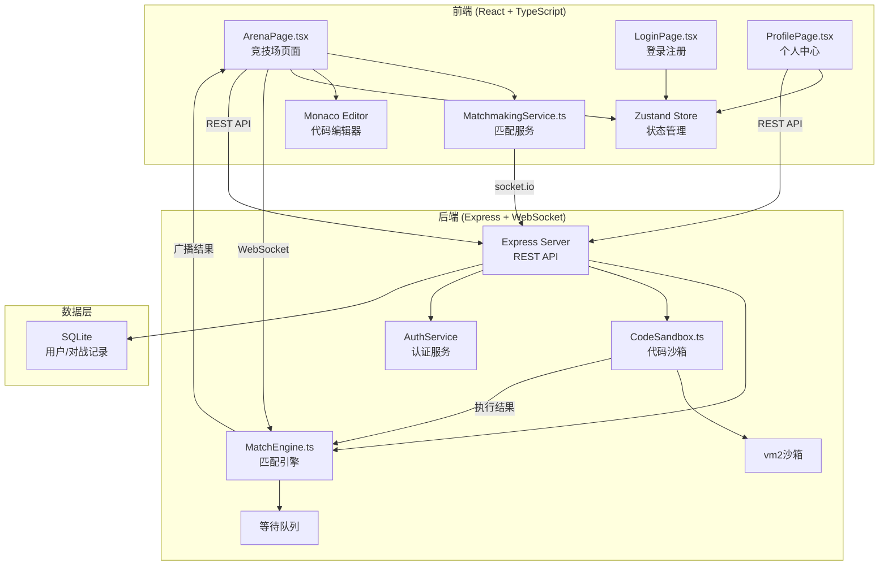
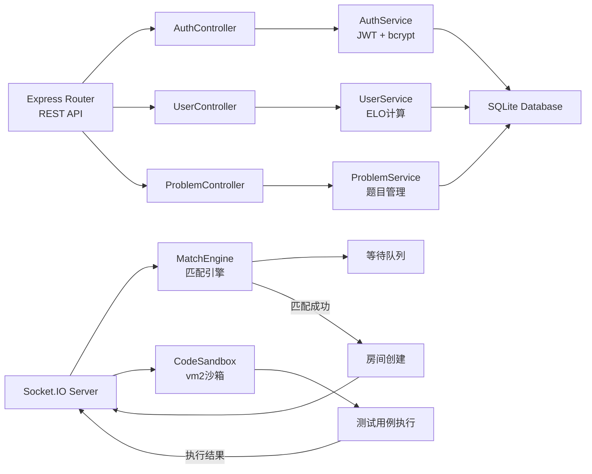
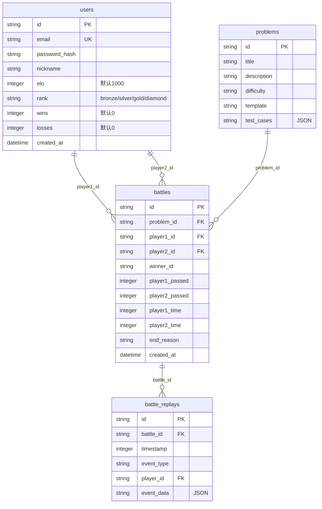

## 1. 架构设计



## 2. 技术说明

- **前端**: React@18 + TypeScript + Zustand + TailwindCSS + Vite
- **初始化工具**: vite-init (react-express-ts模板)
- **后端**: Express@4 + socket.io + vm2
- **数据库**: SQLite (better-sqlite3)，使用mock数据初始化题目库
- **代码编辑器**: @monaco-editor/react
- **动画**: framer-motion
- **图表**: recharts
- **图标**: lucide-react

## 3. 路由定义

| 路由 | 用途 |
|------|------|
| /login | 登录注册页面 |
| /arena | 竞技场主页面（匹配+对战） |
| /profile | 个人中心（历史记录+回放） |

## 4. API定义

### 4.1 认证API

```typescript
interface RegisterRequest {
  email: string;
  password: string;
  nickname: string;
}

interface LoginRequest {
  email: string;
  password: string;
}

interface AuthResponse {
  token: string;
  user: {
    id: string;
    email: string;
    nickname: string;
    elo: number;
    rank: "bronze" | "silver" | "gold" | "diamond";
    wins: number;
    losses: number;
  };
}

// POST /api/auth/register
// POST /api/auth/login
```

### 4.2 用户API

```typescript
interface UserProfile {
  id: string;
  nickname: string;
  elo: number;
  rank: "bronze" | "silver" | "gold" | "diamond";
  wins: number;
  losses: number;
  createdAt: string;
}

interface BattleRecord {
  id: string;
  opponentNickname: string;
  opponentRank: string;
  problemTitle: string;
  result: "win" | "loss";
  passedCases: number;
  totalCases: number;
  totalTime: number;
  createdAt: string;
  replay: ReplayEvent[];
}

interface ReplayEvent {
  timestamp: number;
  type: "submit" | "test_result" | "code_sync";
  playerId: string;
  data: {
    passedCases?: number;
    totalTime?: number;
    editRange?: { startLine: number; endLine: number };
  };
}

// GET /api/user/profile
// GET /api/user/battles
// GET /api/user/battles/:id
```

### 4.3 题目API

```typescript
interface Problem {
  id: string;
  title: string;
  description: string;
  difficulty: "easy" | "medium" | "hard";
  template: string;
  testCases: TestCase[];
}

interface TestCase {
  input: string;
  expectedOutput: string;
  isHidden: boolean;
}

// GET /api/problems/random
```

### 4.4 WebSocket事件

```typescript
// 客户端→服务端
interface ClientEvents {
  "match:join": {};
  "match:cancel": {};
  "code:sync": { range: { startLine: number; endLine: number } };
  "code:submit": { code: string; language: string };
}

// 服务端→客户端
interface ServerEvents {
  "match:waiting": {};
  "match:found": { opponent: UserProfile; problemId: string };
  "match:countdown": { seconds: number };
  "match:start": { problem: Problem; timeLimit: number };
  "opponent:editing": { range: { startLine: number; endLine: number } };
  "battle:result": { playerId: string; passedCases: number; totalTime: number };
  "battle:end": { winner: string; reason: string; eloChange: number };
  "battle:time": { remaining: number };
}
```

## 5. 服务端架构图



## 6. 数据模型

### 6.1 数据模型定义



### 6.2 数据定义语言

```sql
CREATE TABLE users (
  id TEXT PRIMARY KEY,
  email TEXT UNIQUE NOT NULL,
  password_hash TEXT NOT NULL,
  nickname TEXT NOT NULL,
  elo INTEGER DEFAULT 1000,
  rank TEXT DEFAULT 'bronze' CHECK(rank IN ('bronze','silver','gold','diamond')),
  wins INTEGER DEFAULT 0,
  losses INTEGER DEFAULT 0,
  created_at TEXT DEFAULT (datetime('now'))
);

CREATE TABLE problems (
  id TEXT PRIMARY KEY,
  title TEXT NOT NULL,
  description TEXT NOT NULL,
  difficulty TEXT CHECK(difficulty IN ('easy','medium','hard')),
  template TEXT NOT NULL,
  test_cases TEXT NOT NULL
);

CREATE TABLE battles (
  id TEXT PRIMARY KEY,
  problem_id TEXT NOT NULL REFERENCES problems(id),
  player1_id TEXT NOT NULL REFERENCES users(id),
  player2_id TEXT NOT NULL REFERENCES users(id),
  winner_id TEXT REFERENCES users(id),
  player1_passed INTEGER DEFAULT 0,
  player2_passed INTEGER DEFAULT 0,
  player1_time INTEGER DEFAULT 0,
  player2_time INTEGER DEFAULT 0,
  end_reason TEXT,
  created_at TEXT DEFAULT (datetime('now'))
);

CREATE TABLE battle_replays (
  id TEXT PRIMARY KEY,
  battle_id TEXT NOT NULL REFERENCES battles(id),
  timestamp INTEGER NOT NULL,
  event_type TEXT NOT NULL,
  player_id TEXT NOT NULL REFERENCES users(id),
  event_data TEXT NOT NULL
);

CREATE INDEX idx_users_email ON users(email);
CREATE INDEX idx_battles_player1 ON battles(player1_id);
CREATE INDEX idx_battles_player2 ON battles(player2_id);
CREATE INDEX idx_replays_battle ON battle_replays(battle_id);
```
