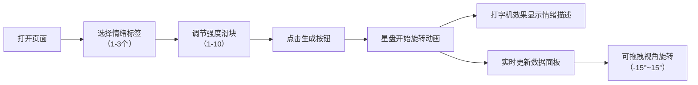

## 1. 产品概述

情绪色彩星盘是一款基于情绪可视化的交互式Web应用，用户选择当下情绪状态后，系统生成由彩色光点和流线构成的动态星盘，将抽象情绪转化为可感知的视觉艺术。

- 面向任何希望通过视觉化方式表达和探索自身情绪的用户
- 产品价值：将情绪转化为美学体验，提供情绪记录与自我觉察的创意工具

## 2. 核心功能

### 2.1 功能模块
1. **情绪选择模块**：情绪标签选择（1-3种）、情绪强度滑块调节、生成按钮
2. **星盘Canvas渲染模块**：光点生成、螺旋运动、尾迹效果、鼠标视角拖拽
3. **数据面板模块**：情绪文字描述（打字机效果）、实时数据展示

### 2.2 页面详情
| 页面名称 | 模块名称 | 功能描述 |
|----------|----------|----------|
| 主页 | 情绪选择卡片 | 4种情绪标签勾选（快乐/忧伤/愤怒/平静），限制1-3个；强度滑块1-10级；渐变生成按钮 |
| 主页 | 星盘画布 | 自适应Canvas（最大800px，1:1），300-500个光点螺旋运动，半透明外圈圆环，鼠标拖拽视角 |
| 主页 | 数据面板 | 情绪组合文字描述（打字机50ms/字），实时显示强度、光点数、旋转速度、颜色分布百分比 |

## 3. 核心流程

用户打开页面 → 勾选1-3种情绪标签 → 拖动滑块调整情绪强度 → 点击生成按钮 → 星盘开始旋转动画 → 数据面板显示文字描述与实时数据 → 可鼠标拖拽调整视角

## 4. 用户界面设计

### 4.1 设计风格
- **主色调**：深色太空主题，背景渐变 #0a0a1a → #1a1a2e
- **情绪色**：快乐 #f9ca24（黄）、忧伤 #5352ed（蓝）、愤怒 #ff6b81（红）、平静 #2ed573（绿）
- **强调色**：按钮渐变 #e94560 → #0f3460，滑块填充青→紫渐变
- **文字色**：#e0e0e0（主文字）、#f0f0f0（强调文字）、#aaa（标签文字）
- **按钮风格**：圆角8px，对称渐变，点击向内挤压动画0.2s
- **标签风格**：圆角20px，半透明底rgba(255,255,255,0.1)，选中放大1.05倍
- **字体**：系统等宽字体用于数字展示

### 4.2 页面设计概览
| 页面名称 | 模块名称 | UI元素 |
|----------|----------|----------|
| 主页 | 情绪选择卡片 | 宽420px，渐变#1a1a2e→#16213e，1px #0f3460边框，内边距24px |
| 主页 | 星盘画布 | 最大800px 1:1，外圈2px rgba(255,255,255,0.2)圆环 |
| 主页 | 数据面板 | rgba(255,255,255,0.05)底，圆角12px，内边距16px |

### 4.3 响应式设计
- 桌面端优先，Canvas最大800px，卡片宽420px
- 移动端（最小360px）：Canvas缩小320x320，情绪卡片单列布局
- 所有过渡动画0.2-0.3s

## 5. 性能要求

- 帧率稳定≥55fps
- 光点>400时启用离屏Canvas缓存
- 帧率<45fps时自动降级：光点减少至200，取消尾迹
- 鼠标拖拽使用requestAnimationFrame节流
