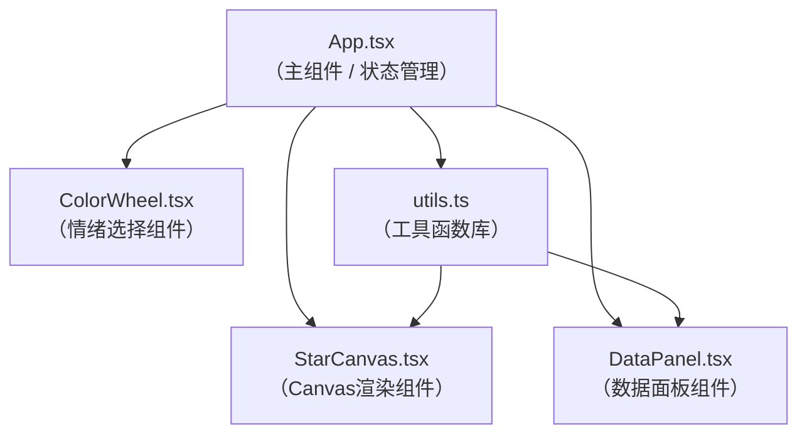

## 1. 架构设计



## 2. 技术描述

- **前端框架**：React 18 + TypeScript（严格模式）
- **构建工具**：Vite
- **状态管理**：React Hooks（useState / useEffect / useRef）
- **渲染技术**：HTML5 Canvas 2D API + OffscreenCanvas
- **动画方案**：requestAnimationFrame
- **样式方案**：原生CSS + CSS变量（无UI框架依赖）
- **图标**：无图标库，使用纯CSS实现

## 3. 文件结构

```
.
├── package.json
├── index.html
├── vite.config.js
├── tsconfig.json
└── src/
    ├── App.tsx         # 主组件，布局与全局状态
    ├── ColorWheel.tsx  # 情绪选择与强度滑块
    ├── StarCanvas.tsx  # Canvas星盘渲染
    ├── DataPanel.tsx   # 底部数据面板
    └── utils.ts        # 工具函数（情绪映射、计算、监控）
```

## 4. 核心类型定义

```typescript
type EmotionKey = 'joy' | 'sadness' | 'anger' | 'calm';

interface EmotionInfo {
  key: EmotionKey;
  name: string;
  color: string;
}

interface Particle {
  x: number;
  y: number;
  radius: number;
  emotion: EmotionKey;
  angle: number;
  radiusDist: number;
  speed: number;
  history: { x: number; y: number }[];
}

interface StarState {
  particles: Particle[];
  rotationSpeed: number;  // 秒/周期
  fps: number;
  particleCount: number;
  colorDistribution: Record<EmotionKey, number>;
}
```

## 5. 性能优化策略

1. **离屏Canvas缓存**：光点数量 > 400 时，将单帧光点绘制缓存到离屏Canvas
2. **自适应降级**：帧率监控器检测 FPS < 45 时，光点数降至 200 并关闭尾迹
3. **节流拖拽**：鼠标移动事件通过 requestAnimationFrame 节流，避免过度渲染
4. **对象池化**：Particle 对象复用，避免频繁 GC
