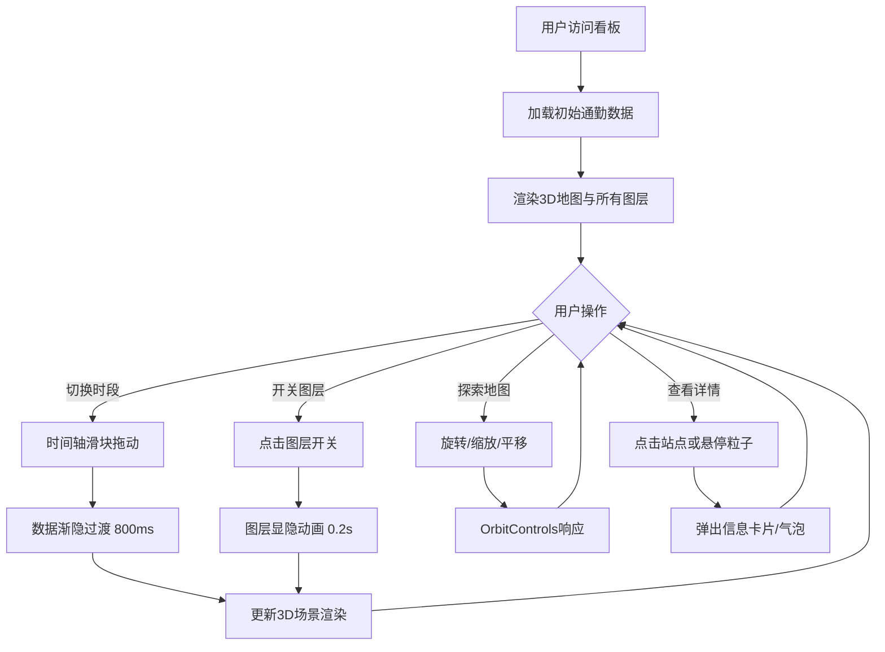

## 1. 产品概述

城市通勤数据3D可视化看板，为数据新闻编辑提供直观展示城市多模式通勤时空分布特征的工具。通过动态3D地图呈现地铁、公交、共享单车、步行四种通勤方式的实时数据，帮助读者快速感知城市交通运行规律。

## 2. 核心功能

### 2.1 功能模块

1. **主看板页面**：3D地图区域、控制面板、信息卡片、数据统计

### 2.2 页面详情

| 页面名称 | 模块名称 | 功能描述 |
|-----------|-------------|---------------------|
| 主看板 | 3D地图区域 | 渲染城市地形、四种通勤图层、粒子流动效果、热力图叠加 |
| 主看板 | 时间轴滑块 | 切换早高峰/午间/晚高峰/深夜四个时段，带动画过渡 |
| 主看板 | 图层控制面板 | 独立开关地铁/公交/共享单车/步行热力图层，带切换动画 |
| 主看板 | 站点信息卡片 | 点击地铁站弹出详细信息（名称、客流量、环比变化） |
| 主看板 | 公交路径气泡 | 悬停公交粒子显示路径名称 |
| 主看板 | 数据统计区 | 显示总通勤人次和四项指标雷达图 |

## 3. 核心流程

## 4. 用户界面设计

### 4.1 设计风格
- **主色调**：深色科技风，背景 #0f0f23
- **主题色**：地铁蓝 #1f77b4、公交绿 #2ca02c、共享单车青 #17becf、步行红黄 #ffeda0→#f03b20、强调蓝 #4a9eff
- **文字颜色**：主文本 #e0e0e0、辅助文本 #888888
- **字体**：系统无衬线字体（-apple-system, BlinkMacSystemFont, "Segoe UI", Roboto, sans-serif）
- **圆角**：卡片 8px、按钮 4px、滑块轨道 3px
- **过渡动画**：交互元素 0.2s、数据切换 0.8s、卡片弹出 0.3s

### 4.2 页面布局

| 页面名称 | 模块名称 | UI 元素 |
|-----------|-------------|-------------|
| 主看板 | 整体布局 | 桌面端左右分栏（70% : 30%），移动端纵向堆叠 |
| 主看板 | 3D地图区 | 全屏3D渲染，OrbitControls交互，半透明信息层叠加 |
| 主看板 | 时间轴 | 高度 6px 轨道，#4a9eff 填充色，直径 20px 半透明蓝色滑块 |
| 主看板 | 图层开关 | 每行 50px，左侧 14px 圆形颜色指示器，中间白色文字，右侧 iOS 风格拨动开关 |
| 主看板 | 信息卡片 | 背景 rgba(30,30,30,0.85)，圆角 8px，中心淡入缩放动画 |
| 主看板 | 数据统计区 | 总人次大数字 + 雷达图展示四项指标 |

### 4.3 响应式设计
- **桌面端（≥768px）**：左侧 3D 地图 70%，右侧控制面板 30%（最小宽度 300px）
- **移动端（<768px）**：控制面板位于底部纵向堆叠，3D 地图全屏显示
- **触摸优化**：支持触摸手势旋转/缩放，按钮触控区域 ≥ 44px

### 4.4 3D 场景指导
- **环境**：深色星空背景，柔和环境光 + 定向主光源
- **地面**：半透明深灰色网格平面，模拟城市路网
- **相机**：PerspectiveCamera，初始 45° 俯视角度，OrbitControls 限制俯仰角度
- **地铁层**：圆柱体按站点位置分布，高度映射客流量，颜色从蓝到红渐变
- **公交层**：粒子沿贝塞尔曲线流动，速度映射班次频率
- **共享单车层**：稀疏粒子集群在商业区，随机游走运动
- **步行热力层**：Ground projected 纹理，黄到红半透明热力图
- **后期处理**：轻微 Bloom 发光效果增强科技感
- **性能预算**：粒子总数 ≤ 5000，帧率 ≥ 30FPS，热力图更新 ≤ 10次/秒
