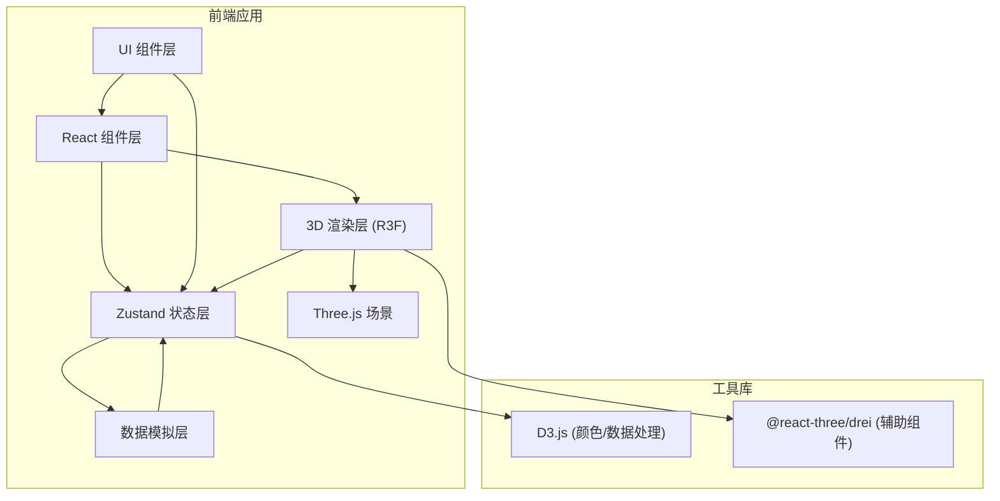

## 1. 架构设计



## 2. 技术说明

- **前端框架**：React 18 + TypeScript（strict 模式，target ES2020）
- **构建工具**：Vite 5
- **3D 渲染**：Three.js + @react-three/fiber + @react-three/drei
- **状态管理**：Zustand
- **数据处理**：D3.js（比例尺、颜色映射、插值）
- **样式方案**：CSS Modules + CSS 变量

## 3. 路由定义

| 路由 | 用途 |
|-------|---------|
| / | 主看板页面（单页应用） |

## 4. 数据模型

### 4.1 类型定义

```typescript
// 时段类型
type TimeSlot = 'morning' | 'noon' | 'evening' | 'night';

// 通勤数据结构
interface CommuteData {
  timeSlot: TimeSlot;
  timestamp: number;
  metro: MetroStation[];
  bus: BusRoute[];
  bike: BikeCluster[];
  walk: WalkHeatmap;
  totalTrips: number;
}

// 地铁站点
interface MetroStation {
  id: string;
  name: string;
  position: [number, number, number]; // [x, y, z]
  passengerFlow: number; // 进出人数
  previousFlow: number; // 上一时段流量
}

// 公交路线
interface BusRoute {
  id: string;
  name: string;
  path: [number, number, number][]; // 路径控制点
  frequency: number; // 班次频率（影响粒子速度）
  particleCount: number;
}

// 共享单车集群
interface BikeCluster {
  id: string;
  center: [number, number, number]; // 商业中心
  radius: number;
  particleCount: number;
  density: number;
}

// 步行热力图
interface WalkHeatmap {
  gridSize: number;
  cells: { position: [number, number]; intensity: number }[];
}

// 图层可见性
interface LayerVisibility {
  metro: boolean;
  bus: boolean;
  bike: boolean;
  walk: boolean;
}
```

### 4.2 数据流向

```
dataSimulator.ts → generateCommuteData() 
    ↓
store.ts → setCommuteData()
    ↓
useScene.ts + UI Components → 订阅状态变化驱动渲染
```

## 5. 项目文件结构

```
├── package.json
├── vite.config.js
├── tsconfig.json
├── index.html
└── src/
    ├── main.tsx           # 应用入口
    ├── App.tsx            # 主应用组件
    ├── types.ts           # 类型定义
    ├── dataSimulator.ts   # 数据模拟器
    ├── store.ts           # Zustand Store
    ├── useScene.ts        # 3D 场景 Hook
    ├── components/
    │   ├── Scene3D.tsx        # 3D 场景容器
    │   ├── MetroLayer.tsx     # 地铁客流量层
    │   ├── BusLayer.tsx       # 公交粒子层
    │   ├── BikeLayer.tsx      # 共享单车层
    │   ├── WalkHeatmap.tsx    # 步行热力图层
    │   ├── ControlPanel.tsx   # 右侧控制面板
    │   ├── TimeSlider.tsx     # 时间轴滑块
    │   ├── LayerToggle.tsx    # 图层开关
    │   ├── StationCard.tsx    # 站点信息卡片
    │   ├── StatsPanel.tsx     # 数据统计面板
    │   └── RadarChart.tsx     # 雷达图
    └── styles/
        └── global.css     # 全局样式
```
