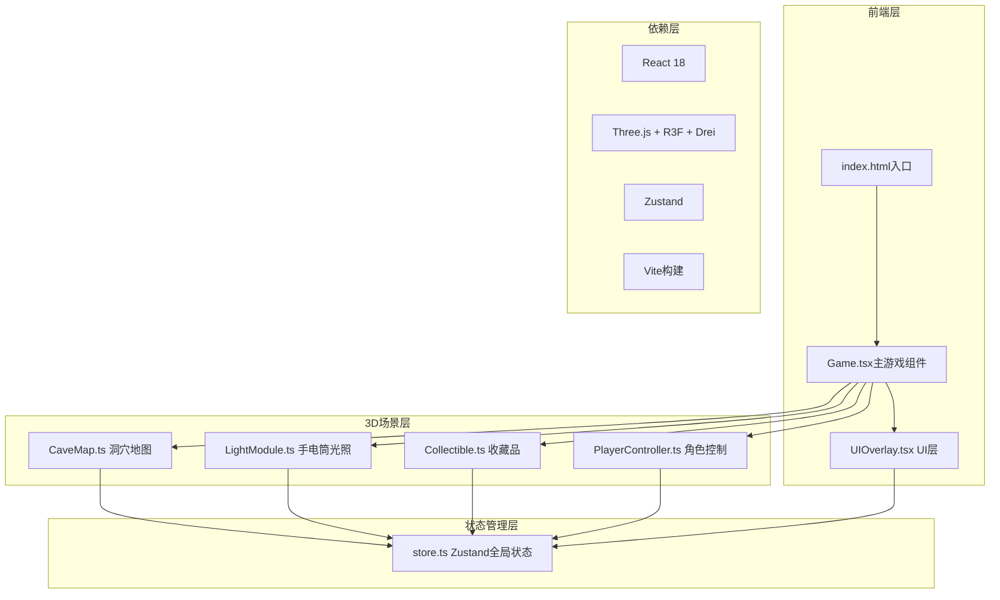

## 1. 架构设计



## 2. 技术说明

- **前端框架**：React@18 + TypeScript@5
- **3D渲染**：Three.js + @react-three/fiber + @react-three/drei
- **状态管理**：Zustand
- **构建工具**：Vite@5 + @vitejs/plugin-react
- **初始化工具**：vite-init react-ts模板

## 3. 路由定义

| 路由 | 用途 |
|------|------|
| / | 游戏主界面 |

## 4. 状态模型

### 4.1 状态定义（Zustand Store）

```typescript
interface GameStore {
  flashlight: {
    enabled: boolean;
    position: [number, number, number];
    rotation: [number, number, number];
    brightness: number; // 0-1
  };
  player: {
    position: [number, number, number];
    velocity: [number, number, number];
    isRunning: boolean;
  };
  collectibles: Array<{
    id: string;
    position: [number, number, number];
    collected: boolean;
    color: string;
  }>;
  collectedCount: number;
  caveMap: {
    walls: Array<WallData>;
    floors: Array<FloorData>;
    mossPoints: Array<MossData>;
    hiddenZones: Array<HiddenZoneData>;
    branches: Array<BranchPath>;
  };
  ui: {
    showCompletion: boolean;
    fadeInProgress: number; // 0-1
    vignetteOpacity: number; // 0-1
    scorePopups: Array<ScorePopup>;
  };
  setFlashlightRotation: (rot: [number, number, number]) => void;
  setPlayerPosition: (pos: [number, number, number]) => void;
  collectItem: (id: string) => void;
  setVignetteOpacity: (val: number) => void;
}
```

## 5. 核心模块说明

### 5.1 文件结构

```
src/
├── store.ts              # Zustand全局状态
├── Game.tsx              # 主游戏组件（场景/灯光/相机）
├── LightModule.ts        # 手电筒光照模块
├── CaveMap.ts            # 洞穴地图生成
├── Collectible.ts        # 收藏品系统
├── PlayerController.ts   # 角色移动控制器
├── ui/
│   └── UIOverlay.tsx     # UI毛玻璃HUD层
├── App.tsx               # 入口组件
└── main.tsx              # React渲染入口
```

### 5.2 数据流向

- Game.tsx 初始化并组合所有模块
- store.ts 作为全局状态中心（手电筒、玩家、收藏、地图）
- LightModule/CaveMap/Collectible/PlayerController 从 store 读取状态
- UIOverlay 订阅 store 更新 HUD
- Collectible 通过 store 更新收藏计数

### 5.3 关键技术实现

**手电筒光照**：
- SpotLight（聚光灯）angle: Math.PI/4 (45°), distance: 12
- 光斑：Decal或自定义shader，半径0.8，边缘模糊0.3
- 材质检测：raycast命中物体材质，岩石暖黄#f5deb3，金属冷白#e0f7fa
- 阻尼跟随：rotation = lerp(current, target, 0.85)
- 收藏品脉冲：0.6s周期，10%幅度

**洞穴生成**：
- 随机分支路径：至少2条分支，1个隐藏区
- 低多边形：每个面至少4个三角形
- 苔藓发光点：9个PointLight，半径0.05-0.15，#00ff88，0.4-0.7透明度，闪烁周期1.5-3s

**角色控制**：
- WASD移动4u/s，Shift奔跑7u/s
- 相机颠簸：sin(2π*2Hz*t)*0.02
- 手电筒晃动：sin(2π*3Hz*t)*0.03
- 墙壁检测：距离<0.5u触发暗角0.3，过渡0.2s

**收藏品**：
- OctahedronGeometry（八面体）边长0.3
- 6个，饱和度≥0.8随机色
- 拾取距离<0.4u自动
- 粒子：32粒子，扩散1.5u，同色，持续0.5s
- +1动画：上飘20px，渐隐1s
- 完成：金色#ffd700，24px，淡入0.5s

**UI层**：
- 毛玻璃：backdrop-filter: blur(10px), rgba(0,0,0,0.4)
- 亮度条：200×12px，圆角6px，背景#333→#666，填充#ffcc00→#ff8800
- 操作提示：底部中央，白色14px，1px黑色阴影
- 场景渐亮：全黑→正常，1.5s
- 隐藏区域：Canvas Audio 80Hz嗡嗡声0.3s
