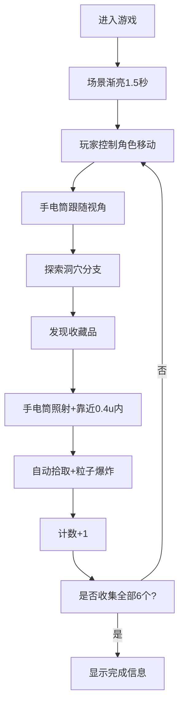

## 1. 产品概述

3D洞穴探索潜行游戏原型，用于验证潜行类游戏在黑暗环境中光照反馈与角色移动节奏的快速验证。玩家在复杂昏暗洞穴中探索，利用手电筒与周围环境交互，收集散布的收藏品。

## 2. 核心功能

### 2.1 用户角色

| 角色 | 注册方式 | 核心权限 |
|------|---------|---------|
| 玩家 | 无需注册，直接进入游戏 | 控制角色移动、使用手电筒、收集物品 |

### 2.2 功能模块

1. **手电筒光照交互**：锥形光锥、光斑投射、材质颜色响应、收藏品高亮脉冲
2. **洞穴场景生成**：随机分支路径、低多边形风格、苔藓发光点、隐藏区域
3. **角色移动与探索**：WASD行走/Shift奔跑、相机颠簸、手电筒晃动、墙壁暗角
4. **收藏品收集与奖励**：发光八面体物品、拾取粒子爆炸、得分动画、完成提示
5. **UI界面**：毛玻璃HUD、收藏计数、灯光亮度条、操作提示、场景渐亮、隐藏区域音效

### 2.3 页面详情

| 页面名称 | 模块名称 | 功能描述 |
|---------|---------|-----------|
| 游戏主界面 | 3D场景渲染 | 渲染洞穴、角色、光照、收藏品 |
| 游戏主界面 | 手电筒光照 | 锥形光（45度张角，12单位距离 |
| 游戏主界面 | 角色控制 | WASD行走4u/s，Shift奔跑7u/s，相机颠簸 |
| 游戏主界面 | HUD界面 | 毛玻璃风格，计数、亮度条、操作提示 |
| 游戏主界面 | 收藏品系统 | 6个八面体收藏品，自动拾取，粒子效果 |

## 3. 核心流程

玩家进入游戏 → 场景渐亮显示洞穴场景 → 使用WASD移动探索洞穴 → 用手电筒照亮环境 → 发现并靠近收藏品（0.4u内自动拾取 → 计数+1并显示粒子效果 → 继续探索分支路径和隐藏区域 → 收集全部6个物品 → 显示完成信息

## 4. 用户界面设计

### 4.1 设计风格

- **主色调**：深暗洞穴风格，低多边形暗色环境光
- **配色**：
  - 环境光强度0.2，主方向光0.1（30度角）
  - 手电筒暖黄#f5deb3（岩石）/冷白#e0f7fa（金属）
  - 苔藓发光点#00ff88
  - 金色完成文字#ffd700
  - UI背景rgba(0,0,0,0.4)毛玻璃
  - 亮度条渐变#ffcc00→#ff8800
- **字体**：无衬线字体，白色文字带1px黑色阴影
- **布局**：
  - 左上角：收藏计数
  - 右下角：灯光亮度条（200×12px，圆角6px）
  - 底部中央：操作提示
  - 屏幕中央：完成信息

### 4.2 页面设计概览

| 页面名称 | 模块名称 | UI元素 |
|---------|---------|--------|
| 游戏主界面 | 3D场景 | 低多边形洞穴、苔藓发光点、手电筒光斑、收藏品八面体
| 游戏主界面 | HUD | 毛玻璃半透明背景、收藏计数、亮度进度条、操作提示文字
| 游戏主界面 | 动效 | 场景渐亮、拾取粒子爆炸、+1飘字、隐藏区域闪烁

### 4.3 响应式

- 桌面优先，全屏3D画布自适应窗口大小
- UI固定定位，不随缩放变形

### 4.4 3D场景指引

- **环境/HDRI：低多边形洞穴，暗色调，低多边形风格
- **光照设置**：环境光0.2，方向光0.1（30度），手电筒聚光灯（45度12单位，苔藓点光源9个动态
- **相机设置**：第一人称视角，随移动上下颠簸0.02u/2Hz，手电筒阻尼0.85
- **构图与焦点**：手电筒光照区域为视觉焦点
- **交互与动画**：手电筒跟随旋转（阻尼0.85），奔跑晃动0.03u/3Hz
- **后处理**：暗角效果（墙壁0.5u内出现），场景渐亮1.5s
- **资源与性能**：10动态光源，阴影贴图1024×1024，帧率>50FPS
