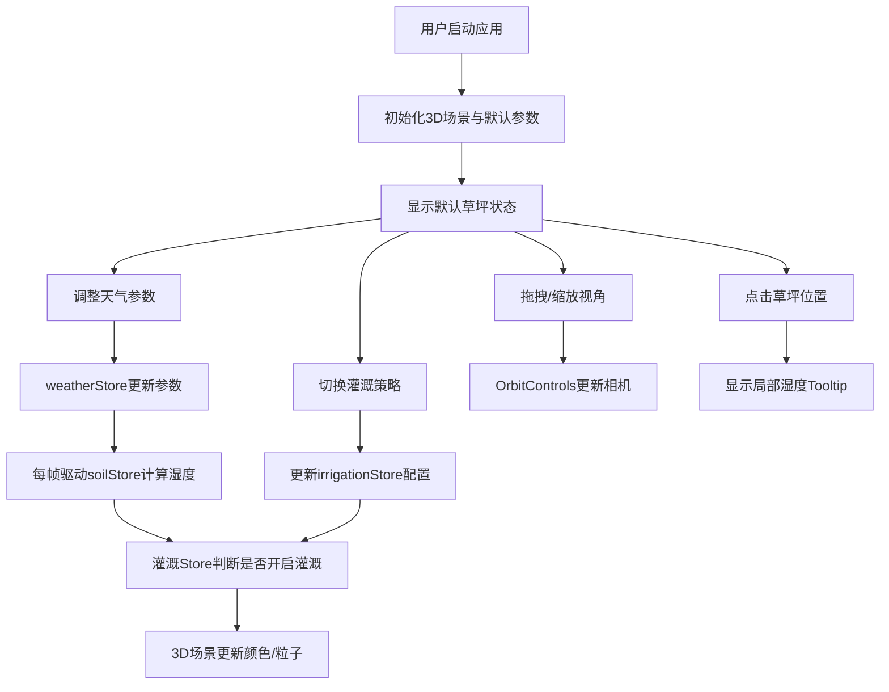

## 1. 产品概述

智能灌溉调度3D可视化模拟系统，为景观设计师提供直观的节水灌溉策略验证工具。通过实时调整天气参数（降雨量、蒸发率、温度），观察虚拟草坪区域土壤湿度的动态变化，并验证不同灌溉策略（阈值触发/定时灌溉）的效果。

- 核心价值：帮助设计师在实际施工前模拟不同天气条件下的灌溉方案，优化水资源利用
- 目标用户：城市园林设计师、景观工程师、农业灌溉规划人员

## 2. 核心功能

### 2.1 用户角色
| 角色 | 注册方式 | 核心权限 |
|------|---------|---------|
| 设计师 | 无需注册，本地应用 | 调整参数、切换策略、观察模拟结果 |

### 2.2 功能模块
1. **主界面**：左侧控制面板 + 右侧3D场景 + 底部HUD数据层
2. **天气控制模块**：雨量/蒸发率/温度滑块实时调节
3. **灌溉策略模块**：阈值触发/定时灌溉模式切换与参数设置
4. **3D场景模块**：双层草坪网格、植被粒子、喷灌粒子系统、视角控制
5. **状态摘要模块**：实时显示土壤湿度、灌溉状态、天气参数

### 2.3 页面详情
| 页面名称 | 模块名称 | 功能描述 |
|---------|---------|---------|
| 主界面 | 天气控制卡片 | 三个渐变滑块调节降雨(0-50mm/h)、蒸发率(0-10mm/h)、温度(15-40°C)，数值实时同步，温度驱动背景色变化 |
| 主界面 | 灌溉策略卡片 | 切换阈值/定时模式，阈值模式设置30%启动70%停止，定时模式设置开始时间与持续时长 |
| 主界面 | 状态摘要卡片 | 上下层湿度百分比显示、灌溉状态文字、天气参数摘要 |
| 主界面 | 3D草坪场景 | 5x5单位双层网格，20x20顶点，湿度映射为颜色渐变（褐→绿），3000植被粒子，喷灌扇形粒子系统 |
| 主界面 | HUD数据层 | 底部半透明条，条状进度条显示湿度，灌溉状态，天气摘要 |
| 主界面 | 重置按钮 | 一键恢复所有参数至默认值 |

## 3. 核心流程

用户打开应用 → 观察默认状态下的草坪 → 通过滑块调整天气参数 → 观察土壤湿度动态变化 → 切换灌溉策略模式 → 设置策略参数 → 观察喷灌系统自动开启/关闭 → 点击草坪位置查看局部湿度 → 拖拽旋转/缩放视角 → 点击重置恢复初始状态

## 4. 用户界面设计

### 4.1 设计风格
- 主色调：深色科技风 `#1a1a2e`，强调色青色 `#00e5ff` 与绿色 `#00ff80`，警示色红色 `#e74c3c`
- 字体色：浅灰 `#e0e0e0`，数值显示用等宽字体
- 卡片风格：半透明毛玻璃 `rgba(255,255,255,0.05)`，背板模糊8px，圆角12px
- 滑块：轨迹4px圆角2px，按钮直径16px青色，宽度220px

### 4.2 页面设计概述
| 页面名称 | 模块名称 | UI元素 |
|---------|---------|--------|
| 主界面 | 左侧控制面板 | 固定宽度320px，内边距24px，三张卡片间距12px：天气(青色10%背景)、灌溉(绿色10%背景)、状态(白色5%背景) |
| 主界面 | 右侧3D场景 | flex占满剩余宽度，Canvas自适应，OrbitControls阻尼0.1，缩放2-15单位 |
| 主界面 | 底部HUD | 高度48px，`rgba(0,0,0,0.5)`背景，水平排列：上层湿度条(120px #00e5ff)、下层湿度条(120px #00ff80)、灌溉状态文字、天气摘要文字 |
| 主界面 | Tooltip | 点击草坪弹出，显示上层/下层湿度值与所属层，持久显示直到点击其他位置 |

### 4.3 响应式
- 桌面优先（>768px）：左侧固定面板 + 右侧3D场景
- 移动端（≤768px）：面板变为顶部可折叠菜单，3D场景占满视口，HUD保持底部

### 4.4 3D场景指导
- 环境：深色调背景（与UI呼应），柔和方向光 + 环境光，营造夜间监控室氛围
- 光照：主光方向 (-5, 10, 7)，强度0.8；环境光强度0.4，色温偏冷
- 相机：初始位置 (0, 6, 8)，看向原点，fov 50
- 草坪：双层20x20顶点平面，上层略高于下层，顶点色独立插值
- 喷灌粒子：扇形分布，半径1.5，每组500个，生命周期2s，重力下落，颜色rgba(100,200,255,0.6)
- 后处理：轻微Bloom使青色元素发光，提升科技感
