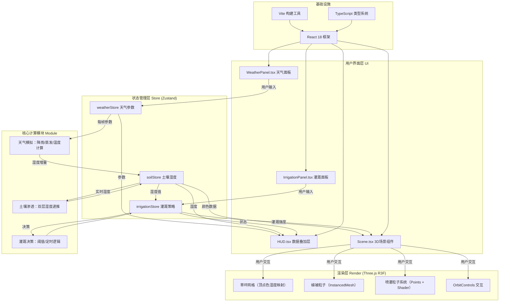

## 1. 架构设计



## 2. 技术选型说明

| 层级 | 技术 | 版本要求 | 用途 |
|------|------|---------|------|
| 前端框架 | React | ^18.2 | 组件化UI开发 |
| 类型系统 | TypeScript | ^5.0 | 严格模式，类型安全 |
| 构建工具 | Vite | ^5.0 | 快速HMR开发与生产构建 |
| 3D渲染 | Three.js | ^0.160 | WebGL底层渲染 |
| React-3D桥接 | @react-three/fiber | ^8.15 | 声明式Three.js封装 |
| 3D工具库 | @react-three/drei | ^9.92 | OrbitControls等辅助组件 |
| 状态管理 | Zustand | ^4.4 | 轻量跨组件状态共享 |

## 3. 目录结构

```
auto68/
├── package.json
├── index.html
├── vite.config.js
├── tsconfig.json
└── src/
    ├── types.ts                   # 全局类型定义
    ├── App.tsx                    # 根组件：布局组合所有模块
    ├── main.tsx                   # React入口
    ├── index.css                  # 全局样式（CSS变量+毛玻璃）
    ├── store/
    │   ├── weatherStore.ts        # 天气状态管理+计算
    │   ├── soilStore.ts           # 土壤湿度双层计算
    │   └── irrigationStore.ts     # 灌溉策略决策
    └── components/
        ├── WeatherPanel.tsx       # 天气参数滑块面板
        ├── IrrigationPanel.tsx    # 灌溉策略设置面板
        ├── Scene.tsx              # 3D场景：草坪+粒子+交互
        └── HUD.tsx                # 底部状态叠加层
```

## 4. 核心数据流与模块契约

### 4.1 Store 数据流时序（每帧执行，requestAnimationFrame 驱动）

```
onFrame(dt)
  ├─ weatherStore.update(dt)    ：对参数做平滑过渡（无突变）
  ├─ soilStore.update(dt, weatherParams)
  │   ├─ 上层：+ 降雨*0.02 - 蒸发*0.01*(蒸发率/10)  clamp(0~1)
  │   └─ 下层：+ (上层-下层)*0.005  clamp(0~0.8)
  └─ irrigationStore.update(dt, soilMoisture)
      ├─ 阈值模式：上层<0.3 开启；上层>0.7 关闭（带迟滞）
      └─ 定时模式：当前时间匹配→开启，持续时长后关闭
```

### 4.2 核心类型（对应 src/types.ts）

| 接口名 | 字段 | 类型 | 语义 |
|--------|------|------|------|
| WeatherParams | rainfall | number (0-50) | 降雨量 mm/h |
| | evaporation | number (0-10) | 蒸发率 mm/h |
| | temperature | number (15-40) | 温度 °C |
| SoilData | topMoisture | number[][] (20x20) | 上层(0-5cm)湿度 0-1 |
| | subMoisture | number[][] (20x20) | 下层(5-20cm)湿度 0-0.8 |
| | avgTop | number | 上层平均值 |
| | avgSub | number | 下层平均值 |
| IrrigationStrategy | mode | 'threshold' \| 'scheduled' | 策略模式 |
| | thresholdOn | number (0-1) | 启动阈值 |
| | thresholdOff | number (0-1) | 停止阈值 |
| | scheduleStart | number (0-24) | 定时开始(小时) |
| | scheduleDuration | number (min) | 持续时长(分钟) |
| IrrigationState | active | boolean | 是否开启 |
| | intensity | number (0-1) | 喷灌强度 |
| | zones | number[][] | 覆盖区域网格 |
| ClickedPoint | x | number | 网格x索引 |
| | z | number | 网格z索引 |
| | layer | 'top' \| 'sub' | 所属层 |

## 5. 性能优化要点

| 优化点 | 方案 | 预算 |
|--------|------|------|
| 草坪网格 | 预分配 BufferGeometry，setAttribute 直接更新顶点 color 数组（不重建） | <0.2ms/帧 |
| 植被粒子 | InstancedMesh 渲染 3000 实例，干燥时通过 uniform 调整饱和度 | 1 draw call |
| 喷灌粒子 | Points + ShaderMaterial，粒子位置在CPU以扇形预生成，GPU做重力与生命周期 | 500粒子/组，<0.5ms |
| 状态更新 | Zustand selector 精确订阅，避免全量 re-render；3D场景用 useFrame 而非 state 订阅 | R3F 每帧 1 次 update |
| 内存 | 数组复用 TypedArray（Float32Array for colors/positions） | 无频繁GC |
| 帧率 | 目标 60fps，保底 30fps；useFrame delta time 缩放保证速度稳定 | DevTools FPS 监控 |
