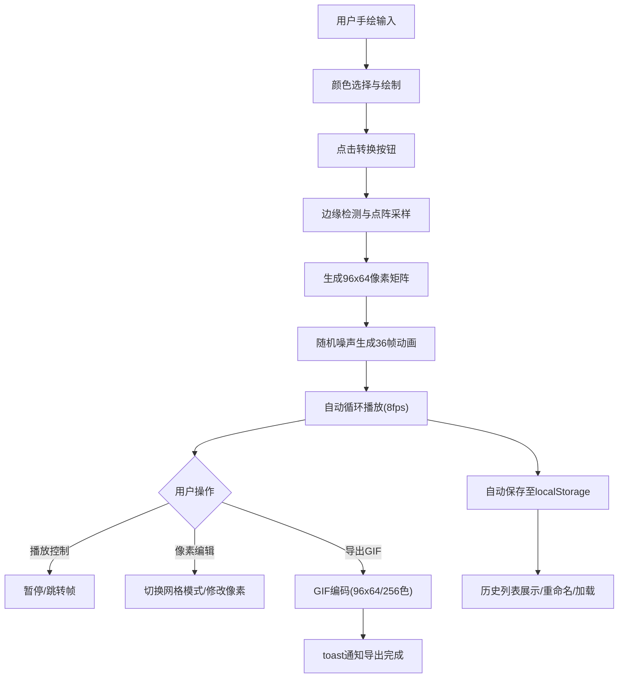

## 1. 产品概述

Pixel Animator 是一款面向创意设计者的手绘转像素动画工具，能够将用户手绘的简笔画实时转化为具有复古感的像素风格动态展示。用户可在白色画布上自由绘制，系统自动进行点阵采样并生成36帧循环像素动画，支持精细编辑、历史管理和GIF导出。

- 核心目标：降低手绘创意到像素动画的转化门槛，提供快速、直观的像素艺术创作体验
- 目标用户：创意设计师、像素艺术爱好者、游戏开发者、教育工作者

## 2. 核心功能

### 2.1 用户角色
| 角色 | 注册方式 | 核心权限 |
|------|----------|----------|
| 普通用户 | 无需注册，本地使用 | 全部功能：绘制、转换、编辑、导出、历史管理 |

### 2.2 功能模块
1. **手绘输入模块**：600x400画布、画笔绘制、颜色选择器、转换按钮
2. **像素动画引擎**：96x64点阵采样、随机噪声算法、36帧循环动画生成
3. **动画播放控制**：播放/暂停、帧进度条拖拽跳转、8fps精确帧率
4. **GIF导出模块**：256色深度、96x64输出、导出完成toast通知
5. **历史作品管理**：localStorage持久化、缩略图列表、重命名、快速加载
6. **像素网格编辑**：预览模式切换、逐像素点击编辑、颜色气泡选择器

### 2.3 页面详情
| 页面名称 | 模块名称 | 功能描述 |
|----------|----------|----------|
| 主页 | 标题区 | 60px高度居中展示Logo与应用名称 |
| 主页 | 手绘画布区 | 660px宽度，包含600x400白色画布、颜色选择器、转换按钮 |
| 主页 | 像素预览区 | 网格编辑模式切换、96x64像素格点展示、点击编辑像素颜色 |
| 主页 | 播放控制栏 | 播放/暂停按钮、帧进度条(400x6px)、可拖拽滑块 |
| 主页 | 历史作品区 | 桌面端右侧200px宽，移动端底部横向滚动，120x80缩略图 |
| 主页 | 导出功能区 | 绿色导出按钮、右上角toast确认通知 |

## 3. 核心流程

用户在画布上绘制简笔画 → 选择画笔画出的颜色 → 点击转换按钮 → 系统进行边缘检测和点阵采样(200ms内) → 生成96x64像素矩阵 → 逐帧生成36帧循环动画(随机噪声算法) → 自动播放动画(8fps) → 用户可：(1)拖拽进度条跳转帧 (2)切换像素编辑模式手动修改像素 (3)点击导出生成GIF(3秒内) → 作品自动保存至本地历史 → 可从历史列表重新加载编辑

## 4. 用户界面设计

### 4.1 设计风格
- 主题：深色科技感，深蓝紫三层渐变(#1a1a2e → #16213e → #0f3460)
- 主操作区：浅灰#f8f9fa背景，与深色主题形成鲜明对比
- 主色：紫色系 #6c5ce7(主色) / #a29bfe(悬停) / #5f27cd(点击)
- 功能色：绿色系 #00b894(导出) / #55efc4(悬停)
- 中性色：#2d3436(深灰文字) / #636e72(次级文字) / #ddd(轨道/边框)
- 卡片：圆角12px，阴影0 4px 12px rgba(0,0,0,0.3)
- 按钮：主按钮圆角12px，导出按钮圆角8px，播放按钮圆形28x28
- 过渡：所有hover/focus/点击使用0.2s ease-out
- 字体：选择现代无衬线字体，标题加粗，正文常规

### 4.2 页面设计概览
| 页面名称 | 模块名称 | UI元素 |
|----------|----------|----------|
| 主页 | 标题区 | 深色渐变背景，居中Logo，60px高度，白色标题文字 |
| 主页 | 主内容区 | Flex布局，左侧画布区(660px) + 右侧历史区(200px)，卡片圆角12px，浅灰背景 |
| 主页 | 画布模块 | 600x400白色画布，8x8色块颜色选择器(18x18px色块)，紫色转换按钮 |
| 主页 | 像素预览 | 576x384网格区域(96x64格点，每格6px)，颜色气泡选择器(圆角6px) |
| 主页 | 播放控制 | 圆形播放/暂停按钮，400x6px进度条(圆角3px)，14px圆形滑块 |
| 主页 | 历史面板 | 纵向/横向滚动缩略图(120x80，圆角4px，1px边框)，可编辑名称，时间戳 |
| 主页 | 导出功能 | 绿色导出按钮，右上角toast(圆角6px，深色背景白字，3秒消失) |

### 4.3 响应式
- 桌面优先，最小宽度1024px
- 画布区固定660px，历史区固定200px，两列并排布局
- 移动端(<1024px)：历史区折叠为底部横向滚动条，画布区居中
- 触摸事件兼容：支持手指绘制和拖拽操作

### 4.4 性能指标
| 操作 | 指标要求 |
|------|----------|
| 手绘→像素矩阵转换(500点内) | ≤200ms |
| 动画帧间隔精度 | 125ms ±10ms |
| 36帧GIF导出总时间 | ≤3秒 |
