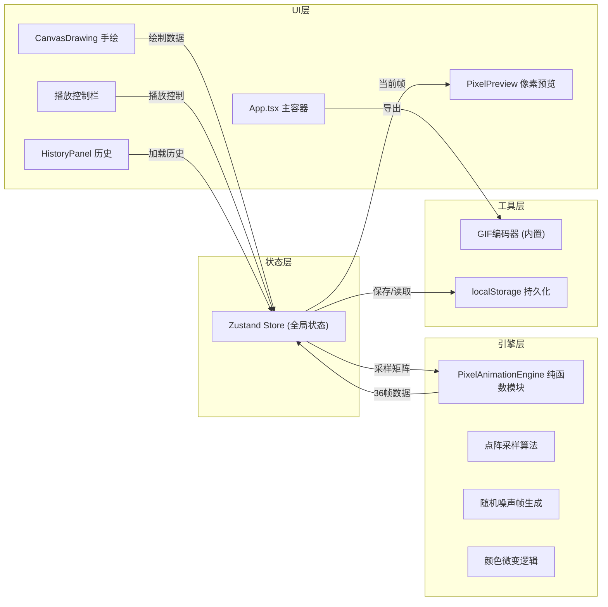

## 1. 架构设计

纯前端单页应用，无后端服务。状态通过Zustand全局管理，Canvas API处理绘制与像素采样，纯函数引擎生成动画帧，localStorage实现数据持久化。



## 2. 技术描述

- 前端框架：React 18 + TypeScript (严格模式，target ES2020)
- 构建工具：Vite 5.x (react-ts模板)
- 状态管理：Zustand 4.x
- 样式方案：原生CSS + CSS Modules (无Tailwind)
- 绘制引擎：HTML5 Canvas API (2D Context)
- 无额外第三方动画库，使用requestAnimationFrame/setInterval精确控制
- 无后端服务，localStorage本地持久化

## 3. 路由定义

| 路由 | 用途 |
|------|------|
| / | 主应用单页，包含全部功能模块 |

单页应用，无路由切换。

## 4. 核心数据模型

### 4.1 像素矩阵
```typescript
// 96x64的像素矩阵，每个元素为CSS颜色字符串或null(透明)
type PixelMatrix = string[][]; // [row: 64][col: 96]
```

### 4.2 动画帧数据
```typescript
interface AnimationData {
  frames: PixelMatrix[]; // 36帧像素数据
  frameCount: 36;
  fps: 8;
  frameDuration: 125; // ms
}
```

### 4.3 历史作品
```typescript
interface Artwork {
  id: string; // uuid
  name: string;
  createdAt: string; // ISO 格式，前端展示 YYYY-MM-DD HH:mm
  thumbnail: string; // DataURL base64 (120x80)
  baseMatrix: PixelMatrix; // 首帧像素矩阵
  animation: AnimationData; // 完整动画数据
  canvasSnapshot?: string; // 原始手绘canvas快照
}
```

### 4.4 全局状态(Zustand Store)
```typescript
interface AppState {
  // 绘制
  currentColor: string;
  brushSize: number;
  canvasDrawingData: ImageData | null;
  
  // 像素与动画
  basePixelMatrix: PixelMatrix | null; // 首帧
  animationFrames: PixelMatrix[]; // 36帧
  currentFrameIndex: number;
  isPlaying: boolean;
  viewMode: 'drawing' | 'pixel-grid'; // 手绘/像素编辑模式
  
  // 历史
  history: Artwork[];
  
  // UI
  toast: { message: string; visible: boolean } | null;
  colorPicker: { x: number; y: number; pixelX: number; pixelY: number } | null;
  
  // Actions
  setCurrentColor: (c: string) => void;
  convertToPixels: (canvas: HTMLCanvasElement) => void; // 采样 + 生成动画
  togglePlay: () => void;
  setFrameIndex: (i: number) => void;
  setViewMode: (m: 'drawing' | 'pixel-grid') => void;
  setPixelColor: (x: number, y: number, color: string) => void;
  regenerateAnimation: () => void;
  exportGIF: () => Promise<void>;
  saveToHistory: () => void;
  loadFromHistory: (id: string) => void;
  renameArtwork: (id: string, name: string) => void;
  showToast: (msg: string) => void;
  openPixelColorPicker: (x, y, px, py) => void;
  closePixelColorPicker: () => void;
}
```

## 5. 文件结构

```
auto69/
├── package.json
├── index.html
├── vite.config.js
├── tsconfig.json
└── src/
    ├── main.tsx                 # React 入口
    ├── App.tsx                  # 主应用组件
    ├── store.ts                 # Zustand 全局状态
    ├── CanvasDrawing.tsx        # 手绘画布组件
    ├── PixelAnimationEngine.ts  # 纯函数：采样+动画引擎
    ├── PixelPreview.tsx         # 像素网格预览与编辑
    ├── HistoryPanel.tsx         # 历史作品面板
    ├── GifEncoder.ts            # 内置GIF编码器
    └── styles.css               # 全局样式
```

## 6. 关键算法说明

### 6.1 手绘→像素矩阵(点阵采样)
1. 将600x400 canvas内容缩放到96x64离屏canvas
2. 逐像素读取ImageData，检测每个像素与画布白色背景的差异
3. 色差阈值判定：RGB差>30判定为有笔迹，取该像素颜色写入矩阵，否则null

### 6.2 随机噪声帧生成
- 输入：首帧96x64矩阵
- 输出：36帧矩阵数组
- 每帧处理：
  - 复制上一帧
  - 随机选择5%-15%的非空像素
  - 对选中像素执行：(a)颜色微变 (b)位置偏移 二选一或同时
  - 颜色微变：HSL空间H±10°, S±10%, L±10%(限制20色阶内)
  - 位置偏移：上下左右随机1格(边界检测)
- 第36帧逐步插值回首帧，实现无缝循环

### 6.3 精确帧率控制
- 使用performance.now()校准的requestAnimationFrame循环
- 累积时间误差补偿，确保125ms±10ms精度
- 帧进度条与渲染帧同步

### 6.4 GIF编码(内置)
- NeuQuant量化算法生成256色调色板
- LZW压缩编码像素数据
- 96x64输出尺寸，每帧delay=8(≈8fps)
- Blob下载，DataURL生成缩略图
