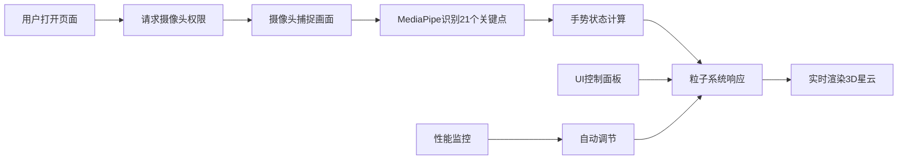

## 1. 产品概述
一个基于Web的手势控制3D粒子星云交互应用，通过摄像头捕捉用户手部动作，实时操控由数千个彩色粒子组成的星云效果。

## 2. 核心功能

### 2.1 功能模块
1. **手势识别与交互映射**：基于MediaPipe Hand Landmarks识别21个手部关键点，支持捏合手势控制粒子聚集/散开，手掌移动控制旋转，张开度控制颜色饱和度。
2. **3D粒子系统**：8000个彩色粒子在球体空间分布，支持布朗运动、聚集动画、颜色动态响应。
3. **场景与环境**：深空渐变背景、外围星光粒子、中心光晕效果。
4. **交互反馈**：实时手势状态显示、状态变化进度提示、手势丢失自动恢复。
5. **UI控制面板**：可拖拽的半透明控制面板，包含粒子数量、旋转速度、背景亮度滑块及重置按钮。
6. **性能监控**：实时FPS显示、粒子渲染数量、手势识别延迟，自动性能调节。

### 2.2 页面详情
| 页面名称 | 模块名称 | 功能描述 |
|-----------|-------------|---------------------|
| 主页面 | 手势识别模块 | 初始化MediaPipe Hands，识别21个关键点，计算手势状态（捏合、张开度、掌心位置） |
| 主页面 | 粒子系统模块 | 生成8000个粒子，处理运动更新、聚集/散开动画、颜色饱和度响应 |
| 主页面 | 场景渲染模块 | Three.js场景、相机、环境星光、光晕效果 |
| 主页面 | 交互反馈模块 | 手势状态HUD、状态变化进度条、自动恢复动画 |
| 主页面 | UI控制面板 | 三个参数滑块、重置按钮、面板拖拽 |
| 主页面 | 性能监控模块 | FPS/粒子数/延迟显示，低FPS自动降级 |

## 3. 核心流程
用户打开页面 → 请求摄像头权限 → 摄像头捕捉画面 → MediaPipe识别手部关键点 → 手势状态计算 → 粒子系统响应手势变化 → 实时渲染3D星云 → 用户通过控制面板调节参数 → 性能监控自动优化

## 4. 用户界面设计

### 4.1 设计风格
- **主题色**：暖紫色 `#9b59b6`
- **背景渐变**：深空从 `#0a0a23` 到 `#1a0a2e`
- **整体风格**：暗色调科技风格，半透明玻璃拟态，平滑过渡动画
- **字体**：现代无衬线字体，12px状态文字，16px性能数字
- **圆角**：8px-12px统一圆角
- **交互元素过渡**：0.3s ease 统一过渡动画

### 4.2 页面设计概述

| 页面名称 | 模块名称 | UI元素 |
|-----------|-------------|-------------|
| 主页面 | 手势状态HUD | 左上角半透明黑底圆角8px，白色12px文字 |
| 主页面 | 3D星云场景 | 居中全屏渲染，深空渐变背景 |
| 主页面 | 状态变化进度条 | 星云下方弧形渐变进度条，宽度4px |
| 主页面 | UI控制面板 | 右侧240px宽半透明面板，可拖拽，三个自定义滑块 |
| 主页面 | 性能监控面板 | 右下角实时数据，低FPS红色警告 |
| 主页面 | 手势识别区域 | 1px dashed #555 虚线边框提示 |

### 4.3 交互细节
- **滑块样式**：轨道高4px圆角2px颜色#333，滑块直径16px圆形渐变从#8e44ad到#9b59b6
- **重置按钮**：圆角8px，背景从#e74c3c到#c0392b渐变，点击反转颜色
- **粒子颜色**：紫#9b59b6、蓝#3498db、粉#e91e63、青#00bcd4 预设调色板
- **星光粒子**：纯白#ffffff，透明度0.4-0.8随机闪烁，周期1-3秒
- **光晕效果**：半径3单位，透明度0.2

### 4.4 3D场景指导
- **环境**：深空渐变背景，无HDRI
- **光照**：点光源配合粒子自发光
- **相机**：固定透视相机，视角75度，近裁剪面0.1，远裁剪面1000
- **构图**：星云居中，半径12单位球体分布
- **交互**：手势驱动旋转、缩放、颜色变化
- **后处理**：轻微光晕效果，无过度曝光
- **性能预算**：8000粒子维持50FPS以上

### 4.5 响应式
- 桌面端优先设计，全屏canvas自适应窗口大小，控制面板吸附右侧边缘，手势识别区域跟随视频流

## 5. 性能指标
- 端到端延迟 < 100ms
- 8000粒子下FPS ≥ 50+
- FPS低于30时自动降低30%粒子数
- FPS恢复50+持续5秒后恢复原粒子数
