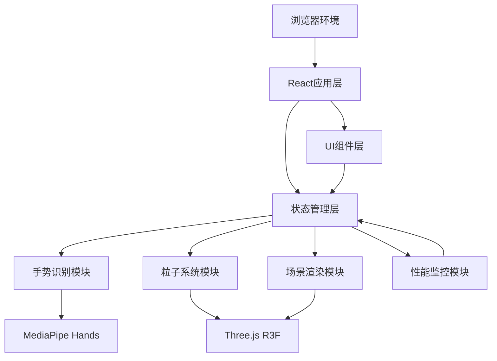
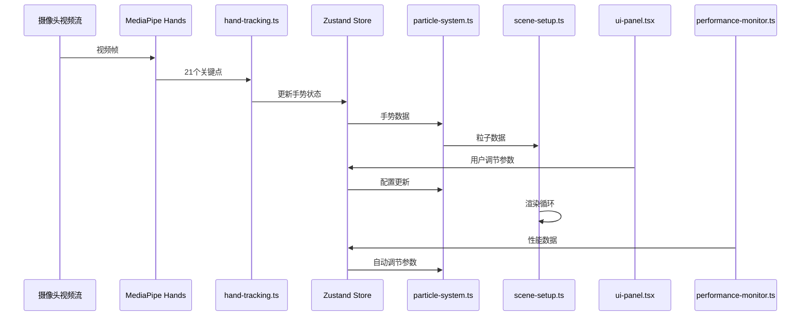

## 1. 架构设计



## 2. 技术描述

### 2.1 前端技术栈
- **框架**：React@18 + TypeScript
- **3D渲染**：Three.js + @react-three/fiber + @react-three/drei
- **状态管理**：Zustand
- **手势识别**：@mediapipe/hands + @mediapipe/camera_utils
- **构建工具**：Vite
- **辅助库**：three-stdlib

### 2.2 项目初始化
- 使用 `vite-init` 创建 react-ts 模板
- 无后端服务，纯前端应用

### 2.3 核心依赖版本
- react: ^18.2.0
- react-dom: ^18.2.0
- typescript: ^5.0.0
- three: ^0.160.0
- @react-three/fiber: ^8.15.0
- @react-three/drei: ^9.92.0
- zustand: ^4.4.0
- @mediapipe/hands: ^0.4.0
- @mediapipe/camera_utils: ^0.3.0
- three-stdlib: ^2.29.0

## 3. 模块架构

### 3.1 文件结构
```
src/
├── store/
│   └── index.ts          # Zustand全局状态管理
├── hand-tracking.ts       # 手势识别模块
├── particle-system.ts   # 粒子系统模块
├── scene-setup.ts      # 场景渲染模块
├── ui-panel.tsx       # UI控制面板组件
├── performance-monitor.ts # 性能监控模块
├── App.tsx            # 主应用组件
├── main.tsx           # 入口文件
└── index.css          # 全局样式
```

### 3.2 模块职责

| 模块 | 职责 | 输出 |
|------|------|------|
| Zustand Store | 全局状态管理，连接所有模块 | handState、particleConfig、uiState、performanceState |
| hand-tracking.ts | MediaPipe初始化、关键点识别、手势计算 | 21个关键点坐标、捏合状态、张开度、掌心位置、左右手识别 |
| particle-system.ts | 粒子生成、运动更新、聚集/散开动画、颜色响应 | 粒子位置、颜色、大小缓冲区 |
| scene-setup.ts | Three.js场景、相机、灯光、星光、光晕 | 可渲染的3D场景 |
| ui-panel.tsx | 控制面板渲染、参数调节、拖拽功能 | 用户交互参数更新到Store |
| performance-monitor.ts | FPS计算、延迟监控、自动性能调节 | 性能数据、自动降级/恢复 |

## 4. 状态管理设计

### 4.1 Zustand Store 状态定义

```typescript
interface HandState {
  landmarks: number[][]; // 21个关键点 [x, y, z][]
  isPinching: boolean;
  pinchDistance: number;
  palmCenter: { x: number; y: number };
  openness: number; // 0-1 张开度
  handSide: 'left' | 'right' | null;
  lastDetectedTime: number;
  trackingLatency: number;
}

interface ParticleConfig {
  count: number; // 1000-10000
  rotationSpeed: number; // 0-0.1 rad/s
  backgroundBrightness: number; // 0.3-1.0
  baseRadius: number; // 12单位
  targetScale: number; // 当前缩放比例
  saturation: number; // 0.3-1.0
  rotationY: number; // 当前Y轴旋转
}

interface UIState {
  panelPosition: { x: number; y: number };
  progressVisible: boolean;
  progressValue: number;
}

interface PerformanceState {
  fps: number;
  particleCount: number;
  handLatency: number;
  lowFpsStartTime: number;
  highFpsStartTime: number;
  originalParticleCount: number;
}
```

## 5. 数据流向



## 6. 核心技术实现要点

### 6.1 手势识别模块
- 使用 MediaPipe Hands 识别21个手部关键点
- 关键点坐标归一化到 [0, 1] 范围
- 捏合检测：大拇指指尖(4)与食指指尖(8)的欧氏距离
- 掌心位置：手腕(0)与中指根部(9)的中点
- 张开度：5个指尖到掌心的平均距离归一化
- 左右手识别：根据关键点相对位置判断

### 6.2 粒子系统模块
- 使用 BufferGeometry + Points 实现高性能粒子渲染
- 粒子初始位置：球体空间随机分布，使用球坐标系
- 布朗运动：每帧位置添加微小随机偏移
- 聚集动画：使用缓动函数实现1.2秒缓出过渡
- 颜色系统：HSL颜色空间，饱和度实时响应
- 性能优化：使用 ShaderMaterial 自定义着色器

### 6.3 场景渲染模块
- 相机固定位置 (0, 0, 30)，看向原点
- 背景：使用 shaderMaterial 实现深空渐变
- 星光粒子：2000个微小粒子，透明度动画
- 光晕效果：使用径向渐变透明球体
- 渲染循环：requestAnimationFrame 驱动

### 6.4 性能监控模块
- FPS计算：使用 performance.now() 计算帧间隔
- 低FPS检测：连续3秒低于30触发降级
- 自动降级：粒子数减少30%
- 自动恢复：FPS稳定50+持续5秒恢复

## 7. 性能优化策略

1. **GPU加速**：使用 Points + ShaderMaterial 批量渲染
2. **BufferGeometry**：避免每帧重建几何体，仅更新位置/颜色缓冲区
3. **对象池**：预分配粒子缓冲区，动态调整可见性
4. **帧率自适应**：根据性能自动调节粒子数量
5. **节流**：手势识别与渲染解耦，使用 requestAnimationFrame 同步

## 8. 配置文件说明

### 8.1 vite.config.js
- 开启 TypeScript 严格模式
- 配置 glsl 文件加载
- 优化生产构建

### 8.2 tsconfig.json
- target: ES2022
- moduleResolution: bundler
- strict: true
- 配置路径别名 @

### 8.3 index.html
- 视口设置：user-scalable=no
- 黑色背景
- 移动端适配
