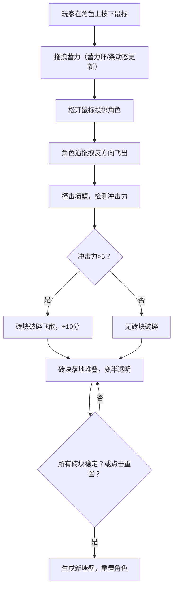

## 1. 产品概述

这是一个基于2D物理引擎的角色投掷与墙壁破碎模拟游戏，玩家通过拖拽蓄力投掷圆形角色撞击墙壁，体验真实的物理碰撞和碎片飞散效果。

- **核心玩法**：拖拽蓄力投掷角色，撞击由多个砖块组成的墙壁，观察物理碰撞带来的破碎效果
- **目标用户**：喜欢物理模拟类休闲游戏的玩家
- **市场价值**：提供高度沉浸式的物理碰撞体验，碎片飞散和堆叠效果具有高度观赏性

## 2. 核心功能

### 2.1 功能模块

1. **游戏主场景**：Canvas画布渲染、物理世界、角色与墙壁
2. **蓄力投掷系统**：鼠标拖拽、蓄力指示环、方向与力度计算
3. **物理破碎系统**：碰撞检测、冲击力判定、砖块飞散
4. **得分与反馈系统**：击碎得分、飘字效果、投掷计数
5. **重置与关卡系统**：自动检测稳定状态、新墙生成、角色重置

### 2.2 页面详情

| 页面名称 | 模块名称 | 功能描述 |
|---------|---------|---------|
| 游戏主页面 | 游戏画布 | 800x600px Canvas，渲染物理世界所有物体 |
| 游戏主页面 | 状态条 | 显示得分、投掷次数、重置按钮 |
| 游戏主页面 | 蓄力指示条 | 垂直显示当前蓄力值，颜色从绿到红渐变 |
| 游戏主页面 | 蓄力指示环 | 角色周围半透明圆环，随蓄力变化半径和颜色 |
| 游戏主页面 | 得分飘字 | 击碎砖块时显示"+10"淡出效果 |

## 3. 核心流程

玩家在圆形角色上按下鼠标左键 → 拖拽调整方向和力度（蓄力环动态变化）→ 松开鼠标投掷 → 角色飞出撞击墙壁 → 冲击力超过阈值的砖块破碎飞散 → 砖块落地堆叠并变半透明 → 所有砖块稳定后自动重置或点击重置按钮 → 生成新墙壁开始下一轮

## 4. 用户界面设计

### 4.1 设计风格

- **主色调**：深蓝渐变背景（#0f0c29 → #302b63），营造深邃太空感
- **强调色**：角色金黄色（#f1c40f）、蓄力指示绿红渐变（#2ecc71 → #e74c3c）、砖块多彩色（#c0392b, #e74c3c, #8e44ad, #2980b9）
- **字体**：无衬线字体，得分文字带1px黑色描边
- **按钮**：圆形重置按钮，背景红色（#e74c3c），点击时缩放动画
- **整体风格**：深色科技感，物理效果突出，动效流畅

### 4.2 页面设计概述

| 页面名称 | 模块名称 | UI元素 |
|---------|---------|--------|
| 游戏主页面 | 游戏画布 | 深蓝渐变背景，800x600px居中，径向渐变角色，多彩砖块 |
| 游戏主页面 | 状态条 | 半透明黑底（rgba(0,0,0,0.5)），圆角8px，内边距12px，位于画布顶部 |
| 游戏主页面 | 蓄力指示条 | 右侧垂直长条，宽20px高200px，半透明白底，边框1px rgba(255,255,255,0.3) |
| 游戏主页面 | 蓄力指示环 | 角色周围半透明圆环，半径20-60px，颜色绿到红渐变 |
| 游戏主页面 | 得分飘字 | 14px白色文字，1.5秒内淡出并上移20px |
| 游戏主页面 | 重置按钮 | 右上角圆形，直径36px，背景#e74c3c，白色图标，点击缩放动画 |

### 4.3 响应性

- 桌面端优先设计，Canvas固定800x600px居中显示
- 所有UI元素带有0.3s淡入动画
- 重置按钮点击时0.1s快速缩放动画

### 4.4 性能优化

- 物理引擎60fps运行，目标帧率不低于30fps
- 砖块停稳后变为半透明并停止碰撞计算
- 碎块超过150个时自动移除最早停稳的碎块
