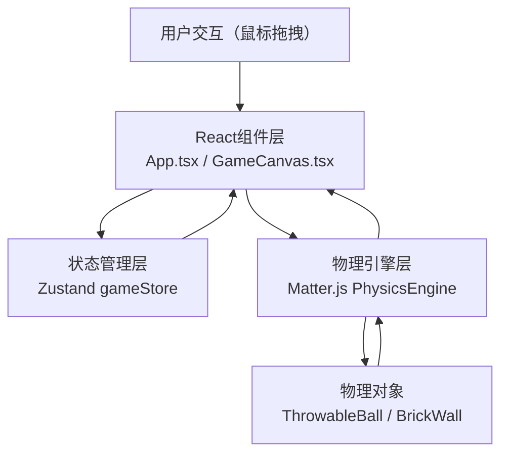

## 1. 架构设计



## 2. 技术描述

- **前端框架**：React@18 + TypeScript@5 + Vite@5
- **物理引擎**：matter-js@0.19 + @types/matter-js
- **状态管理**：zustand@4
- **构建工具**：Vite@5，支持TypeScript和React Fast Refresh
- **渲染方式**：HTML5 Canvas 2D API

## 3. 项目结构

```
├── package.json              # 项目依赖与脚本
├── index.html                # 入口HTML
├── vite.config.js            # Vite构建配置
├── tsconfig.json             # TypeScript配置
└── src/
    ├── App.tsx               # 主应用组件
    ├── components/
    │   └── GameCanvas.tsx    # Canvas渲染组件
    ├── physics/
    │   ├── PhysicsEngine.ts  # Matter.js引擎封装
    │   ├── BrickWall.ts      # 墙壁碎块生成器
    │   └── ThrowableBall.ts  # 可投掷角色管理器
    └── store/
        └── gameStore.ts      # Zustand全局状态
```

## 4. 核心模块说明

### 4.1 状态管理 (gameStore.ts)
```typescript
interface GameState {
  power: number;           // 蓄力值 0-100
  isDragging: boolean;     // 是否正在拖拽
  score: number;           // 得分
  throwCount: number;      // 投掷次数
  floatingTexts: Array<{id, x, y, text, createdAt}>;
  setPower: (power: number) => void;
  setIsDragging: (dragging: boolean) => void;
  addScore: (points: number) => void;
  incrementThrowCount: () => void;
  addFloatingText: (x: number, y: number, text: string) => void;
  removeFloatingText: (id: string) => void;
  reset: () => void;
}
```

### 4.2 物理引擎 (PhysicsEngine.ts)
- 封装Matter.js的Engine、World、Runner、Render
- 提供init()、update()、addBody()、removeBody()接口
- 管理碰撞检测事件，处理冲击力计算
- 维护砖块状态（活跃/停稳），管理性能优化

### 4.3 墙壁生成 (BrickWall.ts)
- 生成指定行列数（8行6列）的砖块矩阵
- 砖块尺寸40x20px，间隙2px，整体居中
- 砖块质量2，摩擦系数0.6，恢复系数0.3
- 颜色从预设色板随机选取

### 4.4 投掷角色 (ThrowableBall.ts)
- 半径15px，径向渐变金黄色
- 初始位置左侧固定Y位置
- 处理拖拽逻辑、蓄力计算、投掷速度计算
- 拖拽距离最大200px，映射到蓄力0-100%
- 投掷速度 = 12px/frame * 蓄力百分比/100

### 4.5 画布渲染 (GameCanvas.tsx)
- 800x600px Canvas
- 深蓝渐变背景
- 渲染所有物理对象（角色、砖块、地面）
- 渲染蓄力指示环、得分飘字
- 处理鼠标事件传递给物理引擎

### 4.6 主应用 (App.tsx)
- 初始化物理引擎和游戏状态
- 布局UI元素：状态条、蓄力指示条、重置按钮
- 管理游戏循环（requestAnimationFrame）
- 处理重置逻辑和墙壁再生

## 5. 关键技术实现

### 5.1 蓄力拖拽与投掷
- 鼠标按下时记录角色位置和拖拽起点
- 拖拽过程中计算距离和角度，更新蓄力值
- 距离超过200px时蓄力值封顶100
- 鼠标松开时根据蓄力值和方向设置角色速度

### 5.2 碰撞破碎逻辑
- 监听Matter.js的collisionStart事件
- 获取碰撞对的法向冲击力（normalImpulse）
- 冲击力>5时，标记砖块为可破碎
- 破碎时给砖块添加随机角速度和基于碰撞方向的线速度
- 飞散方向在碰撞法向±30度范围内随机

### 5.3 砖块停稳检测
- 每帧检测所有砖块的线速度和角速度
- 速度<0.5且持续超过2秒标记为停稳
- 停稳后设置alpha=0.3，设置isStatic=true或collisionFilter移除碰撞
- 所有砖块停稳后触发自动重置

### 5.4 性能优化
- 砖块停稳后不再参与碰撞计算
- 维护砖块创建时间队列，超过150个时移除最早停稳的
- requestAnimationFrame驱动渲染，与物理更新同步

### 5.5 视觉效果
- 角色使用Canvas径向渐变
- 蓄力环使用线性渐变填充
- 得分飘字使用requestAnimationFrame更新位置和alpha
- 重置按钮使用CSS transition实现缩放动画

## 6. 颜色常量

| 用途 | 颜色值 |
|------|--------|
| 背景渐变起始 | #0f0c29 |
| 背景渐变结束 | #302b63 |
| 角色颜色 | #f1c40f |
| 蓄力绿 | #2ecc71 |
| 蓄力红 | #e74c3c |
| 砖块色1 | #c0392b |
| 砖块色2 | #e74c3c |
| 砖块色3 | #8e44ad |
| 砖块色4 | #2980b9 |
| 地面颜色 | #4a2c2a |
| 重置按钮 | #e74c3c |

## 7. 物理参数

| 参数 | 值 |
|------|----|
| 画布尺寸 | 800 x 600 px |
| 角色半径 | 15 px |
| 砖块尺寸 | 40 x 20 px |
| 砖块间隙 | 2 px |
| 砖块质量 | 2 |
| 砖块摩擦系数 | 0.6 |
| 砖块恢复系数 | 0.3 |
| 空气阻力 | 0.02 |
| 最大拖拽距离 | 200 px |
| 基础速度 | 12 px/frame |
| 破碎冲击力阈值 | 5 |
| 随机角速度范围 | -0.1 ~ 0.1 rad/frame |
| 飞散角度范围 | ±30 度 |
| 停稳速度阈值 | 0.5 |
| 停稳时间阈值 | 2 秒 |
| 最大碎块数量 | 150 |
