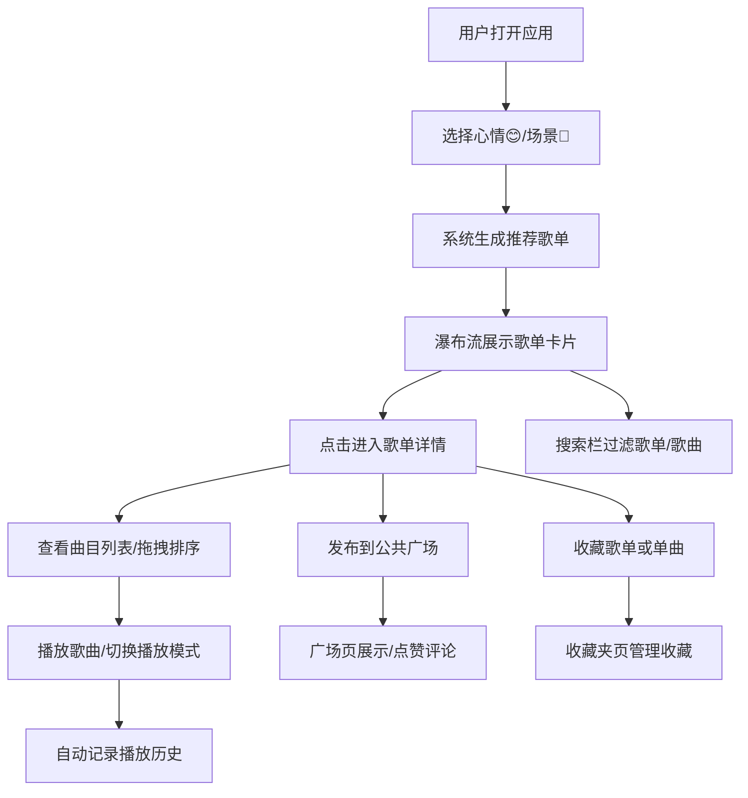

## 1. 产品概述

MoodMix - 个性化音乐歌单生成与社交分享平台，帮助用户在海量曲库中快速发现符合当下心情或场景的新歌，并轻松与朋友共享歌单灵感。

- **目标用户**：音乐爱好者、场景化听歌用户、喜欢分享音乐品味的社交用户
- **核心价值**：心情/场景智能匹配 → 一键生成歌单 → 社交互动分享

## 2. 核心功能

### 2.1 用户角色

| 角色 | 注册方式 | 核心权限 |
|------|---------|---------|
| 普通用户 | 应用内自动创建（匿名） | 浏览歌单、生成推荐、发布歌单、点赞评论、收藏管理 |

### 2.2 功能模块

1. **首页**：搜索栏、心情选择区、场景切换、推荐歌单瀑布流、底部播放栏
2. **歌单详情页**：曲目列表（拖拽排序）、播放控制、BPM筛选、分享到广场
3. **广场页**：公共歌单展示、热度/最新排序、点赞评论转发
4. **收藏夹页**：收藏的歌单/单曲、历史播放记录、搜索删除管理

### 2.3 页面详情

| 页面名称 | 模块名称 | 功能描述 |
|---------|---------|----------|
| 首页 | 心情选择 | 6种心情圆形按钮（快乐😊、忧伤😢、活力💪、放松😌、浪漫💕、专注🧘），选中放大1.1倍+渐变绿填充，0.3s弹性过渡 |
| 首页 | 场景切换 | 4种场景Tab（运动/学习/派对/睡前），自动筛选对应BPM范围并排序 |
| 首页 | 歌单瀑布流 | 多列布局（列宽320px，间距16px），卡片圆角12px，hover上浮4px+投影增强，点击跳转详情 |
| 首页 | 搜索栏 | 防抖300ms，按歌名/歌手过滤，响应<200ms |
| 首页 | 底部播放栏 | 固定80px高，半透明背景，当前歌曲信息+进度条+播放模式切换 |
| 歌单详情页 | 曲目列表 | 行高60px，封面48x48px圆角4px，hover背景高亮rgba(29,185,84,0.1)，支持拖拽排序 |
| 歌单详情页 | 播放控制 | 列表循环/随机播放模式，渐变进度条可点击跳转 |
| 广场页 | 公共歌单 | 歌单卡片（封面+名称+心情标签+歌曲数+点赞数），支持热度/最新排序 |
| 广场页 | 社交互动 | 点赞❤️、评论💬、转发🔗，Toast提示操作结果 |
| 收藏夹页 | 收藏管理 | 按创建时间倒序，支持搜索和删除，区分歌单收藏和单曲收藏 |
| 收藏夹页 | 播放历史 | 最近10首播放记录，展示封面+歌名+歌手+播放时间 |

## 3. 核心流程

## 4. 用户界面设计

### 4.1 设计风格

- **主色调**：暗色主题 #121212，卡片背景 #1e1e1e
- **强调色**：线性渐变 #1db954 → #191414（Spotify风格绿）
- **按钮风格**：圆形心情按钮（直径80px），弹性过渡动画；圆角矩形操作按钮（8px圆角）
- **字体**：系统无衬线字体 + 'Segoe UI'，标题18px/600，正文14px/400，辅助文字12px/400
- **布局风格**：卡片式瀑布流 + 顶部导航 + 底部固定播放栏
- **图标**：Emoji表情 + SVG图标，保持圆润统一风格
- **动画与过渡**：0.3s cubic-bezier(0.34, 1.56, 0.64, 1) 弹性曲线；加载时渐变旋转唱片动画（1.5s周期）

### 4.2 页面设计概览

| 页面名称 | 模块名称 | UI元素详情 |
|---------|---------|-----------|
| 首页 | 心情选择区 | 6个圆形按钮横向排列，直径80px，内边emoji图标+文字标签，选中放大1.1倍+渐变绿填充 |
| 首页 | 歌单卡片 | 320px宽，封面图2:1比例，歌单名称16px/600，心情标签徽章渐变绿背景，歌曲数量灰色小字 |
| 首页 | 底部播放栏 | 左：48x48封面+歌名歌手；中：进度条（渐变绿）+播放控制；右：播放模式+音量 |
| 歌单详情 | 曲目行 | 序号+48x48封面+歌名歌手+时长，hover背景rgba(29,185,84,0.1)，拖拽手柄光标 |
| 广场页 | 排序切换 | 热度/最新Tab切换，当前选中渐变绿下划线 |
| 收藏夹 | 分类切换 | 歌单收藏/单曲收藏/播放历史三段Tab |

### 4.3 响应式设计

- **设计策略**：Desktop-first，移动端断点768px
- **断点768px以下**：
  - 顶部导航栏变为汉堡菜单（点击展开侧边栏）
  - 心情按钮：每行3个，直径64px
  - 瀑布流：单列或双列，卡片宽度自适应
  - 底部播放栏：高度72px，歌名文字截断
- **触摸优化**：所有可点击元素最小尺寸44x44px，拖拽支持触摸事件

### 4.4 交互动效

- **加载状态**：渐变旋转唱片图标（直径32px，animation: spin 1.5s linear infinite）
- **按钮反馈**：点击scale(0.95) → 回弹scale(1)，过渡0.2s
- **Toast提示**：右上角滑入，持续3s自动消失，成功绿边框/失败红边框
- **卡片hover**：transform translateY(-4px) + box-shadow增强，transition 0.3s
- **进度条**：hover时高度4px→6px，点击跳转对应播放位置
