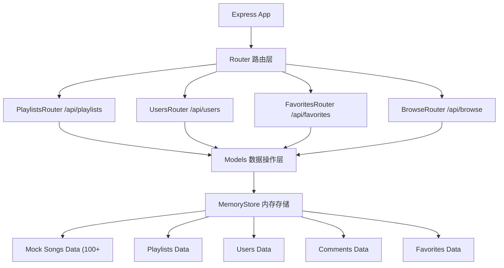
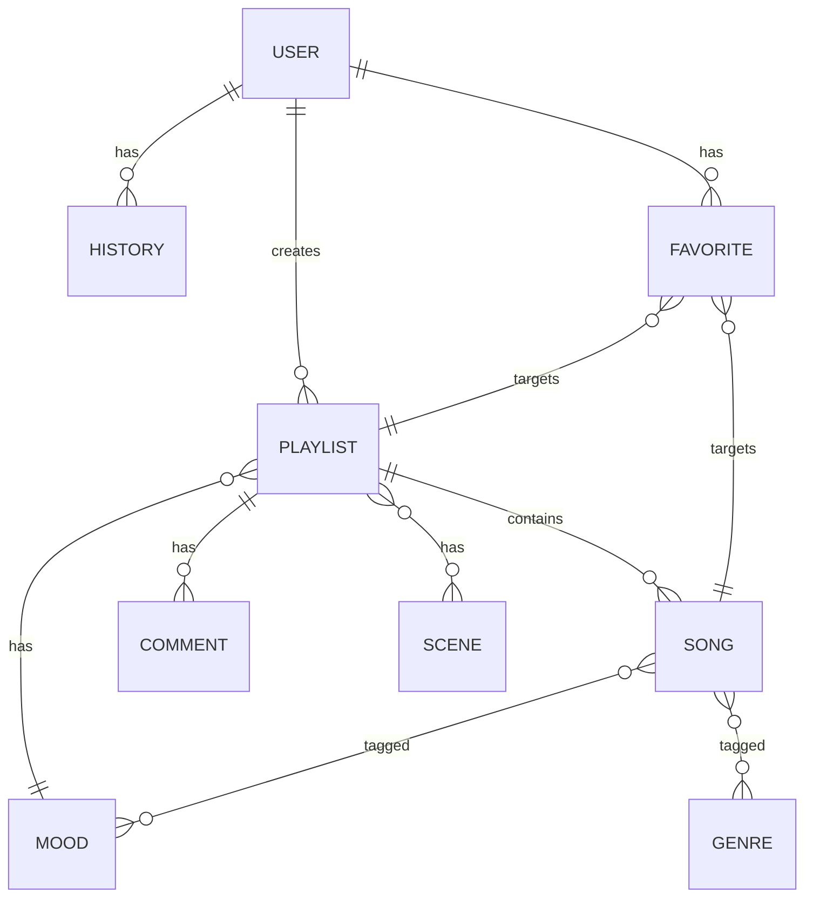

## 1. 架构设计

```mermaid
flowchart LR
    subgraph "前端 React 18"
        A["Vite 构建服务器 (5173) --> B["React Router v6 路由层"]
        B --> C["页面层 Pages"]
        C1["HomePage 首页"]
        C2["PlaylistDetail 歌单详情"]
        C3["BrowsePage 广场"]
        C4["FavoritesPage 收藏夹"]
        C --> D["组件层 Components"]
        D1["PlayerBar 播放栏"]
        D2["PlaylistCard 歌单卡片"]
        D3["SearchBar 搜索栏"]
        C --> E["状态层 Zustand"]
        E1["playlistStore"]
        E2["userStore"]
        E --> F["工具层 Utils"]
        F1["axios API封装"]
    end
    
    subgraph "后端 Express"
        G["Express API 服务器 (3001) --> H["路由层 REST API"]
        H1["/api/playlists 歌单"]
        H2["/api/users 用户"]
        H3["/api/favorites 收藏"]
        H --> I["数据层 Models"]
        I1["内存数据存储"]
    end
    
    A -->|代理 /api| G
    F1 -->|HTTP 请求| H
```

## 2. 技术栈说明

- **前端框架**: React 18 + TypeScript 5
- **构建工具**: Vite 5（含路径别名 @ → src，代理 /api → 后端3001端口
- **状态管理**: Zustand 4（轻量、简洁的状态管理库）
- **路由**: React Router DOM 6（懒加载 + Suspense）
- **样式方案**: 原生 CSS + CSS Modules（或styled-components）
- **HTTP 客户端**: Axios（统一拦截器 + baseURL=/api）
- **后端框架**: Express 4 + CORS 中间件
- **数据存储**: 内存数据 + 歌曲Mock数据
- **启动方式**: 前端5173 + 后端3001（npm run dev 同时启动前后端）

## 3. 路由定义

| 路由路径 | 页面组件 | 功能说明 |
|---------|---------|---------|
| `/` | HomePage | 首页 - 心情选择、场景切换、歌单瀑布流、推荐展示 |
| `/playlist/:id` | PlaylistDetail | 歌单详情 - 曲目列表、拖拽排序、播放控制、分享 |
| `/browse` | BrowsePage | 广场 - 公共歌单、点赞评论、热度/最新排序 |
| `/favorites` | FavoritesPage | 收藏夹 - 歌单/单曲收藏、播放历史、搜索删除 |

## 4. API 接口定义

### 4.1 歌单相关 API

| 方法 | 路径 | 请求参数 | 响应格式 | 说明 |
|------|------|---------|---------|------|
| GET | `/api/playlists` | `?mood=&scene=&limit=` | `Playlist[]` | 获取推荐歌单列表 |
| GET | `/api/playlists/:id` | - | `Playlist` | 获取单个歌单详情 |
| POST | `/api/playlists` | `{ name, mood, songs, cover }` | `Playlist` | 创建新歌单 |
| PUT | `/api/playlists/:id` | `{ songs }` | `Playlist` | 更新歌单曲目/排序 |
| POST | `/api/playlists/:id/like` | - | `{ liked: boolean }` | 点赞/取消点赞 |
| POST | `/api/playlists/:id/comments` | `{ content, userId }` | `Comment` | 发表评论 |
| POST | `/api/playlists/:id/share` | - | `{ shareId: string }` | 分享歌单 |
| GET | `/api/browse` | `?sort=hot|latest` | `Playlist[]` | 获取广场歌单（已发布） |

### 4.2 用户相关 API

| 方法 | 路径 | 请求参数 | 响应格式 | 说明 |
|------|------|---------|---------|------|
| GET | `/api/users/:id` | - | `User` | 获取用户信息 |
| GET | `/api/users/:id/history` | - | `Song[]` | 获取播放历史（最近10首） |
| POST | `/api/users/:id/history` | `{ songId }` | `Song` | 添加播放历史 |

### 4.3 收藏相关 API

| 方法 | 路径 | 请求参数 | 响应格式 | 说明 |
|------|------|---------|---------|------|
| GET | `/api/favorites/:userId` | `?type=` | `Favorite[]` | 获取收藏列表 |
| POST | `/api/favorites` | `{ userId, type, targetId }` | `Favorite` | 添加收藏 |
| DELETE | `/api/favorites/:id` | - | `{ success }` | 删除收藏 |

### 4.4 TypeScript 类型定义

```typescript
interface Song {
  id: string;
  title: string;
  artist: string;
  cover: string;
  duration: number;  // 秒
  bpm: number;
  genre: string;
  mood: MoodType[];
  scene: SceneType[];
}

interface Playlist {
  id: string;
  name: string;
  cover: string;
  mood: MoodType;
  scene?: SceneType;
  songs: Song[];
  likes: number;
  comments: Comment[];
  shares: number;
  createdAt: number;
  isPublic: boolean;
  creatorId: string;
}

interface User {
  id: string;
  name: string;
  avatar: string;
  createdAt: number;
}

interface Comment {
  id: string;
  playlistId: string;
  userId: string;
  userName: string;
  content: string;
  createdAt: number;
}

interface Favorite {
  id: string;
  userId: string;
  type: 'playlist' | 'song';
  targetId: string;
  target: Playlist | Song;
  createdAt: number;
}

type MoodType = 'happy' | 'sad' | 'energetic' | 'relaxed' | 'romantic' | 'focused';
type SceneType = 'workout' | 'study' | 'party' | 'sleep';
```

## 5. 服务端架构图



## 6. 数据模型

### 6.1 ER 图



### 6.2 场景 BPM 映射规则

| 场景 | BPM 范围 | 排序方式 |
|------|----------|--------|
| workout 运动 | 120-140 | BPM 从低到高渐进 |
| study 学习 | 60-80 | BPM 稳定居中 |
| party 派对 | 110-130 | BPM 随机但整体偏高 |
| sleep 睡前 | 50-70 | BPM 从高到低递减 |

### 6.3 心情曲风映射

| 心情 | 匹配曲风 |
|------|--------|
| happy 快乐 | Pop, Dance, Indie Pop, Funk |
| sad 忧伤 | Ballad, Acoustic, Blues |
| energetic 活力 | Rock, EDM, Hip-Hop, Punk |
| relaxed 放松 | Jazz, Lo-Fi, Ambient, Folk |
| romantic 浪漫 | R&B, Soul, Bossanova |
| focused 专注 | Classical, Instrumental, Lo-Fi |

## 7. 状态管理结构

### Zustand Store 设计

```
playlistStore:
├── state:
│   ├── playlists: Playlist[]      # 推荐歌单列表
│   ├── currentPlaylist: Playlist | null
│   ├── currentSong: Song | null
│   ├── currentIndex: number
│   ├── isPlaying: boolean
│   ├── playMode: 'loop' | 'shuffle'
│   ├── favorites: Favorite[]
│   ├── searchQuery: string
│   ├── browseList: Playlist[]
│   ├── loading: boolean
│   └── toast: { type, message } | null
└── actions:
    ├── fetchRecommendations(mood, scene)
    ├── fetchPlaylist(id)
    ├── fetchBrowse(sort)
    ├── playSong(song, playlist)
    ├── togglePlay()
    ├── nextSong()
    ├── prevSong()
    ├── setPlayMode(mode)
    ├── reorderSongs(fromIndex, toIndex)
    ├── toggleFavorite(type, targetId)
    ├── likePlaylist(id)
    ├── addComment(playlistId, content)
    ├── sharePlaylist(id)
    ├── setSearchQuery(query)
    ├── publishPlaylist(playlist)
    └── showToast(type, message)

userStore:
├── state:
│   ├── user: User
│   ├── mood: MoodType | null
│   ├── scene: SceneType | null
│   └── history: Song[]
└── actions:
    ├── setMood(mood)
    ├── setScene(scene)
    ├── addToHistory(song)
    └── clearHistory()
```

## 8. 性能优化方案

| 优化点 | 实现方式 |
|-------|---------|
| 搜索过滤 < 200ms | 前端 useMemo + 缓存 + 防抖300ms |
| 滚动帧率 50fps+ | CSS transform3d 加速 + 虚拟列表（如需要） |
| 图片懒加载 | IntersectionObserver + loading="lazy" |
| 首屏加载 | React.lazy + Suspense 代码分割 |
| 状态更新 | Zustand 选择器订阅避免不必要重渲染 |
| 动画性能 | CSS 动画优先 + will-change |
