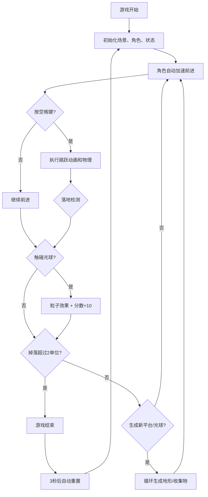

## 1. 产品概述

3D跑酷原型应用，用于验证侧视视角跑酷游戏在动态地形、角色跳跃手感以及收集物生成频率之间的平衡。玩家控制发光圆柱体在高低起伏的传送带上自动奔跑，通过空格键跳跃，收集随机出现的金色光球获得分数。

- 主要目的：验证游戏核心玩法的数值平衡，包括地形高度变化、跳跃物理参数、收集物生成频率
- 目标用户：游戏策划、开发者用于原型测试和调参

## 2. 核心功能

### 2.1 功能模块

1. **游戏主场景**：Three.js 3D渲染场景，包含动态传送带地形、玩家角色、收集物光球
2. **角色控制系统**：自动前进加速、空格键跳跃、重力物理模拟、落地压缩/跳跃拉长动画
3. **收集物系统**：光球随机生成、正弦浮动、碰撞拾取、粒子爆炸效果、分数累加
4. **游戏状态管理**：分数、速度、FPS监控、游戏结束判定、自动重置
5. **UI界面**：得分显示、速度显示、FPS警告、重新开始按钮、游戏结束遮罩

### 2.2 功能详情

| 模块名称 | 功能描述 |
|----------|----------|
| 动态地形生成 | 传送带由宽度4单位、高度0.5-2单位随机变化的矩形平台组成，间隔0.1单位，无限循环。每0.5秒移除末尾旧平台并在开头添加新平台 |
| 角色移动 | 玩家自动从0加速到3单位/秒（2秒加速时间），之后匀速前进 |
| 跳跃物理 | 空格键触发跳跃，初速度2.5单位/秒向上，重力9.8单位/秒²向下，碰撞检测精确到0.01单位 |
| 角色动画 | 跳跃时身体拉长至1.2倍高度并半透明（透明度0.7），落地时压缩至0.8倍高度恢复不透明，动画时长0.15秒 |
| 收集物生成 | 传送带上方0.5-1.5单位高度随机生成金色光球，每0.8秒生成一个，最多同时存在5个 |
| 收集物效果 | 光球以正弦波上下浮动（幅度0.1，频率2Hz），被触碰时消失并绽放20个金色粒子（扩散半径0.5，持续0.4秒），分数+10 |
| 失败判定 | 角色掉落到平台下方超过2个单位触发游戏结束，显示Game Over遮罩，3秒后自动重置 |
| 性能监控 | 60FPS目标运行，低于50FPS时左下角显示红色"FPS警告"文字 |

## 3. 核心流程

## 4. 用户界面设计

### 4.1 设计风格
- **背景色**：暗色主题 #1a1a2e
- **主色调**：淡蓝平台 #87ceeb、珊瑚红角色 #ff6347、金色光球 #ffd700、深红遮罩 #8b0000
- **辅助色**：浅灰网格线 #d3d3d3、按钮背景 #0f3460、悬停 #1a5276、按下 #0e2f4a
- **字体**：Arial
- **动画缓动**：cubic-bezier(0.4, 0, 0.2, 1)

### 4.2 页面设计

| 模块 | UI元素 | 描述 |
|------|--------|------|
| 游戏画布 | 800×500px，居中，1px边框#16213e，圆角8px | 3D场景渲染区域 |
| 得分显示 | 白色#fff，20px，Arial加粗，画布左上角 | 常驻显示当前分数 |
| 速度显示 | 数值保留1位小数+单位"u/s"，画布右上角 | 显示当前移动速度 |
| FPS警告 | 红色文字，画布左下角 | 帧率<50FPS时显示 |
| 重新开始按钮 | 宽100px高36px，圆角6px，背景#0f3460，白色文字 | 画布下方，悬停变#1a5276，按下变#0e2f4a并缩小0.95倍，过渡0.2s |
| 游戏结束遮罩 | 半透明深红#8b0000(透明度0.6)，居中显示"Game Over"白色文字36px Arial | 游戏失败时覆盖画布 |

### 4.3 响应式设计
- Desktop-first 设计
- 视口宽度 < 900px 时，画布宽度占满屏幕宽度，保持 5:3 宽高比

### 4.4 3D场景配置
- **相机**：侧视视角（OrthographicCamera 或 PerspectiveCamera 调整角度），跟随玩家前进
- **光照**：环境光 + 方向光，确保角色发光效果可见
- **平台材质**：半透明淡蓝 MeshStandardMaterial，透明度设置，带细密网格辅助线（颜色#d3d3d3，线宽0.02）
- **角色材质**：发光材质（MeshStandardMaterial + emissive），珊瑚红色
- **光球材质**：金色发光材质
- **粒子系统**：简单 Points 实现，金色扩散效果
