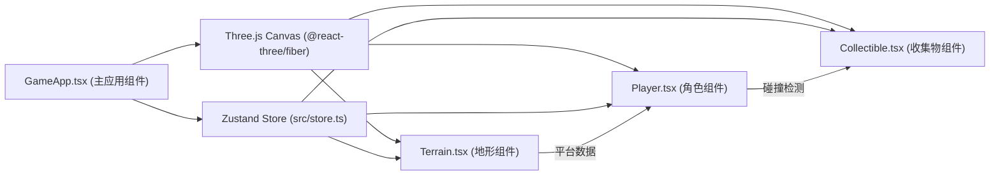

## 1. 架构设计



## 2. 技术描述

- **前端框架**：React@18 + TypeScript@5
- **构建工具**：Vite@5（含TypeScript支持）
- **3D渲染**：three@0.160, @react-three/fiber@8, @react-three/drei@9
- **状态管理**：zustand@4
- **类型定义**：@types/three

## 3. 文件结构

```
e:\solo\VersionFastPro\tasks\auto77\
├── index.html                 # 入口HTML
├── package.json               # 项目依赖和脚本
├── vite.config.js             # Vite构建配置
├── tsconfig.json              # TypeScript配置
└── src/
    ├── GameApp.tsx            # 主应用组件，集成场景、状态、UI、事件
    ├── store.ts               # Zustand全局状态管理
    ├── Terrain.tsx            # 动态地形生成组件
    ├── Player.tsx             # 角色组件（跳跃、重力、碰撞）
    └── Collectible.tsx        # 收集物组件（光球生成、拾取、粒子效果）
```

## 4. 数据模型与状态定义

### 4.1 Zustand Store (src/store.ts)

```typescript
interface GameState {
  score: number;              // 当前得分
  speed: number;              // 当前速度 (u/s)
  fps: number;                // 当前帧率
  gameState: 'playing' | 'gameover';  // 游戏状态
  platforms: Platform[];      // 平台数据列表
  collectibles: Collectible[]; // 收集物列表
  particles: Particle[];      // 粒子效果列表
  
  // Actions
  addScore: (points: number) => void;
  setSpeed: (speed: number) => void;
  setFps: (fps: number) => void;
  setGameState: (state: 'playing' | 'gameover') => void;
  addPlatform: (platform: Platform) => void;
  removePlatform: (id: string) => void;
  addCollectible: (collectible: Collectible) => void;
  removeCollectible: (id: string) => void;
  addParticles: (particles: Particle[]) => void;
  removeParticles: (ids: string[]) => void;
  reset: () => void;
}
```

### 4.2 数据类型定义

```typescript
interface Platform {
  id: string;
  x: number;          // X轴位置
  y: number;          // Y轴高度
  width: number;      // 宽度（固定4）
  height: number;     // 高度（0.5-2随机）
}

interface Collectible {
  id: string;
  x: number;
  y: number;          // 基础高度
  baseY: number;      // 浮动基准高度
  phase: number;      // 正弦波相位
}

interface Particle {
  id: string;
  x: number;
  y: number;
  vx: number;
  vy: number;
  life: number;       // 剩余生命值（秒）
  maxLife: number;    // 最大生命值
}
```

## 5. 核心实现要点

### 5.1 Terrain.tsx
- 使用 `useFrame` 或 `setInterval` 每0.5秒循环更新平台
- 维护固定数量的平台（如15-20个），移出视野的平台从数组末尾删除，在数组开头添加新平台
- 每个平台使用 `<mesh>` + `<boxGeometry>` 渲染，带半透明材质和 EdgesGeometry 网格线

### 5.2 Player.tsx
- 使用 `useFrame` 每帧更新位置和速度
- 加速度：0→3单位/秒，2秒完成，加速率 = 3/2 = 1.5 u/s²
- 跳跃：空格键触发，设置垂直速度 vy = 2.5
- 重力：每帧 vy -= 9.8 * deltaTime
- 碰撞检测：遍历平台，检查角色底部 y 是否与平台顶部 y 距离 < 0.01，且 x 在平台范围内
- 动画状态机：记录跳跃/落地时间，插值计算 scale.y 和 opacity

### 5.3 Collectible.tsx
- 每0.8秒生成一个新光球，随机位置（在前方平台上方），限制最多5个
- 使用 `useFrame` 更新正弦浮动：y = baseY + sin(time * 2π * 2) * 0.1
- 碰撞检测：角色与光球距离 < (角色半径0.3 + 光球半径0.2) = 0.5
- 拾取后生成20个粒子，初始位置为光球位置，速度随机方向，每帧更新位置和生命值

### 5.4 GameApp.tsx
- 使用 `<Canvas>` 包裹3D场景，设置相机位置（侧视）和背景色
- 监听键盘事件（keydown/keyup），空格键触发跳跃
- 使用 `useFrame` 监控帧率（通过 `performance.now()` 计算FPS）
- UI布局：绝对定位显示分数、速度、FPS警告、按钮、Game Over遮罩

## 6. 性能优化

- 平台和收集物使用对象池或固定长度数组，避免频繁GC
- 粒子使用 Three.js Points 批量渲染
- 碰撞检测使用空间分区（如简单按X轴筛选附近平台）
- 帧率监控使用平滑平均（最近30帧平均），避免抖动
