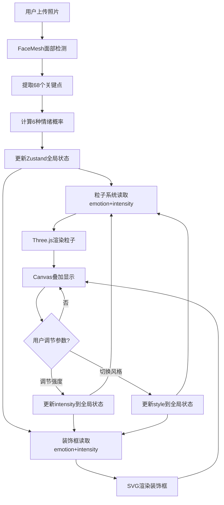

## 1. 产品概述

互动表情相框生成器——一款面向数字艺术家的交互装置应用，将静态人像照片实时转换为带有情绪动态粒子效果与装饰框动画的互动相框。用户上传人像照片后，系统自动识别面部表情（开心、悲伤、惊讶、愤怒、害怕、中性），并在照片周围生成情绪匹配的动态粒子与装饰框，用户可手动调节情绪强度和装饰风格。

- 解决问题：传统相框无法动态展现作品情绪变化
- 目标用户：数字艺术家、创意工作者、交互装置爱好者

## 2. 核心功能

### 2.1 用户角色

| 角色 | 注册方式 | 核心权限 |
|------|----------|----------|
| 普通用户 | 无需注册 | 上传照片、查看情绪识别、调节参数、切换风格 |

### 2.2 功能模块

1. **主页面**：图片上传区、情绪识别结果展示、粒子特效渲染、装饰框动画、控制面板

### 2.3 页面详情

| 页面名称 | 模块名称 | 功能描述 |
|----------|----------|----------|
| 主页面 | 图片上传区 | 拖拽或点击上传JPEG/PNG照片（最大5MB），上传后即时预览 |
| 主页面 | 表情识别 | 使用TensorFlow.js FaceMesh模型识别面部表情，1秒内返回6种情绪概率 |
| 主页面 | 动态粒子效果 | Three.js渲染3000个粒子，颜色与运动模式匹配情绪，强度正比于intensity |
| 主页面 | 情绪装饰框 | 双层圆角矩形边框，旋转光束效果，四角飘动光球，样式随情绪变化 |
| 主页面 | 控制面板 | 文件上传区、情绪强度滑块（0-100）、装饰风格选择器（极简/浪漫/奇幻） |

## 3. 核心流程

用户打开应用 → 在左侧面板拖拽上传人像照片 → 照片显示在右侧预览区 → 系统自动执行FaceMesh推理识别情绪 → 显示情绪标签和置信度 → 粒子特效与装饰框根据情绪实时渲染 → 用户通过滑块调节强度 → 粒子/边框/光效实时同步变化 → 用户切换装饰风格 → 0.5秒淡入淡出过渡后更新视觉风格

## 4. 用户界面设计

### 4.1 设计风格

- 主色调：深色主题背景 #0d0d0d，面板背景 #1a1a1a
- 强调色：情绪色板（开心#ff6b6b、悲伤#4ecdc4、愤怒#ff4500、惊讶#ffe66d、害怕#6c5ce7、中性#dfe6e9）
- 字体：系统默认 + 等宽字体用于数值显示
- 布局：CSS Grid左右两栏，左侧320px控制面板，右侧flex占满
- 动画：粒子运动、旋转光束、光球飘动、淡入淡出过渡

### 4.2 页面设计概览

| 页面名称 | 模块名称 | UI元素 |
|----------|----------|--------|
| 主页面 | 上传区 | 150x150px虚线方形，dashed #444边框，悬停变#00d2ff + scale(1.05) |
| 主页面 | 情绪标签 | 圆角胶囊，半透明情绪色背景+1px情绪色实线边框 |
| 主页面 | 强度滑块 | 280px宽，6px高渐变轨道(#4ecdc4→#ff6b6b)，20px白底圆形滑块 |
| 主页面 | 风格选择器 | 3个48px圆形按钮，#2d3436背景，选中时变色+白色辉光 |
| 主页面 | 预览区 | min-height 400px，照片居中max-width 600px，Canvas叠加粒子 |
| 主页面 | 装饰框 | 双层圆角矩形，内层8px实色+外层4px渐变，间距8px |

### 4.3 响应式设计

- 桌面端优先，CSS Grid左右两栏布局
- 移动端可折叠左侧面板为底部抽屉
- 预览区域自适应剩余空间

### 4.4 3D场景指引

- 粒子系统使用Three.js Points（非单独Sprite），固定3000粒子
- 每帧位置更新需2ms内完成
- 60fps渲染，Canvas叠加在照片之上
- 情绪色板映射粒子颜色，正弦波动幅度正比于intensity
